

  

     
    
     
    <strong>Universidad Peruana de Ciencias Aplicadas</strong>
      
    <strong>Carrera de Ingeniería de Software</strong>
      
    <strong>Ciclo 202610</strong>
      
    1ASI0728 - Arquitecturas De Software Emergentes
      
    <strong>NRC:</strong> 2610   
    <strong>Profesor:</strong> Jara Palacios, Marino Humberto   
    <strong>Informe de Trabajo Final</strong>
  

  

    

      <strong>Startup:</strong> Los Emergentes 
       
      <strong>Producto:</strong> CargaSafe
    

  

      <strong>Relación de integrantes</strong>
        
      <table style="width: 60%; margin: 0 auto;   text-align: left">
        <thead>
          <tr>
            <th>Código</th>
            <th>Nombre</th>
          </tr>
        </thead>
        <tbody>
          <tr>
            <td>u20</td>
            <td>Nombre</td>
          </tr>
          <tr>
            <td>u202113324</td>
            <td>Sanchez Ignacio, Jefrey Martin</td>
          </tr>
          <tr>
            <td>u20211c273</td>
            <td>Aliaga Pimentel, George Arturo</td>
          </tr>
          <tr>
            <td>u202213989</td>
            <td>Martinez Valdivia, Jose Luis</td>
          </tr>
          <tr>
            <td>u20</td>
            <td>Nombre </td>
          </tr>
        </tbody>
      </table>
      

         
        <strong>Abril 2026</strong>
      

    

  

# Registro de Versiones del Informe

| Versión | Fecha      | Autor            | Descripción de modificación                                                                                                                                                                                                                                                                                                                              |
| ------- | ---------- | ---------------- | -------------------------------------------------------------------------------------------------------------------------------------------------------------------------------------------------------------------------------------------------------------------------------------------------------------------------------------------------------- |
| 1.0     | 15/04/2026 | George, Jefrey, Jose Luis, Paulo, Edery           | Se entregó una primera entrega del informe con los siguientes apartados: Carátula, Registro de Versiones, Project Report Collaboration Insights, Contenido, Student Outcome, Capítulo I: Introducción, Capítulo II: Requirements Elicitation & Analysis, Capítulo III: Requirements Specification, Capítulo IV: Solution Software Design y Bibliografía. |

---

# Project Report Collaboration Insights

En esta sección, se registra las colaboraciones realizadas por los miembros del equipo durante el desarrollo del informe del proyecto. En primer lugar, se brinda el enlace del repositorio del reporte del proyecto en la plataforma GitHub.

-**Project Report:** https://github.com/1ASI0728-TF/Report

A continuación, se explicará todo a cerca del desarrollo de activades para la elaboración del informe. Adicionalmente, se presentan las métricas de las acciones del equipo del Project Report de cada entrega correspondiente en forma de contribuciones, commits y network graph registrados en GitHub.

## TB1 Project Report Collaboration Insights

Para la entrega del TB1 se realizaron las actividades necesarias para completar los capítulos I, II, III y IV, resaltando la importancia de la constancia en el trabajo. Como equipo, mantuvimos una frecuencia adecuada de commits y actualizaciones, proyectada como óptima para el desarrollo futuro, y se incluyen en el informe las evidencias de los cambios efectuados.

_Vista general de las contribuciones del equipo_

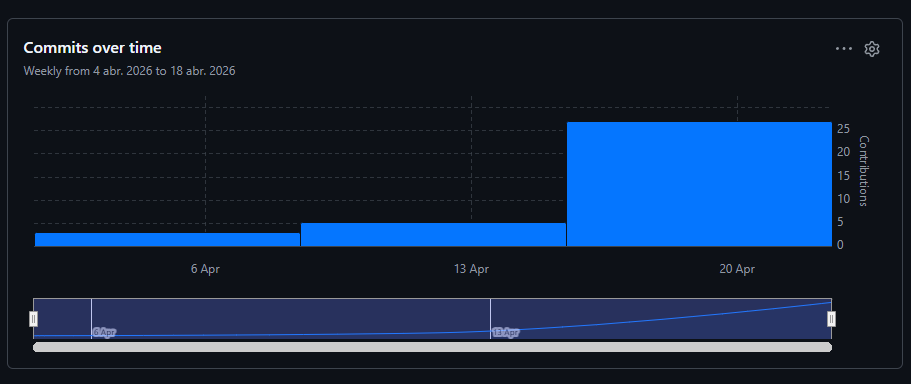

_Contribuciones de cada miembro del equipo para la TB1_
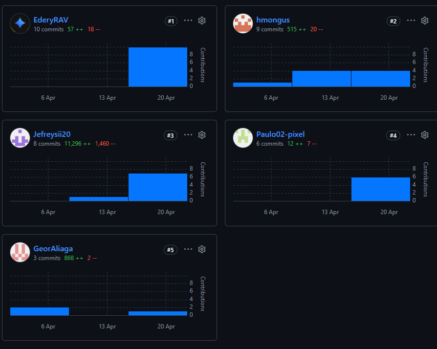

_Commits_
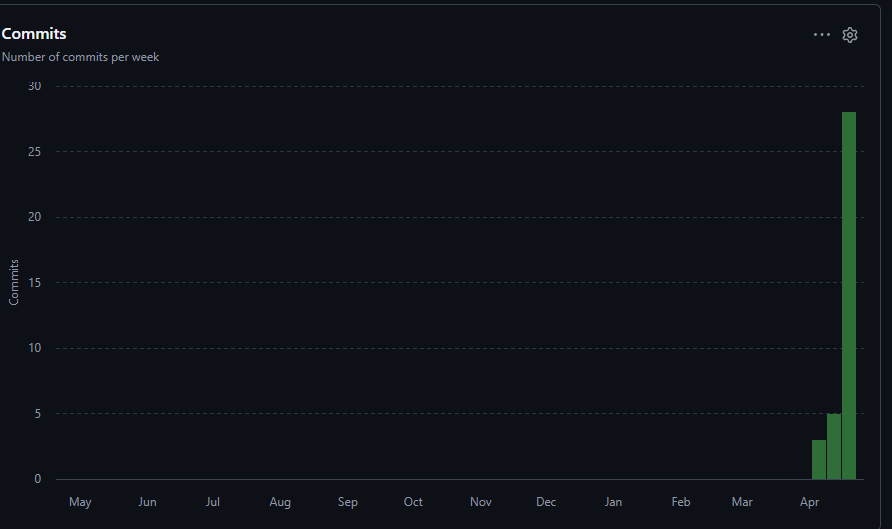

_Network Graph_
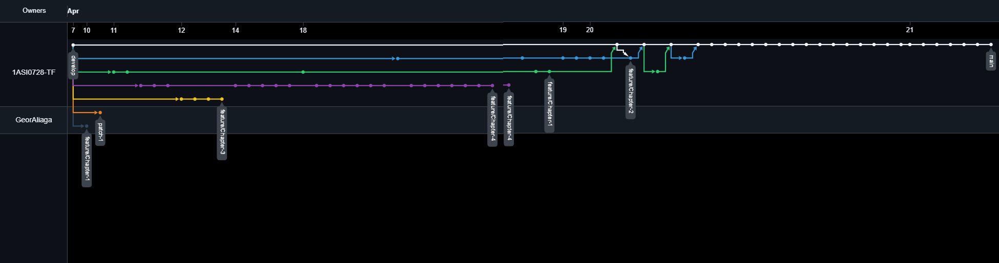

# Contenido

_Tabla de contenidos_

- [Student Outcome](#student-outcome)
- [Capítulo I: Introducción](#capítulo-i-introducción)
  - [1.1. Startup Profile](#11-startup-profile)
    - [1.1.1. Descripción de la Startup](#111-descripción-de-la-startup)
    - [1.1.2. Perfiles de integrantes del equipo](#112-perfiles-de-integrantes-del-equipo)
  - [1.2. Solution Profile](#12-solution-profile)
    - [1.2.1. Antecedentes y problemática](#121-antecedentes-y-problemática)
    - [1.2.2. Lean UX Process](#122-lean-ux-process)
      - [1.2.2.1. Lean UX Problem Statements](#1221-lean-ux-problem-statements)
      - [1.2.2.2. Lean UX Assumptions](#1222-lean-ux-assumptions)
      - [1.2.2.3. Lean UX Hypothesis Statements](#1223-lean-ux-hypothesis-statements)
      - [1.2.2.4. Lean UX Canvas](#1224-lean-ux-canvas)
  - [1.3. Segmentos objetivo](#13-segmentos-objetivo)
    - [1.3.1 Segmento 1: Empresas Clientes](#131-segmento-1-empresas-clientes)
    - [1.3.2 Segmento 2: Clientes Finales](#132-segmento-2-clientes-finales)
- [Capítulo II: Requirements Elicitation \& Analysis](#capítulo-ii-requirements-elicitation--analysis)
  - [2.1. Competidores](#21-competidores)
    - [2.1.1. Análisis competitivo](#211-análisis-competitivo)
    - [2.1.2. Estrategias y tácticas frente a competidores](#212-estrategias-y-tácticas-frente-a-competidores)
  - [2.2. Entrevistas](#22-entrevistas)
    - [2.2.1. Diseño de entrevistas](#221-diseño-de-entrevistas)
    - [2.2.2. Registro de entrevistas](#222-registro-de-entrevistas)
    - [2.2.3. Análisis de entrevistas](#223-análisis-de-entrevistas)
  - [2.3. Needfinding](#23-needfinding)
    - [2.3.1. User Personas](#231-user-personas)
    - [2.3.2. User Task Matrix](#232-user-task-matrix)
    - [2.3.3. User Journey Mapping](#233-user-journey-mapping)
    - [2.3.4. Empathy Mapping](#234-empathy-mapping)
  - [2.4. Big Picture EventStorming](#24-big-picture-eventstorming)
  - [2.5. Ubiquitous Language](#25-ubiquitous-language)
- [Capítulo III: Requirements Specification](#capítulo-iii-requirements-specification)
  - [3.1. User Stories](#31-user-stories)
  - [3.2. Impact Mapping](#32-impact-mapping)
  - [3.3. Product Backlog](#33-product-backlog)
- [Capítulo IV: Solution Software Design](#capítulo-iv-solution-software-design)
  - [4.1. Strategic-Level Domain-Driven Design](#41-strategic-level-domain-driven-design)
    - [4.1.1. Design-Level EventStorming](#411-design-level-eventstorming)
      - [4.1.1.1 Candidate Context Discovery](#4111-candidate-context-discovery)
    - [Leyenda utilizada en el EventStorming](#leyenda-utilizada-en-el-eventstorming)
      - [4.1.1.2. Domain Message Flows Modeling](#4112-domain-message-flows-modeling)
    - [Historias de dominio (Domain Stories)](#historias-de-dominio-domain-stories)
      - [4.1.1.3. Bounded Context Canvases](#4113-bounded-context-canvases)
    - [4.1.2. Context Mapping](#412-context-mapping)
    - [4.1.3. Software Architecture](#413-software-architecture)
      - [4.1.3.1. Software Architecture System Landscape Diagram](#4131-software-architecture-system-landscape-diagram)
      - [4.1.3.2. Software Architecture Context Level Diagrams](#4132-software-architecture-context-level-diagrams)
      - [4.1.3.2. Software Architecture Container Level Diagrams](#4132-software-architecture-container-level-diagrams)
      - [4.1.3.3. Software Architecture Deployment Diagrams](#4133-software-architecture-deployment-diagrams)
  - [4.2. Tactical-Level Domain-Driven Design](#42-tactical-level-domain-driven-design)
    - [4.2.1. Bounded Context: Identity and Access Management](#421-bounded-context-identity-and-access-management)
      - [4.2.1.1. Domain Layer](#4211-domain-layer)
      - [4.2.1.2. Interface Layer](#4212-interface-layer)
      - [4.2.1.3. Application Layer](#4213-application-layer)
      - [4.2.1.4. Infrastructure Layer](#4214-infrastructure-layer)
      - [4.2.1.5. Bounded Context Software Architecture Component Level Diagrams](#4215-bounded-context-software-architecture-component-level-diagrams)
      - [4.2.1.6. Bounded Context Software Architecture Code Level Diagrams](#4216-bounded-context-software-architecture-code-level-diagrams)
        - [4.2.1.6.1. Bounded Context Domain Layer Class Diagrams](#42161-bounded-context-domain-layer-class-diagrams)
        - [4.2.1.6.2. Bounded Context Database Design Diagram](#42162-bounded-context-database-design-diagram)
    - [4.2.2. Bounded Context: _Subscriptions and Billing_](#422-bounded-context-subscriptions-and-billing)
      - [4.2.2.1. Domain Layer](#4221-domain-layer)
      - [4.2.2.2. Interface Layer](#4222-interface-layer)
      - [4.2.2.3. Application Layer](#4223-application-layer)
      - [4.2.2.4. Infrastructure Layer](#4224-infrastructure-layer)
      - [4.2.2.5. Bounded Context Software Architecture Component Level Diagrams](#4225-bounded-context-software-architecture-component-level-diagrams)
      - [4.2.2.6. Bounded Context Software Architecture Code Level Diagrams](#4226-bounded-context-software-architecture-code-level-diagrams)
        - [4.2.2.6.1. Bounded Context Domain Layer Class Diagrams](#42261-bounded-context-domain-layer-class-diagrams)
        - [4.2.2.6.2. Bounded Context Database Design Diagram](#42262-bounded-context-database-design-diagram)
    - [4.2.3. Bounded Context: _Alerts \& Resolution_](#423-bounded-context-alerts--resolution)
      - [4.2.3.1. Domain Layer](#4231-domain-layer)
      - [4.2.3.2. Interface Layer](#4232-interface-layer)
      - [4.2.3.3. Application Layer](#4233-application-layer)
      - [4.2.3.4. Infrastructure Layer](#4234-infrastructure-layer)
      - [4.2.3.5. Bounded Context Software Architecture Component Level Diagrams](#4235-bounded-context-software-architecture-component-level-diagrams)
      - [4.2.3.6. Bounded Context Software Architecture Code Level Diagrams](#4236-bounded-context-software-architecture-code-level-diagrams)
        - [4.2.3.6.1. Bounded Context Domain Layer Class Diagrams](#42361-bounded-context-domain-layer-class-diagrams)
        - [4.2.3.6.2. Bounded Context Database Design Diagram](#42362-bounded-context-database-design-diagram)
    - [4.2.4. Bounded Context: _Real-Time Monitoring_](#424-bounded-context-real-time-monitoring)
      - [4.2.4.1. Domain Layer.](#4241-domain-layer)
      - [4.2.4.2. Interface Layer.](#4242-interface-layer)
      - [4.2.4.3. Application Layer.](#4243-application-layer)
      - [4.2.4.4. Infrastructure Layer.](#4244-infrastructure-layer)
      - [4.2.4.5. Bounded Context Software Architecture Component Level Diagrams](#4245-bounded-context-software-architecture-component-level-diagrams)
      - [4.2.4.6. Bounded Context Software Architecture Code Level Diagrams](#4246-bounded-context-software-architecture-code-level-diagrams)
        - [4.2.4.6.1. Bounded Context Domain Layer Class Diagrams](#42461-bounded-context-domain-layer-class-diagrams)
        - [4.2.4.6.2. Bounded Context Database Design Diagram](#42462-bounded-context-database-design-diagram)
    - [4.2.5. Bounded Context: _Trip management_](#425-bounded-context-trip-management)
      - [4.2.5.1. Domain Layer.](#4251-domain-layer)
      - [4.2.5.2. Interface Layer.](#4252-interface-layer)
      - [4.2.5.3. Application Layer.](#4253-application-layer)
      - [4.2.5.4. Infrastructure Layer.](#4254-infrastructure-layer)
      - [4.2.5.5. Bounded Context Software Architecture Component Level Diagrams.](#4255-bounded-context-software-architecture-component-level-diagrams)
      - [4.2.5.6. Bounded Context Software Architecture Code Level Diagrams.](#4256-bounded-context-software-architecture-code-level-diagrams)
        - [4.2.5.6.1. Bounded Context Domain Layer Class Diagrams.](#42561-bounded-context-domain-layer-class-diagrams)
        - [4.2.5.6.2. Bounded Context Database Design Diagram.](#42562-bounded-context-database-design-diagram)
    - [4.2.6. Bounded Context: Fleet Management](#426-bounded-context-fleet-management)
      - [4.2.6.1. Domain Layer](#4261-domain-layer)
      - [4.2.6.2. Interface Layer](#4262-interface-layer)
      - [Controllers principales (HTTP REST)](#controllers-principales-http-rest)
      - [4.2.6.3. Application Layer](#4263-application-layer)
      - [4.2.6.4. Infrastructure Layer](#4264-infrastructure-layer)
      - [4.2.6.5. Bounded Context Software Architecture Component Level Diagrams.](#4265-bounded-context-software-architecture-component-level-diagrams)
      - [4.2.5.6. Bounded Context Software Architecture Code Level Diagrams.](#4256-bounded-context-software-architecture-code-level-diagrams-1)
        - [4.2.5.6.1. Bounded Context Domain Layer Class Diagrams.](#42561-bounded-context-domain-layer-class-diagrams-1)
        - [4.2.5.6.2. Bounded Context Database Design Diagram.](#42562-bounded-context-database-design-diagram-1)
    - [4.2.7. Bounded Context: Profile and Preferences Management](#427-bounded-context-profile-and-preferences-management)
      - [4.2.7.1. Domain Layer.](#4271-domain-layer)
      - [4.2.7.2. Interface Layer.](#4272-interface-layer)
      - [4.2.7.3. Application Layer.](#4273-application-layer)
      - [4.2.7.4. Infrastructure Layer.](#4274-infrastructure-layer)
      - [4.2.7.5. Bounded Context Software Architecture Component Level Diagrams.](#4275-bounded-context-software-architecture-component-level-diagrams)
      - [4.2.7.6. Bounded Context Software Architecture Code Level Diagrams.](#4276-bounded-context-software-architecture-code-level-diagrams)
        - [4.2.7.6.1. Bounded Context Domain Layer Class Diagrams.](#42761-bounded-context-domain-layer-class-diagrams)
        - [4.2.7.6.2. Bounded Context Database Design Diagram](#42762-bounded-context-database-design-diagram)
    - [4.2.8. Bounded Context: Visualization Analytics](#428-bounded-context-visualization-analytics)
      - [4.2.8.1. Domain Layer](#4281-domain-layer)
      - [4.2.8.2. Interface Layer](#4282-interface-layer)
      - [4.2.8.3. Application Layer](#4283-application-layer)
      - [4.2.8.4. Infrastructure Layer](#4284-infrastructure-layer)
      - [4.2.8.5. Bounded Context Software Architecture Component Level Diagrams](#4285-bounded-context-software-architecture-component-level-diagrams)
      - [4.2.8.6. Bounded Context Software Architecture Code Level Diagrams](#4286-bounded-context-software-architecture-code-level-diagrams)
        - [4.2.8.6.1. Bounded Context Domain Layer Class Diagrams](#42861-bounded-context-domain-layer-class-diagrams)
        - [4.2.8.6.2. Bounded Context Database Design Diagram](#42862-bounded-context-database-design-diagram)
    - [4.2.9. Bounded Context: Merchant](#429-bounded-context-merchant)
      - [4.2.9.1. Domain Layer](#4291-domain-layer)
      - [4.2.9.2. Interface Layer](#4292-interface-layer)
      - [4.2.9.3. Application Layer](#4293-application-layer)
      - [4.2.9.4. Infrastructure Layer](#4294-infrastructure-layer)
      - [4.2.9.5. Bounded Context Software Architecture Component Level Diagrams](#4295-bounded-context-software-architecture-component-level-diagrams)
      - [4.2.9.6. Bounded Context Software Architecture Code Level Diagrams](#4296-bounded-context-software-architecture-code-level-diagrams)
        - [4.2.9.6.1. Bounded Context Domain Layer Class Diagrams](#42961-bounded-context-domain-layer-class-diagrams)
        - [4.2.9.6.2. Bounded Context Database Design Diagram](#42962-bounded-context-database-design-diagram)
- [Capítulo V: Solution UI/UX Design](#capítulo-v-solution-uiux-design)
  - [5.1. Style Guidelines.](#51-style-guidelines)
    - [5.1.1. General Style Guidelines.](#511-general-style-guidelines)
    - [5.1.2. Web, Mobile and IoT Style Guidelines.](#512-web-mobile-and-iot-style-guidelines)
  - [5.2. Information Architecture.](#52-information-architecture)
    - [5.2.1. Organization Systems.](#521-organization-systems)
    - [5.2.2. Labeling Systems.](#522-labeling-systems)
    - [5.2.3. SEO Tags and Meta Tags](#523-seo-tags-and-meta-tags)
    - [5.2.4. Searching Systems.](#524-searching-systems)
    - [5.2.5. Navigation Systems.](#525-navigation-systems)
  - [5.3. Landing Page UI Design.](#53-landing-page-ui-design)
    - [5.3.1. Landing Page Wireframe.](#531-landing-page-wireframe)
    - [5.3.2. Landing Page Mock-up.](#532-landing-page-mock-up)
  - [5.4. Applications UX/UI Design.](#54-applications-uxui-design)
    - [5.4.1. Applications Wireframes.](#541-applications-wireframes)
    - [5.4.2. Applications Wireflow Diagrams.](#542-applications-wireflow-diagrams)
    - [5.4.2. Applications Mock-ups.](#542-applications-mock-ups)
    - [5.4.3. Applications User Flow Diagrams.](#543-applications-user-flow-diagrams)
  - [5.5. Applications Prototyping.](#55-applications-prototyping)
- [Capítulo VI: Product Implementation, Validation \& Deployment](#capítulo-vi-product-implementation-validation--deployment)
  - [6.1. Software Configuration Management.](#61-software-configuration-management)
    - [6.1.1. Software Development Environment Configuration.](#611-software-development-environment-configuration)
    - [6.1.2. Source Code Management.](#612-source-code-management)
    - [6.1.3. Source Code Style Guide \& Conventions.](#613-source-code-style-guide--conventions)
    - [6.1.4. Software Deployment Configuration.](#614-software-deployment-configuration)
  - [6.2. Landing Page, Services \& Applications Implementation.](#62-landing-page-services--applications-implementation)
    - [6.2.1. Sprint 1](#621-sprint-1)
      - [6.2.1.1. Sprint Planning 1.](#6211-sprint-planning-1)
      - [6.2.1.2. Aspect Leaders and Collaborators.](#6212-aspect-leaders-and-collaborators)
      - [6.2.1.3. Sprint Backlog 1.](#6213-sprint-backlog-1)
      - [6.2.1.4. Development Evidence for Sprint Review](#6214-development-evidence-for-sprint-review)
      - [6.2.1.5. Testing Suite Evidence for Sprint Review.](#6215-testing-suite-evidence-for-sprint-review)
      - [6.2.1.6. Execution Evidence for Sprint Review.](#6216-execution-evidence-for-sprint-review)
      - [6.2.1.7. Services Documentation Evidence for Sprint Review](#6217-services-documentation-evidence-for-sprint-review)
      - [6.2.1.8. Software Deployment Evidence for Sprint Review](#6218-software-deployment-evidence-for-sprint-review)
      - [6.2.1.9. Team Collaboration Insights during Sprint.](#6219-team-collaboration-insights-during-sprint)
    - [6.2.2. Sprint 2](#622-sprint-2)
      - [6.2.2.1. Sprint Planning 2.](#6221-sprint-planning-2)
      - [6.2.2.2. Aspect Leaders and Collaborators.](#6222-aspect-leaders-and-collaborators)
      - [6.2.2.3. Sprint Backlog 2.](#6223-sprint-backlog-2)
      - [6.2.2.4. Development Evidence for Sprint Review](#6224-development-evidence-for-sprint-review)
      - [6.2.2.5. Testing Suite Evidence for Sprint Review.](#6225-testing-suite-evidence-for-sprint-review)
      - [6.2.2.6. Execution Evidence for Sprint Review.](#6226-execution-evidence-for-sprint-review)
      - [6.2.2.7. Services Documentation Evidence for Sprint Review](#6227-services-documentation-evidence-for-sprint-review)
      - [6.2.2.8. Software Deployment Evidence for Sprint Review](#6228-software-deployment-evidence-for-sprint-review)
      - [6.2.2.9. Team Collaboration Insights during Sprint.](#6229-team-collaboration-insights-during-sprint)
    - [6.2.3. Sprint 3](#623-sprint-3)
      - [6.2.3.1. Sprint Planning 3.](#6231-sprint-planning-3)
      - [6.2.3.2. Aspect Leaders and Collaborators.](#6232-aspect-leaders-and-collaborators)
      - [6.2.3.3. Sprint Backlog 3.](#6233-sprint-backlog-3)
      - [6.2.3.4. Development Evidence for Sprint Review.](#6234-development-evidence-for-sprint-review)
      - [6.2.3.5. Testing Suite Evidence for Sprint Review.](#6235-testing-suite-evidence-for-sprint-review)
      - [6.2.3.6. Execution Evidence for Sprint Review.](#6236-execution-evidence-for-sprint-review)
      - [6.2.3.7. Services Documentation Evidence for Sprint Review](#6237-services-documentation-evidence-for-sprint-review)
      - [6.2.3.8. Software Deployment Evidence for Sprint Review](#6238-software-deployment-evidence-for-sprint-review)
      - [6.2.3.9. Team Collaboration Insights during Sprint.](#6239-team-collaboration-insights-during-sprint)
  - [6.3. Validation Interviews.](#63-validation-interviews)
    - [6.3.1. Diseño de Entrevistas.](#631-diseño-de-entrevistas)
    - [6.3.2. Registro de Entrevistas.](#632-registro-de-entrevistas)
    - [6.3.3. Evaluaciones según heurísticas](#633-evaluaciones-según-heurísticas)
  - [6.4. Video About-the-Product.](#64-video-about-the-product)
- [Conclusiones](#conclusiones)
  - [Conclusiones y recomendaciones](#conclusiones-y-recomendaciones)
    - [Conclusiones](#conclusiones-1)
    - [Recomendaciones](#recomendaciones)
  - [Video About-the-Team](#video-about-the-team)
- [Bibliografía](#bibliografía)
- [Anexos](#anexos)

# Student Outcome

El curso contribuye de manera directa al desarrollo y cumplimiento del Student Outcome 5 definido por ABET – EAC, asegurando que los estudiantes alcancen las competencias establecidas en dicho resultado.

Criterio: La capacidad de funcionar efectivamente en un equipo cuyos miembros juntos proporcionan liderazgo, crean un entorno de colaboración e inclusivo, establecen objetivos, planifican tareas y cumplen objetivos. En el siguiente cuadro se describe las acciones realizadas y enunciados de conclusiones por parte del grupo, que permiten sustentar el haber alcanzado el logro del ABET – EAC - Student Outcome 3.

<table>
  <thead>
    <tr>
      <th class="outcome-column">Criterio Específico</th>
      <th class="details-column">
        Acciones Realizadas por Miembro (por Avance)
      </th>
      <th class="final-comment-column">Conclusiones del Equipo</th>
    </tr>
  </thead>
  <tbody>
    <tr>
      <td>Capacidad de comunicarse efectivamente con un rango de audiencias</td>
      <td>
        Jefrey Martin Sanchez Ignacio 
        TB1: 
       Soy capaz de comunicar de forma clara y efectiva el funcionamiento, la arquitectura y los resultados del proyecto CargaSafe, adaptando la explicación técnica según la audiencia, ya sea académica, técnica o usuarios finales, mediante presentaciones, documentación y demostraciones del sistema.
        
         
    	 George Arturo Aliaga Pimentel 
        TB1: 
        Texto   
         Jose Luis 
        TB1: 
        Se logro realizar un Analisis de Competencia del Proyecto CargaSafe. Asimismo, se entrevisto a potenciales usuarios de
        nuestra plataforma para tener una mejor vision de lo que ellos necesitan del producto. Gracias a se logro comprender a nuestro 
        publico objetivo y plantear un producto que los satisfaga en el dia   
         Paulo 
        TB1: 
       Texto 
         Edery 
        TB1: 
        Texto  
        </td>
      <td class="conclusions-column">
      TB1: 
        Texto  
      TP1: 
        Texto  
      TB2: 
        Texto  
      </td>
    </tr>
    
 </td>
</table>

---

# Capítulo I: Introducción

## 1.1. Startup Profile

### 1.1.1. Descripción de la Startup

Los Emergentes es una startup innovadora, especializada en el desarrollo de soluciones tecnológicas de monitoreo y trazabilidad para el sector logístico y de transporte. Surge de la iniciativa de un equipo multidisciplinario de estudiantes de la Universidad Peruana de Ciencias Aplicadas, quienes comparten una visión común: transformar la manera en que se gestionan y se supervisan las cadenas de suministro de productos sensibles, utilizando tecnología IoT.

Los Emergentes se distingue por su enfoque centrado en el usuario, trabajando de forma colaborativa con profesionales del ámbito de la logística para diseñar plataformas intuitivas, inteligentes y adaptadas a las necesidades reales de la industria. Su equipo combina conocimientos técnicos de vanguardia en IoT con una comprensión profunda de los desafíos actuales en materia de cadena de frío, trazabilidad de productos y gestión de riesgos.

Entre sus principales productos destaca CargaSafe, una solución integral que permite a las empresas de transporte y a sus clientes monitorear en tiempo real las condiciones de sus cargas, generando reportes y alertas automáticas respaldadas por tecnología inteligente. Los Emergentes emplea metodologías ágiles y tecnologías modernas para garantizar que sus soluciones sean robustas, escalables y capaces de evolucionar con las necesidades del mercado. Además, la empresa ofrece soporte continuo y mejora constante a sus plataformas, priorizando siempre la experiencia del usuario.

**Visión:** La visión de Los Emergentes es convertirse en líder global en el desarrollo de soluciones tecnológicas aplicadas a la logística y la cadena de suministro, empoderando a las empresas para que tomen decisiones más eficientes, informadas y seguras.

**Misión:** La misión de Los Emergentes es diseñar y desarrollar herramientas digitales innovadoras, accesibles y personalizadas que contribuyan a mejorar la eficiencia, la transparencia y la seguridad en el transporte de mercancías

### 1.1.2. Perfiles de integrantes del equipo

<table width="100%">
  <tr>
    <td rowspan="4" align="center" width="25%">
      
    </td>
    <td align="left">
      <b>Nombre y Apellido:</b> 
      Escribir Nombre
    </td>
  </tr>
  <tr>
    <td align="left">
      <b>Código:</b> 
      Escribir Código
    </td>
  </tr>
  <tr>
    <td align="left">
      <b>Carrera:</b> 
      Ingeniería de Software
    </td>
  </tr>
  <tr>
    <td align="left">
      <b>Acerca de:</b> 
      Descripción
    </td>
  </tr>
</table>

 

<table width="100%">
  <tr>
    <td rowspan="4" align="center" width="25%">
      
    </td>
    <td align="left">
      <b>Nombre y Apellido:</b> 
      Jefrey Martin Sanchez Ignacio
    </td>
  </tr>
  <tr>
    <td align="left">
      <b>Código:</b> 
      U202113324
    </td>
  </tr>
  <tr>
    <td align="left">
      <b>Carrera:</b> 
      Ingeniería de Software
    </td>
  </tr>
  <tr>
    <td align="left">
      <b>Acerca de:</b> 
      Actualmente cursando el octavo ciclo de mi carrera, Soy una persona responsable, proactiva. Espero aprender mucho del curso y sobretodo de este proyecto.
    </td>
  </tr>
</table>

 

<table width="100%">
  <tr>
    <td rowspan="4" align="center" width="25%">
      
    </td>
    <td align="left">
      <b>Nombre y Apellido:</b> 
      George Arturo Aliaga Pimentel
    </td>
  </tr>
  <tr>
    <td align="left">
      <b>Código:</b> 
      U20211c273
    </td>
  </tr>
  <tr>
    <td align="left">
      <b>Carrera:</b> 
      Ingeniería de Software
    </td>
  </tr>
  <tr>
    <td align="left">
      <b>Acerca de:</b> 
      Me llamo George Arturo Aliaga Pimentel y soy de la carrera de Ingeniería de Software. Estoy cursando el septimo ciclo. Me considero una persona cooperativa y responsable, lo cual es totalmente requerido para un proyecto grupal. Tengo la meta de ser un gran ingeniero y espero mejorar cada dia para lograr un buen desempeño en la carrera.
    </td>
  </tr>
</table>

 

<table width="100%">
  <tr>
    <td rowspan="4" align="center" width="25%">
      
    </td>
    <td align="left">
      <b>Nombre y Apellido:</b> 
      Jose Luis Martinez Valdivia
    </td>
  </tr>
  <tr>
    <td align="left">
      <b>Código:</b> 
    U202213989
    </td>
  </tr>
  <tr>
    <td align="left">
      <b>Carrera:</b> 
        Ingeniería de Software
    </td>
  </tr>
  <tr>
    <td align="left">
      <b>Acerca de:</b> 
      Desarrollador de resolución de problemas de .NET con experiencia en C#, JavaScript, TypeScript, C++, HTML CSS. Trabajo bien tanto individualmente como en un ambiente de equipo. Como parte de equipos de trabajo, me dedico a dar el 100% hasta su finalización, asegurándose de que se completen en el plazo establecido.
    </td>
  </tr>
</table>

 

<table width="100%">
  <tr>
    <td rowspan="4" align="center" width="25%">
      
    </td>
    <td align="left">
      <b>Nombre y Apellido:</b> 
      Inserte Nombre
    </td>
  </tr>
  <tr>
    <td align="left">
      <b>Código:</b> 
      Inserte Código
    </td>
  </tr>
  <tr>
    <td align="left">
      <b>Carrera:</b> 
      Ingenería de Software
    </td>
  </tr>
  <tr>
    <td align="left">
      <b>Acerca de:</b> 
      Inserte descripción
    </td>
  </tr>
</table>

 

## 1.2. Solution Profile

### 1.2.1. Antecedentes y problemática

### What (¿Qué?)

El transporte de mercancías enfrenta un reto transversal: monitorear de forma continua y verificable las condiciones reales del cargamento durante todo el trayecto. Más allá del simple rastreo de ubicación, las cargas pueden sufrir manipulaciones no autorizadas, aperturas de puerta, golpes, vibraciones, humedad, exposición a ambientes no controlados, desvíos de ruta, retrasos y pérdidas de custodia. La ausencia de evidencia objetiva y en tiempo real sobre estos eventos se traduce en daños, mermas, disputas entre actores de la cadena y costos operativos crecientes.
En la práctica, gran parte de la visibilidad actual se limita a hitos administrativos (salida/arribo) o a sistemas aislados de geolocalización. Esto deja zonas ciegas respecto al estado físico y a la integridad del embalaje en tramos críticos (esperas, transbordos y handoffs entre operadores). Para retail, agro, farmacéutico, pesquero y consumo masivo, contar con telemetría de condiciones del cargamento—incluyendo eventos de integridad, incidencias y evidencias auditables—es ya un requisito para reducir pérdidas, acelerar conciliaciones y sostener SLA con clientes y aseguradoras.

### Who (¿Quién?)

Este problema impacta a dos actores clave:

1. Empresas transportistas y de logística: Enfrentan el riesgo financiero de pérdidas de carga, reclamos de clientes y el daño a su reputación por entregas fallidas.

2. El cliente final: Se ve afectado al recibir productos en mal estado, caducados o, en el caso de medicamentos, que han perdido su efectividad, lo cual representa un riesgo para la salud y la seguridad.

### Where (¿Dónde?)

La problemática se manifiesta a lo largo de toda la cadena de suministro, desde el almacén de origen hasta la entrega final. Es particularmente crítica en los tramos de larga distancia (transporte terrestre, aéreo y marítimo) y en los "puntos de transferencia" entre diferentes vehículos o almacenes, donde la supervisión manual es más difícil. La adopción de tecnologías de monitoreo es una tendencia global que se acelera en mercados con infraestructura logística desarrollada y una creciente demanda de comercio electrónico.

### When (¿Cuándo?)

La necesidad de visibilidad en tiempo real se ha intensificado desde la pandemia de COVID-19, la cual puso de manifiesto la vulnerabilidad de las cadenas de suministro. El aumento del transporte de productos médicos y la expectativa de los consumidores por entregas rápidas y transparentes han impulsado la demanda de soluciones tecnológicas. Hoy en día, la mayoría de los clientes esperan poder rastrear sus pedidos en tiempo real, lo que convierte la visibilidad de la carga en un estándar de mercado, no solo una ventaja competitiva (Perfect Planner, 2025).

### Why (¿Por qué?)

La principal causa de esta problemática es la falta de información oportuna. Las empresas no tienen acceso a datos críticos sobre la temperatura, ubicación o condiciones de su carga en el momento en que ocurren las desviaciones. Esto impide la toma de acciones correctivas inmediatas, como ajustar el termostato de un camión, cambiar una ruta o notificar al cliente sobre un posible retraso. Sin esta visibilidad, los problemas solo se descubren al final del trayecto, cuando ya es demasiado tarde para evitar la pérdida del producto.

### How (¿Cómo?)

Actualmente, el monitoreo se realiza con métodos ineficientes o no integrados. Muchas empresas aún dependen de registradores de datos manuales que requieren ser revisados al final del viaje o utilizan múltiples sistemas (GPS para ubicación, sensores para temperatura) que no se comunican entre sí. Esta fragmentación reduce la eficiencia operativa y aumenta el riesgo de errores humanos. La falta de una plataforma integral que centralice toda la información limita la capacidad de las empresas para optimizar sus rutas, gestionar riesgos y, en última instancia, ofrecer un servicio de alta calidad (Bogdanov, 2024).

### How much (¿Cuánto?)

El impacto de la falta de un monitoreo efectivo es funcional, operativo y estratégico. Las empresas pierden tiempo y recursos reubicando información o lidiando con problemas logísticos que podrían haberse evitado. Operativamente, esta deficiencia se traduce en mayores costos de seguro y en gastos asociados al desperdicio de productos. Desde una perspectiva de negocio, esta brecha representa una oportunidad clara para monetizar al ofrecer una solución de valor que mejore la fidelización del cliente y construya una reputación de confiabilidad, lo que constituye una ventaja competitiva en el mercado.

### 1.2.2. Lean UX Process

#### 1.2.2.1. Lean UX Problem Statements

**Domain**

El proyecto se enmarca en el sector logístico y de transporte de carga, específicamente en el control y monitoreo de condiciones de mercancías sensibles durante su traslado. En este dominio, la información en tiempo real sobre el estado de la carga resulta esencial para garantizar la trazabilidad, la seguridad y el cumplimiento de normativas relacionadas con la cadena de frío, productos farmacéuticos y bienes perecibles.

**Customer Segments**

Empresas de transporte y operadores logísticos: responsables de gestionar flotas y garantizar la integridad de los productos durante el traslado.

Clientes corporativos o distribuidores de productos sensibles: demandan transparencia, control y evidencia del cumplimiento de condiciones óptimas de transporte.

Estos segmentos comparten la necesidad de contar con información precisa, en tiempo real, y herramientas que les permitan actuar de forma proactiva ante incidentes.

**Pain Points**

Falta de visibilidad en tiempo real de las condiciones de temperatura, humedad y localización de la carga.

Pérdida económica por ruptura de la cadena de frío o manipulación inadecuada.

Comunicación deficiente entre transportistas y clientes frente a incidentes.

Ausencia de trazabilidad digital que permita auditar condiciones y responsabilidades.

Procesos manuales y fragmentados que dificultan la gestión operativa y la toma de decisiones.

**Gap**

Actualmente, las empresas del sector utilizan herramientas aisladas —como GPS o registradores de temperatura— que no ofrecen una integración completa entre monitoreo, trazabilidad y comunicación.
Existe una brecha entre la información disponible y la capacidad de reaccionar ante eventos críticos, lo que impide una gestión eficiente y preventiva.

**Vision / Strategy**

La visión de Los Emergentes con CargaSafe es transformar el monitoreo logístico tradicional en un proceso inteligente, preventivo y conectado.
La estrategia consiste en desarrollar una plataforma IoT integral, donde sensores embarcados recopilan datos de las condiciones ambientales y los transmiten a un sistema central que analiza, alerta y visualiza la información en tiempo real.
De esta manera, las empresas podrán anticiparse a riesgos, reducir pérdidas y aumentar la confianza de sus clientes mediante reportes automáticos y trazabilidad verificable.

**Initial Segment**

El proyecto iniciará su implementación con empresas de transporte de productos perecibles y farmacéuticos que operan en Lima Metropolitana.
Este segmento fue seleccionado por su alta sensibilidad a las condiciones ambientales y su interés demostrado en la digitalización de procesos logísticos, representando un entorno ideal para validar la propuesta tecnológica y de negocio.

**Resumen del enfoque:**
Este conjunto de Problem Statements establece las bases para las siguientes etapas del Lean UX Process, en las que se derivarán las Assumptions, Hypothesis Statements y el Lean UX Canvas, alineando los objetivos de negocio con las necesidades reales de los usuarios.

#### 1.2.2.2. Lean UX Assumptions

### Business Assumptions

1. Creemos que existe demanda significativa en transporte LATAM por monitoreo accesible con múltiples parámetros (frío, vibración, ubicación, energía).
   Validamos cuando ≥15 entrevistas B2B y ≥30% de respuestas en encuesta indiquen "intención de evaluar" o mayor.

2. Creemos que las empresas pagan una suscripción mensual por una solución que reduce pérdidas y mejora confianza del cliente.
   Validamos cuando obtenemos ≥5 cartas de intención con rango de precio mensual especificado.

3. Creemos que dispositivos IoT de bajo costo alcanzan la precisión necesaria para cadena de frío, vibración, ubicación y energía.
   Validamos cuando las pruebas de campo muestran ±0.5 °C en temperatura, detección de vibración y GPS dentro de 10 m en ≥95% de lecturas.

4. Creemos que el modelo de suscripción resulta más atractivo que licencias perpetuas en el segmento meta.
   Validamos cuando el ≥70% de decisiones simuladas o cotizaciones reales eligen suscripción sobre perpetuo, dado el mismo alcance.

5. Creemos que incluir parámetros adicionales (humedad, vibración, volcado) eleva el valor percibido.
   Validamos cuando las pruebas de pricing A/B muestran disposición a pagar ≥15% más por el paquete multiparámetro.

### Business Outcome Assumptions

1. Creemos que reducir incidentes de cadena de frío disminuye costos de merma para clientes.
   Validamos cuando los conductores muestran ≥20% menos eventos críticos/mes vs. línea base.

2. Creemos que visibilidad en tiempo real acorta el ciclo de cobro por menos disputas.
   Validamos cuando el DSO (days sales outstanding) baja ≥10% en 2 meses de uso.

3. Creemos que el producto acelera ventas en el segmento objetivo.
   Validamos cuando la conversión piloto pago es ≥40% y ciclo de venta ≤60 días.

4. Creemos que el servicio retiene cuentas con valor sostenido.
   Validamos cuando la retención mensual ≤3% y NRR (net revenue retention) ≥100% a 6 meses.

5. Creemos que la propuesta escala con márgenes sanos.
   Validamos cuando margen bruto de servicio IoT ≥60% a partir de 50 dispositivos activos/cliente.

### User Assumptions

1. Creemos que los usuarios principales son gerentes de operaciones y conductores de transporte de productos sensibles.
   Validamos cuando el ≥80% de entrevistas y sesiones sombra confirman estos roles como usuarios frecuentes.

2. Creemos que los usuarios necesitan alertas inmediatas ante ruptura de frío, vibración excesiva o volcado para actuar.
   Validamos cuando el ≥70% prioriza "alertas en tiempo real" en ejercicios de priorización (MoSCoW/stack ranking).

3. Creemos que los usuarios quieren un dashboard simple con estado de toda la flota en una sola vista.
   Validamos cuando las pruebas de usabilidad logran "localizar vehículo en riesgo" en <10 s por ≥80% de participantes.

4. Creemos que los usuarios valoran reportes automáticos que integran todos los parámetros para sus clientes.
   Validamos cuando el ≥60% selecciona "reportes automáticos" dentro de su top-3 beneficios en encuesta.

5. Creemos que los usuarios prefieren baja necesidad de capacitación frente a mayor complejidad funcional.
   Validamos cuando el onboarding autoguiado (sin formación formal) obtiene SUS ≥70 y tareas clave completadas por ≥80% en la primera sesión.

### User Outcomes & Benefits Assumptions

1. Creemos que con alertas y vista unificada, los equipos responden más rápido a eventos críticos.
   Validamos cuando tiempo de respuesta medio baja ≥30% vs. línea base en 4 semanas.

2. Creemos que con práctica operativa guiada, los conductores cometen menos incidencias (puertas abiertas, detenciones no planificadas).
   Validamos cuando incidencias por 1,000 km bajan ≥15% en 8 semanas.

3. Creemos que con reportes automáticos, los gerentes ahorran tiempo en auditorías y atención de reclamos.
   Validamos cuando tiempo semanal en compilación/reportes baja ≥50% medido por time-tracking.

4. Creemos que con trazabilidad histórica, aumenta la tasa de auditorías aprobadas.
   Validamos cuando tasa de auditoría/cliente sube ≥10 pp en el primer trimestre.

5. Creemos que con visibilidad y control, mejora la confianza del cliente final.
   Validamos cuando NPS de clientes finales sube ≥10 puntos a los 3 meses.

### Feature Assumptions

1. Creemos que el monitoreo en tiempo real de temperatura, humedad, vibración y ubicación es crítico.
   Validamos cuando ≥80% de cuentas activas mantiene dispositivos online >95% del tiempo y consulta la vista en tiempo real semanalmente.

2. Creemos que alertas automática para volcado, baja energía y ruptura de frío son fundamentales.
   Validamos cuando ≥70% de eventos críticos genera apertura de alerta y ≥40% desencadena acción registrada.

3. Creemos que la gestión multi-vehículo en una sola plataforma es necesaria.
   Validamos cuando usuarios gestionan ≥20 vehículos por cuenta sin caída de rendimiento percibido (tiempos <2 s por acción).

4. Creemos que reportes históricos son necesarios para cumplimiento y trazabilidad.
   Validamos cuando ≥60% programa reportes recurrentes y consulta históricos ≥1 vez/semana.

5. Creemos que la integración con IoT existente amplía mercado.
   Validamos cuando al menos 2 integraciones con hardware de terceros se usan en producción y representan ≥25% de dispositivos activos.

#### 1.2.2.3. Lean UX Hypothesis Statements

#### Hipótesis 1

Creemos que reducir en 30% las pérdidas de producto y aumentar en 25% la satisfacción del cliente se logrará si las empresas de transporte logran responder a tiempo a eventos críticos (ruptura de frío, humedad fuera de rango, volcado) con un sistema de alertas en tiempo real.
Lo sabremos cuando los incidentes reportados bajen ≥30% y el CSAT/NPS suba ≥10 puntos en 8 semanas de piloto, con ≥80% de feedback positivo.

#### Hipótesis 2

Creemos que mejorar en 40% la eficiencia operativa se logrará si los gerentes de operaciones logran detectar y priorizar incidentes en minutos con un dashboard intuitivo que muestra el estado completo de la flota (temperatura, humedad, vibración, ubicación).
Lo sabremos cuando el tiempo medio de respuesta baje de >4 h a <30 min y el tiempo para identificar el vehículo en riesgo sea <10 s para ≥80% de usuarios en 4 semanas.

#### Hipótesis 3

Creemos que alcanzar 15% de adopción del mercado objetivo en 12 meses se logrará si los decisores de las empresas de transporte logran seleccionar el plan adecuado a su valor percibido con un modelo de suscripción flexible por niveles.
Lo sabremos cuando tengamos ≥150 empresas activas, conversión piloto→pago ≥40% y churn mensual ≤3% dentro de 12 meses.

#### Hipótesis 4

Creemos que aumentar en 20% la retención de clientes de nuestros usuarios se logrará si los gerentes de operaciones logran demostrar trazabilidad completa a sus clientes con reportes automáticos e historial auditado.
Lo sabremos cuando la tasa de renovación suba ≥20%, el tiempo de preparación de auditorías baje ≥50%, y se programen reportes recurrentes en ≥60% de cuentas en 1 trimestre.

#### 1.2.2.4. Lean UX Canvas

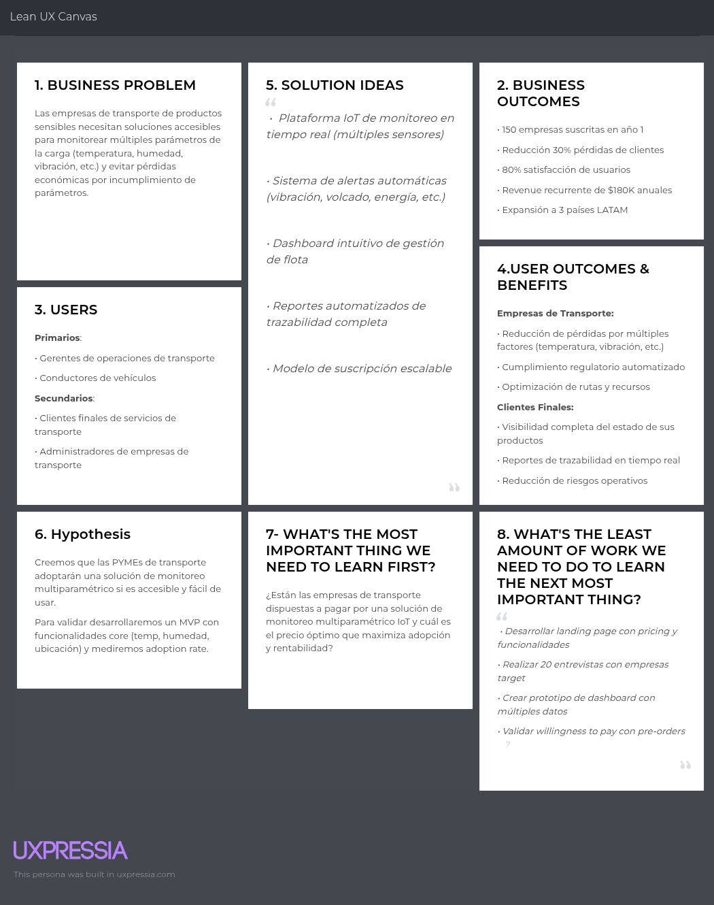

## 1.3. Segmentos objetivo

### 1.3.1 Segmento 1: Empresas Clientes

Estas empresas, dedicadas a la logística, distribución o producción de bienes sensibles, necesitan un control exhaustivo sobre sus cargas para asegurar la calidad y evitar pérdidas económicas. Su objetivo es tener una visibilidad completa en tiempo real de sus productos, centralizando toda la información en una sola plataforma para optimizar sus operaciones, cumplir con las normativas y generar confianza en sus propios clientes.

**Caracteristícas:**

- **Rol:** Gerentes o responsables de logística, calidad o distribución.
- **Ubicación:** Empresas ubicadas en zonas con alta actividad logística y acceso a tecnologías de digitalización.
- **Sector de la industria:** Alimentos perecederos, farmacéuticos, químicos, flores y otros productos que requieren condiciones especiales de conservación.

### 1.3.2 Segmento 2: Clientes Finales

Los clientes finales son los consumidores de los productos transportados por las empresas. Su necesidad principal es la transparencia y la seguridad, ya que buscan la tranquilidad de saber que el producto que adquieren ha sido manejado bajo los estándares de calidad correctos. Valoran la capacidad de verificar el estado de su pedido, desde el origen hasta la entrega, a través de una plataforma sencilla y confiable.

**Características:**

- **Edad:** Mayor a 18 años
- **Ubicación:** Lima, Peru
- **Nivel Socioeconomico:** Medio a alto

# Capítulo II: Requirements Elicitation & Analysis

## 2.1. Competidores

### 2.1.1. Análisis competitivo

<table>
<!-- Título -->
  <tr>
    <th colspan="6" valign="top"><b>Análisis Competitivo</b></th>
  </tr>

  <!-- Motivación del análisis -->
  <tr>
    <td rowspan="2" colspan="1" valign="top">¿Por qué llevar a cabo este Análisis?</td>
    <td colspan="5" valign="top">
      Este análisis permite identificar fortalezas, debilidades y oportunidades en el mercado de soluciones IoT para el monitoreo de cadena de frío, de modo que Macetech pueda priorizar características, precios y estrategias de marketing que maximicen su adopción en el mercado peruano y latinoamericano.
    </td>
  </tr>
  <tr></tr>

  <!-- Cabeceras de competidores (logo + nombre) -->
  <tr>
    <td colspan="2" valign="top"></td>
    <td valign="top">
      
<b>Sensitech (Thermo King)</b>

      
    </td>
    <td valign="top">
      
<b>Frigga (China)</b>

      
    </td>
    <td valign="top">
      
<b>Emerson Cargo Solutions</b>

      
    </td>
    <td valign="top">
      
<b>Carga Safe</b>

      
    </td>
  </tr>

  <!-- PERFIL -->
  <tr>
    <td rowspan="2" valign="top">
Perfil
</td>
    <td valign="top">Overview</td>
    <td valign="top">Multinacional estadounidense líder en monitoreo de la cadena de frío con décadas de experiencia.</td>
    <td valign="top">Fabricante global de dispositivos IoT para cadena de frío, con distribución en más de 60 países.</td>
    <td valign="top">División de Emerson Electric dedicada a soluciones de monitoreo de transporte refrigerado.</td>
    <td valign="top">Startup tecnológica latinoamericana que ofrece monitoreo en tiempo real enfocado en la temperatura del transporte de cargas.</td>
  </tr>
  <tr>
    <td valign="top">¿Qué valor ofrece a los clientes?</td>
    <td valign="top">Ofrece confianza, cumplimiento de normativas globales (FDA, OMS), cobertura mundial y tecnología robusta.</td>
    <td valign="top">Ofrece sensores desechables/reutilizables de bajo costo, fáciles de implementar en transporte.</td>
    <td valign="top">Seguridad y precisión en tiempo real con analítica avanzada para grandes corporaciones.</td>
    <td valign="top">Propuesta accesible y flexible que asegura la conservación de productos críticos, con alertas inmediatas y dashboards intuitivos.</td>
  </tr>

  <!-- MARKETING -->
  <tr>
    <td rowspan="2" valign="top">
Perfil de Marketing
</td>
    <td valign="top">Mercado objetivo</td>
    <td valign="top">Multinacionales farmacéuticas, agroexportadoras y grandes retailers.</td>
    <td valign="top">Exportadores agrícolas y farmacéuticos medianos.</td>
    <td valign="top">Corporaciones de alimentos y farmacéuticas multinacionales.</td>
    <td valign="top">Empresas de transporte, agroexportadores medianos, distribuidores locales de alimentos y fármacos.</td>
  </tr>
  <tr>
    <td valign="top">Estrategias de marketing</td>
    <td valign="top">Presencia en ferias globales, contratos con distribuidores y certificaciones internacionales.</td>
    <td valign="top">Marketing digital, distribuidores locales, precios competitivos.</td>
    <td valign="top">Ventas consultivas, certificaciones globales, contratos a largo plazo.</td>
    <td valign="top">Marketing digital, alianzas con cámaras de comercio, programas de suscripción escalables.</td>
  </tr>

  <!-- PRODUCTO -->
  <tr>
    <td rowspan="3" valign="top">
Perfil de Producto
</td>
    <td valign="top">Productos & Servicios</td>
    <td valign="top">Data loggers, sensores IoT, software de análisis predictivo, soporte técnico 24/7.</td>
    <td valign="top">Data loggers, dispositivos de monitoreo en tiempo real, dashboards básicos.</td>
    <td valign="top">Monitoreo en tiempo real, analítica predictiva, dashboards avanzados.</td>
    <td valign="top">Sensores IoT propios o integrados, aplicación web y móvil, dashboards con métricas clave, alertas en tiempo real.</td>
  </tr>
  <tr>
    <td valign="top">Precios y costos</td>
    <td valign="top">Altos; modelo premium con costo por dispositivo y licencias anuales.</td>
    <td valign="top">Muy competitivos; pago por dispositivo + acceso a plataforma.</td>
    <td valign="top">Elevados; modelo enterprise con contratos anuales.</td>
    <td valign="top">Suscripciones flexibles + costo bajo por dispositivo.</td>
  </tr>
  <tr>
    <td valign="top">Canales de distribución</td>
    <td valign="top">Distribuidores autorizados globales, venta directa enterprise, canal online.</td>
    <td valign="top">Marketplace de e-commerce, distribuidores locales, venta directa.</td>
    <td valign="top">Venta directa corporativa, partners certificados, canal enterprise.</td>
    <td valign="top">Venta directa, partnerships con cámaras de comercio, distribuidores especializados en logística.</td>
  </tr>

  <!-- SWOT -->
  <tr>
    <td rowspan="4" valign="top">
Análisis SWOT
</td>
    <td valign="top">Fortalezas</td>
    <td valign="top">• Reputación global • Cumplimiento normativo • Soporte internacional</td>
    <td valign="top">• Precios accesibles • Disponibilidad masiva</td>
    <td valign="top">• Marca reconocida • Integración tecnológica avanzada</td>
    <td valign="top">• Accesibilidad y escalabilidad • Enfoque en empresas de transporte • Software amigable</td>
  </tr>
  <tr>
    <td valign="top">Debilidades</td>
    <td valign="top">• Alto costo • Poca flexibilidad para PYMEs</td>
    <td valign="top">• Limitada personalización de software • Menor soporte local en LATAM</td>
    <td valign="top">• Precio inaccesible para PYMEs • Implementación compleja</td>
    <td valign="top">• Respaldo de marca frente a multinacionales • Mercado nicho especializado</td>
  </tr>
  <tr>
    <td valign="top">Oportunidades</td>
    <td valign="top">• Creciente regulación en transporte farmacéutico y alimentario</td>
    <td valign="top">• Crecimiento del e-commerce y transporte de alimentos</td>
    <td valign="top">• Demanda en mercados regulados (fármacos, vacunas)</td>
    <td valign="top">• Expansión en LATAM donde grandes competidores no tienen presencia fuerte • Crecimiento del e-commerce y transporte</td>
  </tr>
  <tr>
    <td valign="top">Amenazas</td>
    <td valign="top">• Startups ágiles con precios más bajos en LATAM</td>
    <td valign="top">• Competidores regionales con soluciones más adaptadas</td>
    <td valign="top">• Startups regionales con mejor relación costo-beneficio</td>
    <td valign="top">• Copia rápida de modelo por competidores grandes o locales • Regulaciones de transporte cambiantes</td>
  </tr>
</table>

### 2.1.2. Estrategias y tácticas frente a competidores

- **Precios accesibles y modelo de suscripción flexible**  
  Plan básico desde $29/mes por dispositivo con suscripción mensual sin compromisos a largo plazo, contrastando con licencias anuales costosas de Sensitech y Emerson.

- **Soporte local y personalización regional**  
  Equipo técnico en español con horarios LATAM, dashboards personalizables con métricas locales y cumplimiento de normativas regionales (SENASA, DIGESA).

- **Implementación rápida y sin complejidad técnica**  
  Configuración plug-and-play en menos de 24 horas versus semanas de implementación de competidores enterprise, con capacitación incluida.

- **Alianzas estratégicas con el ecosistema local**  
  Partnerships con cámaras de comercio agrícola, asociaciones de transportistas y distribuidores de dispositivos IoT en mercados emergentes.

- **Transparencia de datos y alertas proactivas**  
  API abierta para integración con sistemas ERP locales, reportes en tiempo real y alertas vía WhatsApp/SMS, ventajas sobre dashboards cerrados de competidores.

## 2.2. Entrevistas

### 2.2.1. Diseño de entrevistas

### 1. Preguntas generales

- ¿Cuál es tu nombre y cargo?
- ¿Cuántos años tienes?
- ¿En qué sector o industria trabajas? (alimentos, farmacéutica, logística, etc.)

---

### 2. Preguntas — **Segmento: Empresa (Gestores de transporte)**

1. **Proceso actual de monitoreo**

   - ¿Cómo monitoreas actualmente la temperatura durante el transporte de tus productos?

2. **Herramientas y tecnología**

   - ¿Qué dispositivos o sistemas utilizas para el control de cadena de frío y por qué los elegiste?

3. **Gestión de viajes y rutas**

   - ¿Cómo planificas y registras los viajes de transporte? ¿Qué información consideras esencial?

4. **Desafíos principales**

   - ¿Qué problemas enfrentas cuando se rompe la cadena de frío? ¿Cómo impacta en costos y tiempo?

5. **Alertas y respuesta a incidentes**

   - ¿Cómo te enteras cuando hay un problema de temperatura? ¿Qué tan rápido puedes responder?

6. **Reportes y documentación**

   - ¿Qué tipo de reportes necesitas generar para clientes o autoridades regulatorias?

7. **Gestión de dispositivos IoT**

   - Cuéntame sobre tu experiencia gestionando el mantenimiento y configuración de sensores o dispositivos de monitoreo. ¿Qué desafíos has encontrado?

8. **Características ideales**

   - Si pudieras diseñar la plataforma perfecta, ¿qué funciones serían imprescindibles para ti?

9. **Presupuesto y modelo de pago**
   - ¿Cuál sería tu modelo de pago preferido para este tipo de servicios y qué factores influyen en esa decisión?

---

### 3. Preguntas — **Segmento: Clientes Finales (Consumidores finales)**

1. **Experiencia actual de recepción de productos**

   - Cuéntame cómo verificas actualmente que los productos que compras llegaron en condiciones óptimas de temperatura.

2. **Confianza y transparencia en proveedores**

   - Describe tu nivel de confianza en los reportes de temperatura que te proporcionan tus proveedores. ¿Qué factores aumentarían o disminuirían esa confianza?

3. **Información requerida sobre el transporte**

   - ¿Qué información consideras más valiosa tener sobre el transporte de tus productos y cómo te ayudaría en tus operaciones?

4. **Experiencias con productos dañados**

   - Comparte alguna experiencia que hayas tenido rechazando productos por problemas de cadena de frío. ¿Cómo identificaste el problema y qué impacto tuvo?

5. **Preferencias de acceso a información**

   - Describe cómo prefieres recibir y acceder a información sobre tus pedidos. ¿Qué métodos de comunicación funcionan mejor para tu flujo de trabajo?

6. **Alertas y notificaciones proactivas**

   - Cuéntame qué tipo de notificaciones durante el transporte de tus productos serían más útiles para ti y en qué momentos las necesitarías.

7. **Facilidad de uso y comprensión**

   - Describe la importancia que tiene para ti que la información técnica sea presentada de manera comprensible. ¿Qué características valoras en las interfaces que usas?

8. **Características más valoradas**

   - ¿Qué funcionalidades consideras que agregarían más valor a tu proceso de recepción y validación de productos?

9. **Expectativas sobre tecnología IoT**
   - ¿Qué beneficios esperas de un sistema de monitoreo IoT para tus compras de productos sensibles a temperatura y qué preocupaciones tienes al respecto?

### 2.2.2. Registro de entrevistas

### Segmento 1: Empresa

- **Nombre**: Miguel Ruiz
- **Edad**: 28 años
- **Ocupación**: Gestor de transportes - linea de frio
- **Empresa**: Ofertimaq - Distribuidora
- **Enlace**: [Click aquí para ver la entrevista](https://upcedupe-my.sharepoint.com/:v:/g/personal/u20201c410_upc_edu_pe/EQnkVAuczH1LrYiGNF_7JdcBPW2RT-EsqX0thMbMGisRKg?e=KIofFP&nav=eyJyZWZlcnJhbEluZm8iOnsicmVmZXJyYWxBcHAiOiJTdHJlYW1XZWJBcHAiLCJyZWZlcnJhbFZpZXciOiJTaGFyZURpYWxvZy1MaW5rIiwicmVmZXJyYWxBcHBQbGF0Zm9ybSI6IldlYiIsInJlZmVycmFsTW9kZSI6InZpZXcifSwicGxheWJhY2tPcHRpb25zIjp7fX0%3D)
- **Fecha de entrevista**: 14 de Abril del 2026
- **Tiempo inicio - tiempo fin**: 00:00:00 - 00:07:28
   
   

**Resumen**  
Monitorea la temperatura de forma manual a través de choferes que revisan el cooler en paradas y con termómetro digital. Usa GPS para validar paradas y kilometraje, no para temperatura. La planificación la hace un asistente considerando tráfico de Lima (Waze) con holguras, y exige verificación de cooler en puntos de parada. La detección de problemas depende de llamadas de choferes; cuando hay incidente, redirigen un vehículo cercano para salvar producto. Gestiona reportes de ruta como evidencia frente a reclamos. No han implementado sensores; demanda una plataforma con monitoreo en tiempo real, alertas automáticas, y reportes simples/dashboards. Prefiere suscripción mensual (mejor aún prepago/largo plazo) y acceso del cliente a un link para seguimiento.

**Rasgos objetivos**  

- _Herramientas_: GPS, termómetro digital, Waze/Mapas.
- _Canales_: Llamadas, mensajería interna.
- _Dispositivos_: Smartphone de choferes + PC oficina.
- _Reportes_: Hoja de ruta; auditorías sanitarias.

**Rasgos subjetivos**  

- Perfil operativo, orientado a continuidad y respuesta rápida.
- Valora trazabilidad visible para clientes.

**Dolores y oportunidades**  
_Pain_: Dependencia de manualidad y llamadas; falta de visibilidad en ruta.
_Need_: Telemetría + alertas; portal cliente; evidencia automática.

**Implicancias para CARGA-TROM**  
Requisitos: Sensor temperatura; alertas; linea de tiempo por viaje; Link para compartir seguimiento.

##  

 

- **Nombre**: Sebastian Montalvo
- **Edad**: 26 años
- **Ocupación**: Operador Logístico
- **Empresa**: Urbano - Distribuidora Ecommerces
- **Enlace**: [Click aquí para ver la entrevista](https://upcedupe-my.sharepoint.com/:v:/g/personal/u202213989_upc_edu_pe/IQCTVpRAR7pGSKc6yom4PbHXAYR81cn0dUrEr2dtwXW0h9Q?nav=eyJyZWZlcnJhbEluZm8iOnsicmVmZXJyYWxBcHAiOiJTdHJlYW1XZWJBcHAiLCJyZWZlcnJhbFZpZXciOiJTaGFyZURpYWxvZy1MaW5rIiwicmVmZXJyYWxBcHBQbGF0Zm9ybSI6IldlYiIsInJlZmVycmFsTW9kZSI6InZpZXcifX0%3D&e=7SUVjD)
- **Fecha de entrevista**: 18 abril del 2025
- **Tiempo inicio - tiempo fin**: 00:00:10 - 00:08:06

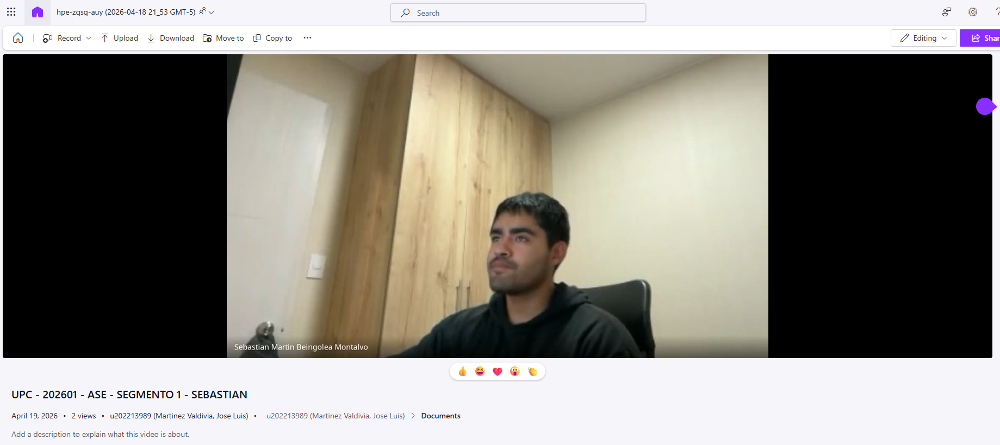 

 

**Resumen**  
Controla temperatura con termómetro portátil en paradas y el indicador del camión. El sistema de cadena de frío es nativo del vehículo, elegido por sencillez. Planifica con hojas de ruta y bitácora manual. Cuando falla el frío, se avisa a central; los daños impactan tiempos y reclamos. Emite hoja de viaje firmada con datos de temperatura. Percibe el monitoreo como pesado y manual. Pide una plataforma que integre panel del camión + app móvil con notificaciones cuando se sale del estándar.

**Rasgos objetivos**  
_Herramientas_: Indicador del camión, termómetro, bitácora.
_Canales_: Llamada a central.
_Dispositivo_: Celular personal; cabina camión.

**Rasgos subjetivos**

- Busca simplicidad y automatización de tareas repetitivas.

**Dolores / Oportunidades**
_Pain_: Monitoreo manual constante; reacción tardía.
_Need_: App móvil con push alerts, captura automática de lecturas.

**Implicancias para Carga-Safe**
_Requisitos_: App conductor (checklist, lecturas guiadas, foto/nota), notificaciones.

 

---

  

### Segmento 2: Clientes Finales (Consumidores finales)

- **Nombre**: Adrián Zapata
- **Edad**: 23 años
- **Ocupación**: Responsable de parrilla en un negocio de comida rápida
- **Empresa/Sector**: Negocio local de comida rápida / Sector alimentario
- **Enlace**: [URL del video de la entrevista](https://upcedupe-my.sharepoint.com/:v:/g/personal/u20201c410_upc_edu_pe/EQnkVAuczH1LrYiGNF_7JdcBPW2RT-EsqX0thMbMGisRKg?e=xwhjks&nav=eyJyZWZlcnJhbEluZm8iOnsicmVmZXJyYWxBcHAiOiJTdHJlYW1XZWJBcHAiLCJyZWZlcnJhbFZpZXciOiJTaGFyZURpYWxvZy1MaW5rIiwicmVmZXJyYWxBcHBQbGF0Zm9ybSI6IldlYiIsInJlZmVycmFsTW9kZSI6InZpZXcifSwicGxheWJhY2tPcHRpb25zIjp7InN0YXJ0VGltZUluU2Vjb25kcyI6MTI1MS44OX19)
- **Fecha de entrevista**: 10 de Setiembre del 2025
- **Tiempo inicio - tiempo fin**: 00:20:51 - 00:30:50
   
  
   

**Resumen**  
_Verifica al recibir_: estado físico, frío al tacto, indicadores simples; desconfía de la cadena previa. Aumenta confianza con datos en tiempo real y trazabilidad.
_Información valiosa_: tiempo y temperatura en trayecto; notificaciones ante retrasos (tráfico) o temperaturas fuera de rango. Prefiere WhatsApp para avisos y un portal/app para consultar detalles on-demand. Quiere interfaces claras, en °C y tipografía grande. Pide notificaciones al proveedor además del cliente.

**Tecnología & canales**  

- WhatsApp como principal; App/portal web como consulta.
- Smartphone predominante.

**Dolores / Oportunidades**  
_Pain_: Incertidumbre en ruta; impacto de retrasos.
_Need_: ETA (calculo de duracion de ruta) + temperatura en vivo; doble notificación (cliente/proveedor).

**Implicancias para CargaSafe**  
_Requisitos_: Link para seguimiento, push WhatsApp/SMS configurable, UI accesible (alto contraste, números grandes).

---

 

---

 

- **Nombre**: Maria Vallejos
- **Edad**: 22 años
- **Ocupación**: Trabajadora de medio tiempo en un minimarket, responsable de compras de insumos para refrigeración
- **Empresa/Sector**: Retail alimentario local – Consumo final
- **Enlace**: [URL del video de la entrevista](https://upcedupe-my.sharepoint.com/:v:/g/personal/u202213989_upc_edu_pe/IQCI6MustT6BQYlo3t33Th0aAdd1QhrtHP_3yR0fex2MvDI?nav=eyJyZWZlcnJhbEluZm8iOnsicmVmZXJyYWxBcHAiOiJTdHJlYW1XZWJBcHAiLCJyZWZlcnJhbFZpZXciOiJTaGFyZURpYWxvZy1MaW5rIiwicmVmZXJyYWxBcHBQbGF0Zm9ybSI6IldlYiIsInJlZmVycmFsTW9kZSI6InZpZXcifX0%3D&e=Cu1n2G)
- **Fecha de entrevista**: 19 de Abril del 2026
- **Tiempo inicio - tiempo fin**: 00:00:00 - 00:06:30
   
  
   

**Resumen**  
_Audita recepción_: integridad del empaque, condensación, frío al tacto, fecha de vencimiento. Confía parcialmente en reportes; requiere datos trazables y consistentes con lo recibido. _Información clave_: temperatura a lo largo del trayecto, eventos fuera de rango, tiempos. Rechazó lote de yogures por tibieza/inflado; proveedor sin justificación. Prefiere portal o app para consultar sin llamadas; notificaciones breves ante retrasos/problemas. Valora interfaces simples con gráficos y reportes descargables para evidencias.

**Tecnología & canales**  
App/portal web, notificaciones breves; móvil como dispositivo principal.

**Dolores / Oportunidades**  
_Pain_: Reportes genéricos; inconsistencias.
_Need_: Logs detallados, exportables y comparables por pedido.

**Implicancias para CargaSafe**  
_Requisitos_: Panel cliente con histórico por pedido, botón Descargar PDF/CSV, alertas de retraso y anomalía térmica.

   

---

  

   

### 2.2.3. Análisis de entrevistas

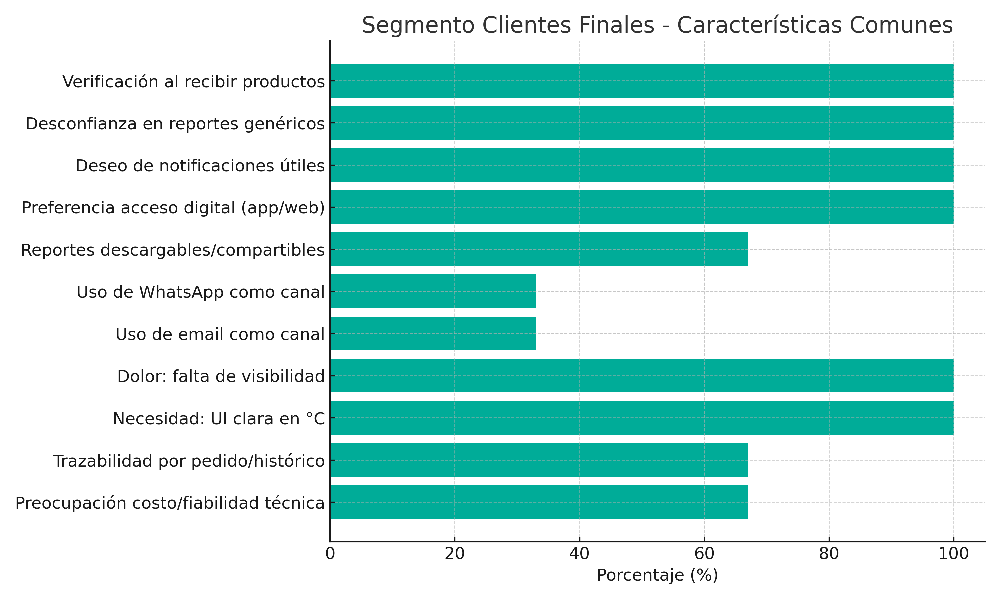

 
 

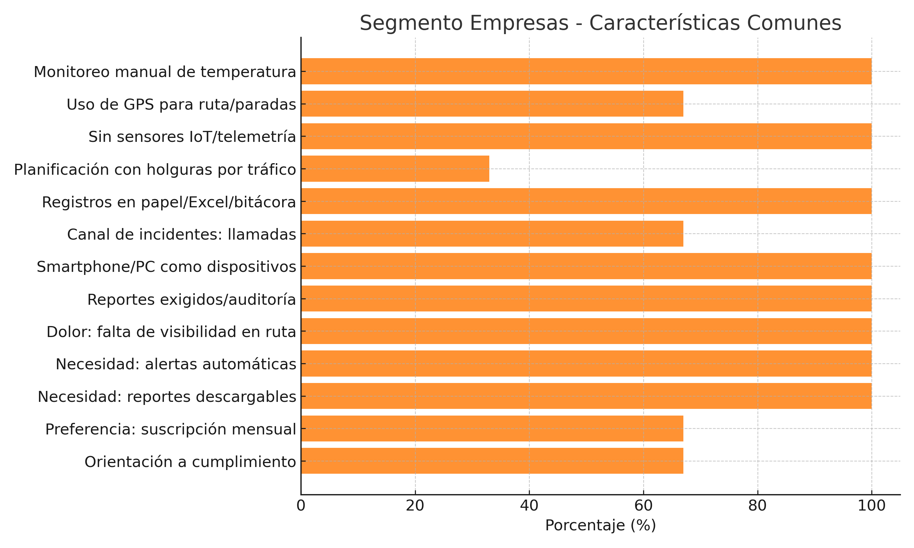

 
 

## 2.3. Needfinding

### 2.3.1. User Personas

- **Segmento: Empresa (Gestores de transporte)**

  

  **Carlos Mendoza - Jefe de Logística**  
  El user persona de Carlos representa al gestor experimentado que prioriza la eficiencia operativa y la minimización de riesgos. Muestra la necesidad de herramientas tecnológicas robustas y precisas que le permitan mantener control total sobre la cadena de frío. Su perfil refleja la importancia de la confiabilidad del sistema, ya que cualquier falla puede resultar en pérdidas económicas significativas y problemas regulatorios. Carlos ejemplifica al usuario que valora los datos en tiempo real, reportes detallados y funcionalidades que le permitan tomar decisiones informadas para proteger productos de alto valor.

   

- **Segmento: Clientes Finales (Consumidores finales)**

  

  **María González - Gerente de Compras de Restaurante**  
  El user persona de María representa al consumidor final que valora la transparencia y la calidad en los productos que adquiere para su negocio. Como responsable de compras de un restaurante, necesita la seguridad de que los alimentos que recibe han mantenido la cadena de frío adecuada durante el transporte. Su perfil ilustra la importancia de contar con información clara y accesible sobre el estado de los productos, reportes de cumplimiento fáciles de entender, y la capacidad de verificar la integridad de los alimentos antes de aceptar las entregas. María ejemplifica al usuario que busca confianza y transparencia en el proceso logístico para proteger la reputación de su negocio.

   

### 2.3.2. User Task Matrix

**Segmento: Empresa (Gestores de transporte)**

| Tarea                                                                             | Frecuencia | Importancia |
| --------------------------------------------------------------------------------- | ---------- | ----------- |
| Llamar a conductores para verificar condiciones de carga manualmente              | Alta       | Alta        |
| Revisar múltiples parámetros (temperatura, humedad, vibración) al final del viaje | Alta       | Alta        |
| Completar bitácoras en papel con datos de condiciones del cargamento              | Alta       | Media       |
| Buscar información de viajes en múltiples sistemas desintegrados                  | Alta       | Media       |
| Coordinar por teléfono cuando hay incidencias en las condiciones de transporte    | Media      | Alta        |
| Recopilar firmas y documentos físicos de entregas                                 | Alta       | Media       |
| Armar reportes manuales combinando datos de diferentes fuentes                    | Media      | Alta        |
| Enviar unidades de emergencia cuando se detecta falla en el transporte            | Baja       | Alta        |
| Atender consultas de clientes por falta de visibilidad en tiempo real             | Media      | Alta        |
| Revisar rutas en GPS básico sin integración con sensores de carga                 | Alta       | Media       |
| Capacitar conductores en procedimientos de verificación de carga                  | Baja       | Media       |
| Verificar manualmente el funcionamiento de sistemas de conservación               | Alta       | Alta        |
| Consolidar información de múltiples dispositivos y plataformas                    | Alta       | Alta        |

**Segmento: Clientes Finales (Consumidores finales)**

| Tarea                                                                     | Frecuencia | Importancia |
| ------------------------------------------------------------------------- | ---------- | ----------- |
| Verificar productos visualmente al recibirlos                             | Alta       | Alta        |
| Inspeccionar condiciones físicas de productos sensibles                   | Alta       | Alta        |
| Llamar al proveedor para preguntar estado del envío                       | Media      | Media       |
| Examinar empaques buscando señales de deterioro o daños                   | Alta       | Alta        |
| Rechazar productos que muestran signos de mal manejo                      | Media      | Alta        |
| Solicitar reportes de trazabilidad que suelen ser genéricos o incompletos | Media      | Alta        |
| Esperar sin información sobre el estado real de sus pedidos               | Media      | Alta        |
| Revisar fechas de vencimiento y condiciones de almacenamiento             | Alta       | Alta        |
| Registrar incidencias de productos que llegan en mal estado               | Baja       | Alta        |
| Aceptar productos sin evidencia objetiva de las condiciones de transporte | Alta       | Media       |
| Realizar reclamos por productos deteriorados o fuera de especificación    | Baja       | Alta        |
| Archivar documentación física de entregas                                 | Media      | Baja        |
| Validar cumplimiento de condiciones especiales sin datos verificables     | Alta       | Alta        |

### 2.3.3. User Journey Mapping

## Journey Map: Carlos Mendoza (Gestor de transporte)

El Journey Map de Carlos muestra un proceso de 5 etapas desde la planificación hasta la entrega final. Sus momentos críticos se concentran en la configuración de parámetros correctos y la gestión eficiente de alertas durante el viaje. Las oportunidades principales incluyen simplificar la configuración inicial con plantillas predefinidas, proporcionar dashboards unificados durante el monitoreo, y automatizar la generación de reportes post-viaje. Sus mayores pain points están en la complejidad de configuración y la falta de contexto en las alertas críticas.

 

## Journey Map: María González (Gerente de Compras de Restaurante)

El journey map de María ilustra un proceso enfocado en la verificación y validación de productos desde la solicitud hasta la aceptación final. Sus momentos críticos se centran en la recepción de productos y la verificación de que cumplan con los estándares de calidad requeridos. Las oportunidades principales incluyen proporcionar acceso fácil a reportes de cumplimiento, notificaciones proactivas sobre el estado del transporte, y documentación clara que facilite la toma de decisiones de aceptación. Sus mayores pain points están en la falta de transparencia durante el transporte y la dificultad para verificar la integridad de los productos al momento de la entrega.

 

### 2.3.4. Empathy Mapping

## Segmento: Empresa (Gestores de transporte) - Carlos Mendoza

El empathy map de Carlos revela a un profesional experimentado que busca control total y confiabilidad en los sistemas de monitoreo. Sus principales preocupaciones giran en torno a las pérdidas económicas por fallas en la cadena de frío y la necesidad de mantener la reputación empresarial. Valora la tecnología que le proporcione visibilidad en tiempo real, reportes automáticos y alertas accionables que le permitan responder rápidamente ante incidentes. Su enfoque está en el ROI medible y sistemas que cumplan con regulaciones estrictas.

 

## Segmento: Clientes Finales (Consumidores finales) - María González

El empathy map de María revela a una profesional responsable que prioriza la calidad y la confianza en sus proveedores. Sus principales preocupaciones se centran en la reputación de su negocio y la satisfacción de sus clientes finales. Valora la transparencia en el proceso de transporte, documentación clara de cumplimiento, y la capacidad de tomar decisiones informadas sobre la aceptación de productos. Su dolor principal es la incertidumbre sobre las condiciones de transporte y la falta de información confiable que le permita verificar la calidad de los productos. Su ganancia principal es tener acceso a información transparente y reportes de cumplimiento que le den confianza para aceptar productos y mantener la calidad en su negocio.

 
# Capítulo III: Requirements Specification

## 3.1. User Stories

| Epic / Story ID | Título                                       | Descripción                                                                                                                                                                                                                  | Criterios de Aceptación                                                                                                                                                                                                                                                                                                                                                                                                                                                                                                                                                                                                                                                                                                                                                                                                                                                                                                                                                                                                                                                                                                                                                                                                                                                                                                                                                                                                                                                                                                                                                                                                                                                                                                                                                                                                                                                                                                                                                                                  | Relacionado con (Epic ID) |
| --------------- | -------------------------------------------- | ---------------------------------------------------------------------------------------------------------------------------------------------------------------------------------------------------------------------------- | -------------------------------------------------------------------------------------------------------------------------------------------------------------------------------------------------------------------------------------------------------------------------------------------------------------------------------------------------------------------------------------------------------------------------------------------------------------------------------------------------------------------------------------------------------------------------------------------------------------------------------------------------------------------------------------------------------------------------------------------------------------------------------------------------------------------------------------------------------------------------------------------------------------------------------------------------------------------------------------------------------------------------------------------------------------------------------------------------------------------------------------------------------------------------------------------------------------------------------------------------------------------------------------------------------------------------------------------------------------------------------------------------------------------------------------------------------------------------------------------------------------------------------------------------------------------------------------------------------------------------------------------------------------------------------------------------------------------------------------------------------------------------------------------------------------------------------------------------------------------------------------------------------------------------------------------------------------------------------------------------------- | ------------------------- |
| E1              | Landing Page                                 | Página principal con secciones informativas y de contacto para captar y orientar a los visitantes.                                                                                                                           |                                                                                                                                                                                                                                                                                                                                                                                                                                                                                                                                                                                                                                                                                                                                                                                                                                                                                                                                                                                                                                                                                                                                                                                                                                                                                                                                                                                                                                                                                                                                                                                                                                                                                                                                                                                                                                                                                                                                                                                                          |                           |
| E2              | Autenticación                                | Módulo de registro e inicio de sesión seguro para usuarios.                                                                                                                                                                  |                                                                                                                                                                                                                                                                                                                                                                                                                                                                                                                                                                                                                                                                                                                                                                                                                                                                                                                                                                                                                                                                                                                                                                                                                                                                                                                                                                                                                                                                                                                                                                                                                                                                                                                                                                                                                                                                                                                                                                                                          |                           |
| E3              | Gestión de flota                             | Administración de la flota: registro, actualización y baja de vehículos.                                                                                                                                                     |                                                                                                                                                                                                                                                                                                                                                                                                                                                                                                                                                                                                                                                                                                                                                                                                                                                                                                                                                                                                                                                                                                                                                                                                                                                                                                                                                                                                                                                                                                                                                                                                                                                                                                                                                                                                                                                                                                                                                                                                          |                           |
| E4              | Planificador de viajes                       | Creación y actualización de estados de los viajes.                                                                                                                                                                           |                                                                                                                                                                                                                                                                                                                                                                                                                                                                                                                                                                                                                                                                                                                                                                                                                                                                                                                                                                                                                                                                                                                                                                                                                                                                                                                                                                                                                                                                                                                                                                                                                                                                                                                                                                                                                                                                                                                                                                                                          |                           |
| E5              | Monitoreo en tiempo real                     | Engloba funcionalidades de monitoreo de temperatura en tiempo real y alertas.                                                                                                                                                |                                                                                                                                                                                                                                                                                                                                                                                                                                                                                                                                                                                                                                                                                                                                                                                                                                                                                                                                                                                                                                                                                                                                                                                                                                                                                                                                                                                                                                                                                                                                                                                                                                                                                                                                                                                                                                                                                                                                                                                                          |                           |
| E6              | Dashboard de viajes                          | Engloba pantallas, gráficos e informes relacionados a los viajes.                                                                                                                                                            |                                                                                                                                                                                                                                                                                                                                                                                                                                                                                                                                                                                                                                                                                                                                                                                                                                                                                                                                                                                                                                                                                                                                                                                                                                                                                                                                                                                                                                                                                                                                                                                                                                                                                                                                                                                                                                                                                                                                                                                                          |                           |
| E7              | Módulo de suscripciones                      | Engloba funcionalidades de pago, manejo y control de suscripciones.                                                                                                                                                          |                                                                                                                                                                                                                                                                                                                                                                                                                                                                                                                                                                                                                                                                                                                                                                                                                                                                                                                                                                                                                                                                                                                                                                                                                                                                                                                                                                                                                                                                                                                                                                                                                                                                                                                                                                                                                                                                                                                                                                                                          |                           |
| US001           | Navegación en landing page                   | **Como** visitante  **quiero** acceder a diferentes secciones del servicio  **para** informarme sobre la plataforma.                                                                                                   | Scenario: Acceso a información principal Given un visitante accede a la landing page When solicita información sobre el servicio Then obtiene el contenido correspondiente a cada sección (Inicio, Características, Planes, Contacto)  Scenario: Acceso completo a todas las secciones Given un visitante quiere explorar la plataforma When realiza solicitudes de información sobre distintas secciones Then recibe los datos correctos de cada sección sin errores                                                                                                                                                                                                                                                                                                                                                                                                                                                                                                                                                                                                                                                                                                                                                                                                                                                                                                                                                                                                                                                                                                                                                                                                                                                                                                                                                                                                                                                                                                            | E1                        |
| US002           | Sección portada                              | **Como** visitante,  **quiero** conocer el mensaje principal del servicio,  **para** entender rápidamente el propósito de la plataforma.                                                                               | Scenario: Mensaje principal disponible Given un visitante accede a la plataforma When solicita información general sobre el servicio Then recibe un mensaje claro que describe el propósito y la propuesta de valor                                                                                                                                                                                                                                                                                                                                                                                                                                                                                                                                                                                                                                                                                                                                                                                                                                                                                                                                                                                                                                                                                                                                                                                                                                                                                                                                                                                                                                                                                                                                                                                                                                                                                                                                                                             | E1                        |
| US003           | Sección de funcionalidades                   | **Como** visitante,  **quiero** conocer las funcionalidades principales de la plataforma,  **para** entender qué servicios puedo utilizar.                                                                             | Scenario: Funcionalidades disponibles Given un visitante accede a la plataforma When solicita información sobre las funcionalidades Then el sistema entrega al menos tres funcionalidades principales de la plataforma                                                                                                                                                                                                                                                                                                                                                                                                                                                                                                                                                                                                                                                                                                                                                                                                                                                                                                                                                                                                                                                                                                                                                                                                                                                                                                                                                                                                                                                                                                                                                                                                                                                                                                                                                                          | E1                        |
| US004           | Sección de beneficios                        | **Como** visitante,  **quiero** conocer los beneficios de la plataforma,  **para** entender qué valor obtengo al usarla.                                                                                               | Scenario: Beneficios disponibles Given un visitante solicita información sobre la plataforma When el sistema procesa la solicitud Then entrega la lista de beneficios disponibles de forma clara y completa                                                                                                                                                                                                                                                                                                                                                                                                                                                                                                                                                                                                                                                                                                                                                                                                                                                                                                                                                                                                                                                                                                                                                                                                                                                                                                                                                                                                                                                                                                                                                                                                                                                                                                                                                                                     | E1                        |
| US005           | Sección de testimonios                       | **Como** visitante,  **quiero** conocer experiencias de otros clientes,  **para** generar confianza en el servicio.                                                                                                    | Scenario: Testimonios disponibles Given un visitante solicita información sobre la experiencia de otros usuarios When el sistema procesa la solicitud Then entrega al menos dos testimonios verificados de clientes o usuarios con sus datos generales                                                                                                                                                                                                                                                                                                                                                                                                                                                                                                                                                                                                                                                                                                                                                                                                                                                                                                                                                                                                                                                                                                                                                                                                                                                                                                                                                                                                                                                                                                                                                                                                                                                                                                                                          | E1                        |
| US006           | Sección de contáctanos                       | **Como** visitante,  **quiero** enviar consultas o solicitudes a la empresa,  **para** recibir información o soporte.                                                                                                  | Scenario: Envío de mensaje válido Given un visitante proporciona nombre, correo y mensaje válidos When envía la información al sistema Then el sistema registra la solicitud y confirma que fue recibida  Scenario: Envío de mensaje con datos inválidos Given un visitante omite datos requeridos When envía la información Then el sistema rechaza la solicitud y notifica al visitante sobre los campos faltantes o incorrectos                                                                                                                                                                                                                                                                                                                                                                                                                                                                                                                                                                                                                                                                                                                                                                                                                                                                                                                                                                                                                                                                                                                                                                                                                                                                                                                                                                                                                                                                                                                                               | E1                        |
| US007           | Call to Action a la aplicación web           | **Como** visitante  **quiero** acceder a la aplicación web  **para** registrarme o iniciar sesión y usar el servicio desde un navegador.                                                                               | Scenario: Acceso a la app web Given un visitante quiere usar la plataforma web When solicita iniciar sesión o registrarse Then el sistema le permite autenticarse y acceder a las funcionalidades disponibles                                                                                                                                                                                                                                                                                                                                                                                                                                                                                                                                                                                                                                                                                                                                                                                                                                                                                                                                                                                                                                                                                                                                                                                                                                                                                                                                                                                                                                                                                                                                                                                                                                                                                                                                                                                   | E1                        |
| US008           | Call to Action de descarga de App Móvil      | **Como** visitante  **quiero** descargar la aplicación móvil  **para** instalarla en mi dispositivo y usar la plataforma.                                                                                              | Scenario: Descarga de la app móvil Given un visitante desea usar la app móvil When solicita la descarga Then el sistema proporciona los medios correctos para descargar la aplicación según su dispositivo (iOS o Android)                                                                                                                                                                                                                                                                                                                                                                                                                                                                                                                                                                                                                                                                                                                                                                                                                                                                                                                                                                                                                                                                                                                                                                                                                                                                                                                                                                                                                                                                                                                                                                                                                                                                                                                                                                      | E1                        |
| US009           | Registro de usuario                          | **Como** usuario **quiero** registrarme en la plataforma **para** acceder a mi cuenta y funcionalidades personalizadas.                                                                                                | Scenario: Registro exitoso Given un usuario no registrado When proporciona credenciales válidas Then el sistema crea la cuenta y permite acceso a la plataforma  Scenario: Registro inválido Given un usuario no registrado When proporciona credenciales incorrectas o incompletas Then el sistema rechaza la creación de la cuenta y notifica el error                                                                                                                                                                                                                                                                                                                                                                                                                                                                                                                                                                                                                                                                                                                                                                                                                                                                                                                                                                                                                                                                                                                                                                                                                                                                                                                                                                                                                                                                                                                                                                                                                         | E2                        |
| US010           | Inicio de sesión                             | **Como** usuario **quiero** iniciar sesión en la plataforma **para** acceder a mi cuenta y funcionalidades personalizadas.                                                                                             | Scenario: Inicio de sesión válido Given un usuario registrado When ingresa credenciales correctas Then el sistema autentica y permite acceso  Scenario: Inicio de sesión inválido Given un usuario registrado When ingresa credenciales incorrectas Then el sistema rechaza la autenticación y muestra error                                                                                                                                                                                                                                                                                                                                                                                                                                                                                                                                                                                                                                                                                                                                                                                                                                                                                                                                                                                                                                                                                                                                                                                                                                                                                                                                                                                                                                                                                                                                                                                                                                                                     | E2                        |
| US011           | Cerrar sesión                                | **Como** usuario autenticado **quiero** cerrar sesión desde la aplicación  **para** que mi cuenta deje de estar accesible en el dispositivo actual.                                                                    | Scenario 1: Cierre de sesión exitoso Given que el usuario tiene un token válido y está autenticado When solicita cerrar sesión Then se elimina el token del lado del cliente And los siguientes intentos de acceder a recursos requieren autenticación nuevamente                                                                                                                                                                                                                                                                                                                                                                                                                                                                                                                                                                                                                                                                                                                                                                                                                                                                                                                                                                                                                                                                                                                                                                                                                                                                                                                                                                                                                                                                                                                                                                                                                                                                                                                            | E2                        |
| US012           | Recuperar contraseña                         | **Como** usuario **quiero** recuperar el acceso a mi cuenta mediante un proceso de restablecimiento de contraseña  **para** poder ingresar nuevamente en caso de olvidar mis credenciales.                             | Scenario 1: Solicitud de recuperación Given un cliente no recuerda su contraseña When solicita la recuperación en la pantalla de inicio de sesión e ingresa su correo registrado Then el sistema envía un correo electrónico con un enlace seguro para restablecer la contraseña  Scenario 2: Enlace válido y único Given el cliente recibe un enlace de restablecimiento When hace clic en el enlace dentro del tiempo de validez (ej. 15 minutos) Then el sistema muestra un formulario para crear una nueva contraseña And valida que el enlace no haya sido usado previamente  Scenario 3: Enlace expirado Given un cliente recibe un enlace de restablecimiento When intenta usarlo después del tiempo de validez Then el sistema rechaza el intento And muestra el mensaje “El enlace ha expirado, solicita nuevamente la recuperación de contraseña”  Scenario 4: Contraseña actualizada correctamente Given el cliente ingresa una nueva contraseña válida When confirma el restablecimiento Then el sistema actualiza la contraseña en la base de datos And notifica al cliente que el cambio se realizó con éxito                                                                                                                                                                                                                                                                                                                                                                                                                                                                                                                                                                                                                                                                                                                                                                                                               | E2                        |
| US013           | Registro de vehículos de carga               | **Como** administrador logístico,  **quiero** registrar vehículos en la plataforma,  **para** mantener un inventario actualizado de la flota.                                                                          | Scenario: Registrar un vehículo válido Given el administrador cuenta con los datos de marca, modelo, placa, capacidad y dimensiones When el administrador registra el vehículo en la plataforma Then el sistema guarda el vehículo como parte de la flota activa  Scenario: Registro sin datos obligatorios Given el administrador omite campos requeridos como marca, modelo o placa When intenta registrar el vehículo Then el sistema rechaza el registro y muestra un error de validación  Scenario: Validar formato de placa Given el administrador ingresa un formato de placa incorrecto When intenta registrar el vehículo Then el sistema rechaza el registro y solicita un formato válido  Scenario: Validar dimensiones del vehículo Given el administrador ingresa dimensiones físicas del vehículo (alto, ancho, largo) When las dimensiones son numéricas y positivas Then el sistema acepta los valores y guarda la información  Scenario: Validar capacidad de carga Given el administrador ingresa capacidad de carga en kilogramos When la capacidad es mayor a 0 Then el sistema guarda el valor correctamente And el sistema rechaza valores negativos o nulos                                                                                                                                                                                                                                                                                                                                                                                                                                                                                                                                                                                                                                                                                                                                               | E3                        |
| US014           | Actualización de datos de vehículos de carga | **Como** administrador logístico, **quiero** editar la información de los vehículos, **para** mantener actualizado su estado operativo.                                                                                      | Scenario: Actualizar información básica del vehículo Given existe un vehículo registrado en la plataforma When el administrador modifica la marca, modelo o dimensiones Then el sistema actualiza la información y guarda los cambios en el historial  Scenario: Validar actualización de placa duplicada Given un vehículo ya tiene registrada una placa única When el administrador intenta asignar esa misma placa a otro vehículo Then el sistema rechaza la actualización y muestra un error de duplicidad  Scenario: Mantener consistencia en datos obligatorios Given existe un vehículo registrado When el administrador elimina un dato obligatorio como marca o modelo Then el sistema rechaza la actualización y mantiene los datos anteriores                                                                                                                                                                                                                                                                                                                                                                                                                                                                                                                                                                                                                                                                                                                                                                                                                                                                                                                                                                                                                                                                                                                                                                                                         | E3                        |
| US015           | Eliminación de vehículos de carga            | **Como** administrador logístico, **quiero** eliminar vehículos de la plataforma, **para** mantener un inventario actualizado y evitar registros obsoletos.                                                                  | Scenario: Eliminar vehículo activo Given un vehículo está registrado en la flota When el administrador elimina el vehículo Then el sistema cambia su estado a "inactivo" And conserva su historial de viajes y mantenimientos  Scenario: Intentar eliminar vehículo con viaje en curso Given un vehículo tiene un viaje activo When el administrador intenta eliminarlo Then el sistema rechaza la eliminación And muestra un mensaje indicando que el vehículo tiene viajes pendientes  Scenario: Eliminación exitosa de vehículo sin viajes en curso Given un vehículo no tiene viajes activos When el administrador lo elimina Then el sistema lo marca como eliminado And ya no aparece en el inventario activo de la flota                                                                                                                                                                                                                                                                                                                                                                                                                                                                                                                                                                                                                                                                                                                                                                                                                                                                                                                                                                                                                                                                                                                                                                                                                          | E3                        |
| US016           | Registro de dispositivos IoT                 | **Como** Administrador Logístico  **quiero** registrar un dispositivo IoT en la plataforma  **para** asociarlo a la flota y comenzar a recibir sus datos.                                                              | Scenario: Registro exitoso de dispositivo nuevo  Given un dispositivo IoT con un ID único  When el administrador lo registra en la plataforma  Then el sistema almacena el dispositivo en la base de datos  And queda disponible para asignarlo a un vehículo de carga  Scenario: Intentar registrar dispositivo duplicado  Given un dispositivo IoT con un ID ya registrado  When el administrador intenta registrarlo nuevamente  Then el sistema rechaza el registro  And muestra un mensaje "El dispositivo ya está registrado"  Scenario: Validación de campos obligatorios  Given un administrador intenta registrar un dispositivo sin datos requeridos como deviceId o tipo  When envía la solicitud de registro  Then el sistema rechaza el registro  And muestra un mensaje indicando los campos faltantes                                                                                                                                                                                                                                                                                                                                                                                                                                                                                                                                                                                                                                                                                                                                                                                                                                                                                                                                                                                                                                                                                                                                     | E3                        |
| US017           | Eliminar dispositivo IoT                     | **Como** Administrador Logístico,  **quiero** eliminar un dispositivo IoT de la plataforma,  **para** darlo de baja en caso de falla o reemplazo.                                                                      | Scenario: Eliminar dispositivo inactivo  Given un dispositivo IoT está registrado en la plataforma y no transmite datos  When el administrador elimina el dispositivo  Then el sistema cambia su estado a _“inactivo”_  And conserva su historial de transmisiones y alertas  Scenario: Intentar eliminar dispositivo activo  Given un dispositivo está enviando datos en tiempo real  When el administrador intenta eliminarlo  Then el sistema rechaza la eliminación  And muestra un mensaje indicando que el dispositivo sigue activo  Scenario: Eliminación exitosa de dispositivo sin actividad reciente  Given un dispositivo no transmite datos desde hace más de 24h  When el administrador lo elimina  Then el sistema lo marca como _“eliminado”_  And ya no aparece en la lista de dispositivos activos                                                                                                                                                                                                                                                                                                                                                                                                                                                                                                                                                                                                                                                                                                                                                                                                                                                                                                                                                                                                                                                                                                                                      | E3                        |
| US018           | Asignar dispositivo a vehículo de carga      | **Como** Administrador Logístico  **quiero** asignar un dispositivo IoT a un vehículo de carga  **para** identificar a qué unidad pertenece cada transmisión de datos                                                  | Scenario: Asignar dispositivo a vehículo disponible  Given un dispositivo IoT registrado y sin asignar  When el administrador selecciona un vehículo de la flota  Then el sistema vincula el dispositivo a ese vehículo  And las próximas transmisiones aparecen bajo ese vehículo  Scenario: Intentar asignar dispositivo ya vinculado  Given un dispositivo IoT ya asignado a un vehículo  When el administrador intenta asignarlo a otro sin liberar la relación  Then el sistema rechaza la acción  And muestra el mensaje "Dispositivo ya vinculado"                                                                                                                                                                                                                                                                                                                                                                                                                                                                                                                                                                                                                                                                                                                                                                                                                                                                                                                                                                                                                                                                                                                                                                                                                                                                                                                                                                                                                  | E3                        |
| US019           | Cambiar dispositivo de vehículo              | **Como** Administrador Logístico  **quiero** reasignar un dispositivo IoT de un vehículo a otro  **para** reutilizarlo en caso de mantenimiento o rotación de la flota                                                 | Scenario: Reasignar dispositivo a otro vehículo  Given un dispositivo IoT asignado a un vehículo  When el administrador lo reasigna a un vehículo diferente  Then el sistema actualiza la relación  And las transmisiones futuras aparecen bajo el nuevo vehículo  Scenario: Confirmar cambio en inventario  Given un dispositivo IoT reasignado de un vehículo a otro  When el administrador consulta el vehículo anterior  Then el dispositivo ya no aparece en su lista de dispositivos asociados                                                                                                                                                                                                                                                                                                                                                                                                                                                                                                                                                                                                                                                                                                                                                                                                                                                                                                                                                                                                                                                                                                                                                                                                                                                                                                                                                                                                                                                                          | E3                        |
| US020           | Ver vehículos de carga                       | **Como** Administrador Logístico  **quiero** visualizar la lista de vehículos de carga registrados en la plataforma  **para** supervisar y gestionar el inventario                                                     | Scenario: Consulta de lista de vehículos  Given existen vehículos registrados en la base de datos  When el administrador accede a la sección de vehículos  Then el sistema muestra la lista con placa, modelo, estado y capacidad de cada vehículo  Scenario: Lista vacía de vehículos  Given no existen vehículos registrados en la base de datos  When el administrador consulta la sección de vehículos  Then el sistema muestra un mensaje “No hay vehículos registrados”  Scenario: Consulta de detalle de vehículo  Given un vehículo está registrado en la base de datos  When el administrador selecciona un vehículo de la lista  Then el sistema muestra su información completa                                                                                                                                                                                                                                                                                                                                                                                                                                                                                                                                                                                                                                                                                                                                                                                                                                                                                                                                                                                                                                                                                                                                                                                                                                                                        | E3                        |
| US021           | Ver dispositivos IoT                         | **Como** Administrador Logístico  **quiero** visualizar la lista de dispositivos IoT registrados en la plataforma  **para** supervisar su estado y administración                                                      | Scenario: Consulta de lista de dispositivos  Given existen dispositivos IoT registrados en la base de datos  When el administrador accede a la sección de dispositivos  Then el sistema muestra la lista con ID, tipo, estado y vehículo asignado de cada dispositivo  Scenario: Lista vacía de dispositivos  Given no existen dispositivos IoT registrados en la base de datos  When el administrador consulta la sección de dispositivos  Then el sistema muestra un mensaje “No hay dispositivos registrados”  Scenario: Consulta de detalle de dispositivo  Given un dispositivo IoT está registrado en la base de datos  When el administrador selecciona un dispositivo de la lista  Then el sistema muestra su información completa                                                                                                                                                                                                                                                                                                                                                                                                                                                                                                                                                                                                                                                                                                                                                                                                                                                                                                                                                                                                                                                                                                                                                                                                                        | E3                        |
| US022           | Ver estado de dispositivo por vehículo       | **Como** Administrador Logístico  **quiero** visualizar el estado de todos los dispositivos asociados a un vehículo en el dashboard  **para** monitorear su funcionamiento                                             | Scenario: Ver dispositivos conectados  Given un vehículo con dispositivos asignados  When el administrador lo selecciona en el dashboard  Then se listan los dispositivos con estado online u offline  Scenario: Detectar dispositivo desconectado  Given un dispositivo deja de transmitir datos por más de 5 minutos  When el sistema verifica su estado  Then lo marca como "Desconectado"  Scenario: Recuperar estado conectado  Given un dispositivo previamente desconectado  When transmite datos nuevamente  Then la plataforma actualiza su estado a "Conectado"                                                                                                                                                                                                                                                                                                                                                                                                                                                                                                                                                                                                                                                                                                                                                                                                                                                                                                                                                                                                                                                                                                                                                                                                                                                                                                                                                                                         | E3                        |
| US023           | Ver estado de dispositivo                    | **Como** usuario del dispositivo **quiero** conocer el estado del dispositivo  **para** verificar rápidamente si funciona correctamente.                                                                               | Scenario: Dispositivo activo y funcionando Given el dispositivo está encendido y transmite datos correctamente When el usuario solicita el estado del dispositivo Then el sistema indica que el dispositivo está operativo y conectado  Scenario: Dispositivo sin conexión Given el dispositivo ha perdido conectividad When el usuario solicita el estado del dispositivo Then el sistema indica que el dispositivo no está transmitiendo datos  Scenario: Batería baja Given el dispositivo tiene un nivel de batería inferior al 20% When el usuario solicita el estado del dispositivo Then el sistema alerta sobre el nivel bajo de batería  Scenario: Dispositivo apagado Given el dispositivo ha sido apagado When el usuario solicita el estado del dispositivo Then el sistema indica que el dispositivo está apagado o inactivo                                                                                                                                                                                                                                                                                                                                                                                                                                                                                                                                                                                                                                                                                                                                                                                                                                                                                                                                                                                                                                                                                                          | E3                        |
| US024           | Creación de viajes                           | **Como** administrador logístico,  **quiero** crear viajes asignando vehículo y ruta,  **para** planificar el transporte de mercancías.                                                                                | Scenario: Crear viaje válido Given existe un vehículo disponible When el administrador crea un viaje con origen y destino Then el sistema registra el viaje con estado "Pendiente"                                                                                                                                                                                                                                                                                                                                                                                                                                                                                                                                                                                                                                                                                                                                                                                                                                                                                                                                                                                                                                                                                                                                                                                                                                                                                                                                                                                                                                                                                                                                                                                                                                                                                                                                                                                                              | E4                        |
| US025           | Actualización de estados de viaje            | **Como** administrador logístico,  **quiero** actualizar el estado de un viaje,  **para** mantener informados a gerentes y clientes sobre el progreso de la entrega.                                                   | Scenario: Cambiar estado de viaje a "En ruta" Given existe un viaje con estado "Pendiente" When el administrador cambia su estado a "En ruta" Then el sistema actualiza el estado del viaje a "En ruta" And notifica a los clientes asociados  Scenario: Cambiar estado de viaje a "Finalizado" Given existe un viaje en estado "En ruta" When el administrador cambia el estado a "Finalizado" Then el sistema marca el viaje como finalizado And registra la fecha y hora de finalización  Scenario: Intentar cambiar estado de un viaje cancelado Given un viaje está en estado "Cancelado" When el administrador intenta modificar el estado Then el sistema rechaza la actualización And muestra un mensaje de restricción                                                                                                                                                                                                                                                                                                                                                                                                                                                                                                                                                                                                                                                                                                                                                                                                                                                                                                                                                                                                                                                                                                                                                                                                                          | E4                        |
| US026           | Reprogramación de viajes                     | **Como** administrador logístico,  **quiero** reprogramar un viaje ya creado,  **para** ajustar fechas y horarios en caso de cambios operativos.                                                                       | Scenario: Reprogramar un viaje válido Given existe un viaje programado con estado “Pendiente” When el administrador modifica la fecha y hora de inicio Then el sistema actualiza la información del viaje y guarda el cambio en el historial  Scenario: Intentar reprogramar un viaje en curso Given existe un viaje con estado “En ruta” When el administrador intenta cambiar la fecha u hora de inicio Then el sistema rechaza la reprogramación y muestra un mensaje de restricción                                                                                                                                                                                                                                                                                                                                                                                                                                                                                                                                                                                                                                                                                                                                                                                                                                                                                                                                                                                                                                                                                                                                                                                                                                                                                                                                                                                                                                                                                          | E4                        |
| US027           | Código de viaje para cliente                 | **Como** cliente final,  **quiero** recibir un código único de viaje,  **para** poder consultar fácilmente el estado de mi pedido.                                                                                     | Scenario: Generar código de viaje al crear pedido Given el administrador crea un viaje nuevo When el sistema registra el viaje Then se genera un código único y se envía al cliente por correo o notificación en la aplicación  Scenario: Consultar estado con código de viaje Given un cliente cuenta con el código de su viaje When ingresa el código en la aplicación Then el sistema muestra el estado actual del viaje en tiempo real                                                                                                                                                                                                                                                                                                                                                                                                                                                                                                                                                                                                                                                                                                                                                                                                                                                                                                                                                                                                                                                                                                                                                                                                                                                                                                                                                                                                                                                                                                                                       | E4                        |
| US028           | Actualización de temperatura en tiempo real  | **Como** empresa,  quiero recibir la temperatura en tiempo real de mis dispositivos IoT,  para supervisar la cadena de frío de los viajes.                                                                             | Given un sensor IoT transmite datos de temperatura When el sistema recibe los datos Then la temperatura se actualiza en la plataforma sin retrasos.  Given un dispositivo pierde conexión When intenta enviar datos Then el sistema muestra la última lectura disponible y marca estado de conexión                                                                                                                                                                                                                                                                                                                                                                                                                                                                                                                                                                                                                                                                                                                                                                                                                                                                                                                                                                                                                                                                                                                                                                                                                                                                                                                                                                                                                                                                                                                                                                                                                                                                                    | E4                        |
| US029           | Alertas por incumplimiento de temperatura    | **Como** cliente final,  **quiero** recibir alertas cuando la temperatura sobrepasa los límites definidos  **para** tomar acciones correctivas.                                                                        | Given la temperatura excede el rango permitido When el sistema procesa la lectura Then se genera una alerta y se notifica al usuario.  Given un usuario tiene notificaciones activadas When recibe una alerta Then visualiza el mensaje en el sistema o correo/SMS                                                                                                                                                                                                                                                                                                                                                                                                                                                                                                                                                                                                                                                                                                                                                                                                                                                                                                                                                                                                                                                                                                                                                                                                                                                                                                                                                                                                                                                                                                                                                                                                                                                                                                                     | E5                        |
| US030           | Alertas de conexión IoT                      | **Como** empresa,  **quiero** recibir alertas cuando un dispositivo IoT deja de enviar datos  **para** actuar de inmediato.                                                                                            | Given un dispositivo deja de transmitir por más de X minutos When el sistema detecta la ausencia Then genera una alerta para la empresa                                                                                                                                                                                                                                                                                                                                                                                                                                                                                                                                                                                                                                                                                                                                                                                                                                                                                                                                                                                                                                                                                                                                                                                                                                                                                                                                                                                                                                                                                                                                                                                                                                                                                                                                                                                                                                                            | E5                        |
| US031           | Roles y permisos de acceso                   | **Como** empresa,  **quiero** que el sistema gestione roles y permisos de usuarios (admin, cliente, operador)  **para** controlar accesos.                                                                             | Given un usuario con rol administrador When accede al panel de gestión Then puede realizar todas las operaciones.  Given un usuario con rol cliente When accede al sistema Then solo puede ver información de sus viajes y suscripciones                                                                                                                                                                                                                                                                                                                                                                                                                                                                                                                                                                                                                                                                                                                                                                                                                                                                                                                                                                                                                                                                                                                                                                                                                                                                                                                                                                                                                                                                                                                                                                                                                                                                                                                                               | E5                        |
| US032           | Lista de viajes registrados                  | **Como** empresa,  **quiero** ver una lista de todos los viajes registrados  **para** gestionarlos de forma rápida.                                                                                                    | Given un usuario autenticado accede al dashboard When solicita la lista de viajes Then el sistema muestra todos los viajes con sus datos principales.                                                                                                                                                                                                                                                                                                                                                                                                                                                                                                                                                                                                                                                                                                                                                                                                                                                                                                                                                                                                                                                                                                                                                                                                                                                                                                                                                                                                                                                                                                                                                                                                                                                                                                                                                                                                                                              | E6                        |
| US033           | Detalle de viaje                             | **Como** cliente final,  **quiero** consultar el detalle de un viaje  **para** verificar información específica como ruta, estado y temperatura.                                                                       | Given un viaje está registrado When el usuario selecciona un viaje de la lista Then se muestran todos sus detalles asociados.                                                                                                                                                                                                                                                                                                                                                                                                                                                                                                                                                                                                                                                                                                                                                                                                                                                                                                                                                                                                                                                                                                                                                                                                                                                                                                                                                                                                                                                                                                                                                                                                                                                                                                                                                                                                                                                                      | E6                        |
| US034           | Gráficos de tiempo y temperatura             | **Como** cliente final,  **quiero** ver gráficos de evolución de la temperatura durante el viaje  **para** verificar el cumplimiento de parámetros.                                                                    | Given un viaje cuenta con datos de temperatura When se consulta el detalle Then el sistema despliega un gráfico de línea con los valores.                                                                                                                                                                                                                                                                                                                                                                                                                                                                                                                                                                                                                                                                                                                                                                                                                                                                                                                                                                                                                                                                                                                                                                                                                                                                                                                                                                                                                                                                                                                                                                                                                                                                                                                                                                                                                                                          | E6                        |
| US035           | Gráficos de incidencias por mes              | **Como** empresa,  **quiero** ver un gráfico mensual de incidencias  **para** identificar patrones de fallos.                                                                                                          | Given existen incidencias en el histórico When el usuario consulta el dashboard Then se muestra un gráfico con número de incidencias por mes.                                                                                                                                                                                                                                                                                                                                                                                                                                                                                                                                                                                                                                                                                                                                                                                                                                                                                                                                                                                                                                                                                                                                                                                                                                                                                                                                                                                                                                                                                                                                                                                                                                                                                                                                                                                                                                                      | E6                        |
| US036           | Filtrado de viajes por fecha                 | **Como** empresa,  **quiero** filtrar la lista de viajes por rango de fechas  **para** analizar un periodo específico.                                                                                                 | Given un usuario aplica un filtro de fechas When el sistema procesa la consulta Then se muestran solo los viajes que cumplen el criterio.                                                                                                                                                                                                                                                                                                                                                                                                                                                                                                                                                                                                                                                                                                                                                                                                                                                                                                                                                                                                                                                                                                                                                                                                                                                                                                                                                                                                                                                                                                                                                                                                                                                                                                                                                                                                                                                          | E6                        |
| US037           | Descarga de reporte de viajes                | **Como** cliente final,  **quiero** descargar un reporte en PDF de un viaje con su información y gráficos  **para** archivarlo o compartirlo.                                                                          | Given un usuario selecciona un viaje When solicita la exportación Then el sistema genera y entrega un archivo PDF con la información del viaje.                                                                                                                                                                                                                                                                                                                                                                                                                                                                                                                                                                                                                                                                                                                                                                                                                                                                                                                                                                                                                                                                                                                                                                                                                                                                                                                                                                                                                                                                                                                                                                                                                                                                                                                                                                                                                                                    | E6                        |
| US038           | Cancelar suscripción                         | **Como** cliente final,  **quiero** cancelar mi suscripción  **para** detener los cobros futuros.                                                                                                                      | Given un cliente con suscripción activa When solicita la cancelación Then el sistema marca la suscripción como cancelada y detiene próximos pagos.                                                                                                                                                                                                                                                                                                                                                                                                                                                                                                                                                                                                                                                                                                                                                                                                                                                                                                                                                                                                                                                                                                                                                                                                                                                                                                                                                                                                                                                                                                                                                                                                                                                                                                                                                                                                                                                 | E7                        |
| US039           | Visualizar información de suscripción        | **Como** cliente final,  **quiero** ver mi estado de suscripción y fecha de expiración  **para** gestionar mi acceso al servicio.                                                                                      | Given un cliente autenticado accede a la sección de suscripción When consulta su información Then el sistema muestra el plan, estado y fecha de expiración.                                                                                                                                                                                                                                                                                                                                                                                                                                                                                                                                                                                                                                                                                                                                                                                                                                                                                                                                                                                                                                                                                                                                                                                                                                                                                                                                                                                                                                                                                                                                                                                                                                                                                                                                                                                                                                        | E7                        |
| US040           | Historial de pagos                           | **Como** cliente final,  **quiero** consultar mi historial de pagos  **para** verificar mis transacciones.                                                                                                             | Given un cliente autenticado When accede al historial de pagos Then el sistema muestra todas las transacciones registradas con fecha y monto.                                                                                                                                                                                                                                                                                                                                                                                                                                                                                                                                                                                                                                                                                                                                                                                                                                                                                                                                                                                                                                                                                                                                                                                                                                                                                                                                                                                                                                                                                                                                                                                                                                                                                                                                                                                                                                                      | E7                        |
| US041           | Notificación de renovación próxima           | **Como** cliente final,  **quiero** recibir una notificación antes de que mi suscripción se renueve  **para** decidir si continúo o cancelo.                                                                           | Given una suscripción está próxima a renovarse (ej. 3 días antes) When el sistema procesa la fecha Then envía una notificación al cliente.                                                                                                                                                                                                                                                                                                                                                                                                                                                                                                                                                                                                                                                                                                                                                                                                                                                                                                                                                                                                                                                                                                                                                                                                                                                                                                                                                                                                                                                                                                                                                                                                                                                                                                                                                                                                                                                         | E7                        |
| TS001           | API de autenticación                         | **Como** developer  **quiero** implementar múltiples endpoints de autenticación (login, logout, refresh y validación de sesión)  **para** que los usuarios puedan gestionar de forma segura su acceso a la plataforma. | **Scenario: Login exitoso**  Given un usuario envía credenciales válidas al endpoint de login  When el backend valida usuario y contraseña  Then el sistema responde con código **200 OK**  And devuelve un token de acceso y un refresh token  **Scenario: Login fallido**  Given un usuario envía credenciales inválidas al endpoint de login  When el backend intenta validarlas  Then el sistema responde con código **401 Unauthorized**  And devuelve un mensaje de error de autenticación  **Scenario: Logout exitoso**  Given un usuario tiene sesión activa con un refresh token válido  When envía solicitud al endpoint de logout  Then el backend responde con código **200 OK**  And el refresh token queda invalidado  **Scenario: Registro exitoso de usuario**  Given un nuevo usuario envía datos válidos (correo, contraseña y nombre) al endpoint de registro  When el backend valida la información y la almacena en la base de datos  Then el sistema responde con código **201 Created**  And devuelve un mensaje confirmando la creación del usuario  **Scenario: Registro con correo duplicado**  Given un correo ya existe en la base de datos  When un usuario intenta registrarse con ese mismo correo  Then el sistema responde con código **409 Conflict**  And devuelve un mensaje “El correo ya está registrado”  **Scenario: Refresh token válido**  Given un usuario tiene un refresh token válido  When envía solicitud al endpoint de refresh  Then el backend responde con código **200 OK**  And devuelve un nuevo par de tokens de acceso y refresh  **Scenario: Token inválido o expirado en validación**  Given un usuario envía un token inválido o expirado al endpoint de validación  When el backend procesa el token  Then el sistema responde con código **401 Unauthorized**  And devuelve un mensaje “Token inválido o expirado” | E2                        |
| TS002           | Servicio de autenticación con JWT            | **Como** developer,  **quiero** implementar autenticación basada en JWT,  **para** asegurar la comunicación entre cliente y servidor.                                                                                  | **Scenario: Generación de token JWT**  Given un usuario inicia sesión exitosamente  When el backend autentica sus credenciales  Then genera un token JWT con payload que incluye `userId`, `rol` y fecha de expiración  **Scenario: Verificación de token JWT válido**  Given un cliente envía un token JWT válido en la cabecera Authorization  When el backend lo verifica con la clave secreta  Then acepta la solicitud  And permite acceso al recurso protegido  **Scenario: Verificación de token JWT inválido**  Given un cliente envía un token JWT alterado o mal formado  When el backend lo valida  Then rechaza la solicitud  And devuelve un error 401 Unauthorized  **Scenario: Token expirado**  Given un cliente envía un token JWT expirado  When el backend intenta validarlo  Then rechaza la solicitud  And devuelve un error 401 Unauthorized con mensaje “Token expirado”  **Scenario: Renovación de sesión con refresh token**  Given un access token está expirado  When el cliente envía un refresh token válido  Then el backend genera un nuevo JWT de acceso  And responde con los nuevos tokens                                                                                                                                                                                                                                                                                                                                                                                                                                                                                                                                                                                                                                                                                                                                                                                            | E2                        |
| TS003           | API de vehículos de carga                    | **Como** developer,  **quiero** exponer un endpoint para registrar,  modificar y consultar vehículos de carga, **para** que el backend gestione el inventario de la flota.                                             | Scenario: Registro exitoso de vehículo  Given un vehículo con datos válidos (placa, modelo, año, capacidad)  When se envía una solicitud POST al endpoint de vehículos  Then el sistema almacena el vehículo en la base de datos  And devuelve un código 201 con el detalle del vehículo registrado  Scenario: Intentar registrar vehículo duplicado  Given un vehículo con una placa ya existente en el sistema  When el developer intenta registrarlo nuevamente  Then el sistema rechaza la solicitud  And devuelve un código 409 con el mensaje "El vehículo ya está registrado"  Scenario: Modificar datos de un vehículo existente  Given un vehículo registrado en la base de datos  When se envía una solicitud PUT con los campos actualizados  Then el sistema actualiza los datos del vehículo  And devuelve un código 200 con el detalle actualizado  Scenario: Consultar vehículo por ID  Given un vehículo registrado en la base de datos  When se envía una solicitud GET al endpoint con su identificador  Then el sistema devuelve un código 200  And muestra los datos completos del vehículo  Scenario: Consultar lista de vehículos  Given existen varios vehículos registrados en la base de datos  When se envía una solicitud GET al endpoint de vehículos  Then el sistema devuelve un código 200  And muestra la lista completa de vehículos disponibles en el inventario                                                                                                                                                                                                                                                                                                                                                                                                                                                                                                                   | E3                        |
| TS004           | API de dispositivos IoT                      | Como developer quiero exponer un endpoint de dispositivos  para que la plataforma pueda registrar y administrar los dispositivos IoT.                                                                                  | Scenario: Registro exitoso de dispositivo  Given un dispositivo IoT con datos válidos (deviceId, tipo, estado inicial)  When se envía una solicitud POST al endpoint de dispositivos  Then el sistema almacena el dispositivo en la base de datos  And devuelve un código 201 con el detalle del dispositivo registrado  Scenario: Intentar registrar dispositivo duplicado  Given un dispositivo IoT con un deviceId ya existente en la base de datos  When se intenta registrarlo nuevamente  Then el sistema rechaza la solicitud  And devuelve un código 409 con el mensaje "El dispositivo ya está registrado"  Scenario: Consultar dispositivo por ID  Given un dispositivo IoT registrado en la base de datos  When se envía una solicitud GET al endpoint con su identificador  Then el sistema devuelve un código 200  And muestra los datos completos del dispositivo  Scenario: Consultar lista de dispositivos  Given existen varios dispositivos IoT registrados en la base de datos  When se envía una solicitud GET al endpoint de dispositivos  Then el sistema devuelve un código 200  And muestra la lista completa de dispositivos registrados  Scenario: Modificar datos de un dispositivo  Given un dispositivo IoT registrado en la base de datos  When se envía una solicitud PUT con campos actualizados (ej. nombre, estado, vehículo asignado)  Then el sistema actualiza los datos del dispositivo  And devuelve un código 200 con el detalle actualizado  Scenario: Eliminar dispositivo registrado  Given un dispositivo IoT existe en la base de datos y no tiene transmisiones activas  When se envía una solicitud DELETE al endpoint de dispositivos  Then el sistema cambia su estado a "inactivo"  And conserva su historial de transmisiones y eventos                                                                                                         | E3                        |
| TS005           | API de viajes                                | **Como** developer,  **quiero** exponer un endpoint RESTful para registrar viajes,  **para** que la aplicación guarde y gestione la información.                                                                       | **Scenario: Registro exitoso de viaje**  Given un cliente envía los datos válidos de un viaje (vehículo, dispositivo IoT, fecha de inicio, destino) al endpoint de viajes  When el backend valida la información  Then el sistema responde con código **201 Created**  And almacena el viaje en la base de datos  **Scenario: Registro con datos incompletos**  Given un cliente envía una solicitud de registro sin todos los campos obligatorios  When el backend procesa la solicitud  Then el sistema responde con código **400 Bad Request**  And devuelve un mensaje indicando los campos faltantes  **Scenario: Registro con vehículo no existente**  Given el identificador de vehículo no existe en la base de datos  When el cliente intenta registrar un viaje con ese vehículo  Then el sistema responde con código **404 Not Found**  And devuelve un mensaje “Vehículo no encontrado”  **Scenario: Registro con dispositivo IoT no existente**  Given el identificador de dispositivo IoT no existe en la base de datos  When el cliente intenta registrar un viaje con ese dispositivo  Then el sistema responde con código **404 Not Found**  And devuelve un mensaje “Dispositivo IoT no encontrado”  **Scenario: Validación de solapamiento de viajes**  Given un vehículo ya tiene un viaje activo en la base de datos  When se intenta registrar un nuevo viaje con el mismo vehículo en paralelo  Then el sistema responde con código **409 Conflict**  And devuelve un mensaje “El vehículo ya tiene un viaje activo”                                                                                                                                                                                                                                                                                                                                                                          | E4                        |

## 3.2. Impact Mapping

### Empresa (Gestores de transporte)

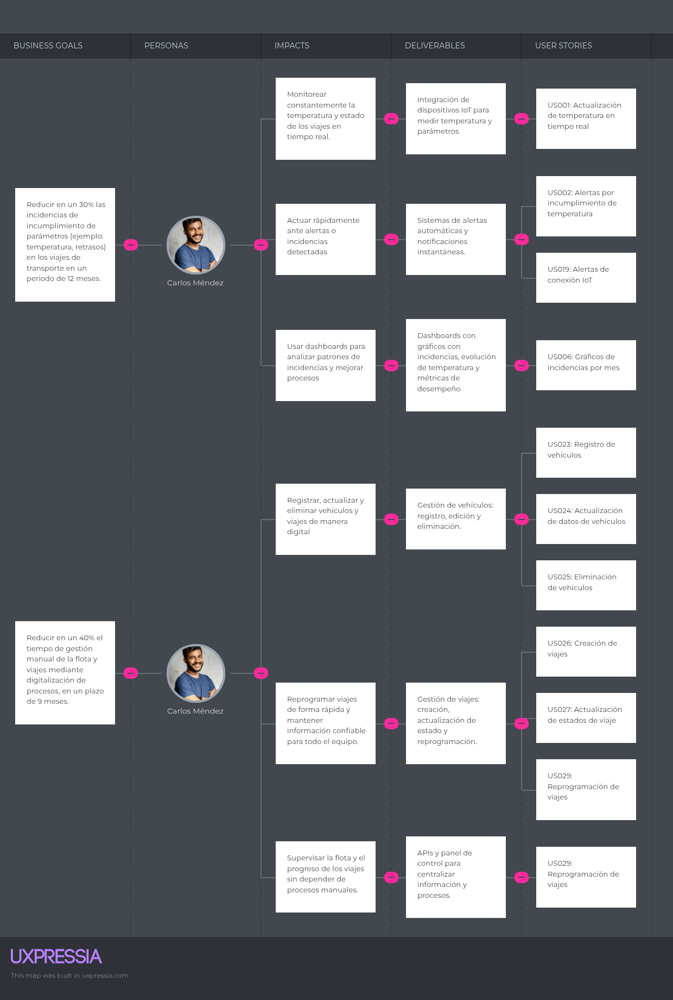

### Clientes Finales (Consumidores finales)

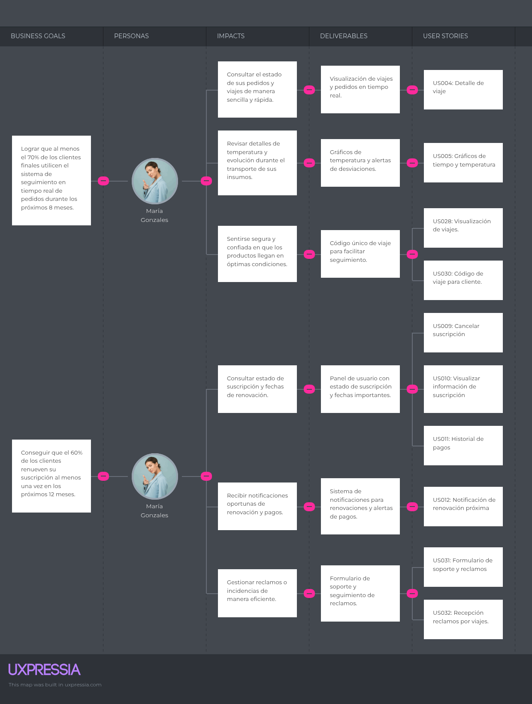

## 3.3. Product Backlog

| # Orden | User Story ID | Título                                        | Descripción                                                                                                                                                                                              | Story Points |
| ------- | ------------- | --------------------------------------------- | -------------------------------------------------------------------------------------------------------------------------------------------------------------------------------------------------------- | ------------ |
| 1       | US028         | Monitoreo de temperatura en tiempo real       | Como empresa, quiero recibir la temperatura en tiempo real de mis dispositivos IoT, para supervisar la cadena de frío de los viajes.                                                                     | 8            |
| 2       | US029         | Alertas por incumplimiento de temperatura     | Como cliente final, quiero recibir alertas cuando la temperatura sobrepasa los límites definidos, para tomar acciones correctivas.                                                                       | 5            |
| 3       | US033         | Detalle de viaje                              | Como cliente final, quiero consultar el detalle de un viaje, para verificar información específica como ruta, estado y temperatura.                                                                      | 3            |
| 4       | US024         | Creación de viajes                            | Como administrador logístico, quiero crear viajes asignando vehículo y ruta, para planificar el transporte de mercancías.                                                                                | 5            |
| 5       | US032         | Lista de viajes registrados                   | Como empresa, quiero ver una lista de todos los viajes registrados para gestionarlos de forma rápida.                                                                                                    | 3            |
| 6       | US026         | Reprogramación de viajes                      | Como administrador logístico, quiero reprogramar un viaje ya creado, para ajustar fechas y horarios en caso de cambios operativos.                                                                       | 5            |
| 7       | US027         | Código de viaje para cliente                  | Como cliente final, quiero recibir un código único de viaje, para poder consultar fácilmente el estado de mi pedido.                                                                                     | 5            |
| 8       | US020         | Ver vehículos de carga                        | Como administrador logístico, quiero visualizar la lista de vehículos de carga registrados en la plataforma, para supervisar y gestionar el inventario.                                                  | 3            |
| 9       | US036         | Filtrado de viajes por fecha                  | Como empresa, quiero filtrar la lista de viajes por rango de fechas, para analizar un periodo específico.                                                                                                | 3            |
| 10      | US037         | Descarga de reporte de viajes                 | Como cliente final, quiero descargar un reporte en PDF de un viaje con su información y gráficos, para archivarlo o compartirlo.                                                                         | 5            |
| 11      | US016         | Registro de dispositivos IoT                  | Como administrador logístico, quiero registrar un dispositivo IoT en la plataforma, para asociarlo a la flota y comenzar a recibir sus datos.                                                            | 5            |
| 12      | US017         | Eliminar dispositivo IoT                      | Como administrador logístico, quiero eliminar un dispositivo IoT de la plataforma, para darlo de baja en caso de falla o reemplazo.                                                                      | 3            |
| 13      | US021         | Ver dispositivos IoT                          | Como administrador logístico, quiero visualizar la lista de dispositivos IoT registrados en la plataforma, para supervisar su estado y administración.                                                   | 3            |
| 14      | US030         | Alertas de conexión IoT                       | Como empresa, quiero recibir alertas cuando un dispositivo IoT deja de enviar datos, para actuar de inmediato.                                                                                           | 5            |
| 15      | US022         | Ver estado de dispositivo por vehículo        | Como administrador logístico, quiero visualizar el estado de todos los dispositivos asociados a un vehículo en el dashboard, para monitorear su funcionamiento                                           | 3            |
| 16      | US023         | Ver estado de dispositivo en el módulo físico | Como usuario del dispositivo, quiero que el dispositivo tenga un indicador físico de estado (ej. LED), para verificar rápidamente si funciona sin depender de la app                                     | 3            |
| 17      | US034         | Gráficos de tiempo y temperatura              | Como cliente final, quiero ver gráficos de evolución de la temperatura durante el viaje, para verificar el cumplimiento de parámetros.                                                                   | 5            |
| 18      | US018         | Asignar dispositivo a vehículo de carga       | Como administrador logístico, quiero asignar un dispositivo IoT a un vehículo de carga, para identificar a qué unidad pertenece cada transmisión de datos                                                | 3            |
| 19      | US013         | Registro de vehículos de carga                | Como administrador logístico, quiero registrar vehículos en la plataforma, para mantener un inventario actualizado de la flota.                                                                          | 5            |
| 20      | US014         | Actualización de datos de vehículos de carga  | Como administrador logístico, quiero editar la información de los vehículos, para mantener actualizado su estado operativo.                                                                              | 3            |
| 21      | US015         | Eliminación de vehículos de carga             | Como administrador logístico, quiero eliminar vehículos de la plataforma, para mantener un inventario actualizado y evitar registros obsoletos.                                                          | 3            |
| 22      | US019         | Cambiar dispositivo de vehículo               | Como administrador logístico, quiero reasignar un dispositivo IoT de un vehículo a otro, para reutilizarlo en caso de mantenimiento o rotación de la flota                                               | 3            |
| 23      | US025         | Actualización de estados de viaje             | Como administrador logístico, quiero actualizar el estado de un viaje, para mantener informados a gerentes y clientes sobre el progreso de la entrega.                                                   | 5            |
| 24      | US031         | Roles y permisos de acceso                    | Como empresa, quiero que el sistema gestione roles y permisos de usuarios (admin, cliente, operador), para controlar accesos.                                                                            | 8            |
| 25      | US035         | Gráficos de incidencias por mes               | Como empresa, quiero ver un gráfico mensual de incidencias para identificar patrones de fallos.                                                                                                          | 5            |
| 26      | US038         | Cancelar suscripción                          | Como cliente final, quiero cancelar mi suscripción, para detener los cobros futuros.                                                                                                                     | 2            |
| 27      | US039         | Visualizar información de suscripción         | Como cliente final, quiero ver mi estado de suscripción y fecha de expiración, para gestionar mi acceso al servicio.                                                                                     | 2            |
| 28      | US040         | Historial de pagos                            | Como cliente final, quiero consultar mi historial de pagos, para verificar mis transacciones.                                                                                                            | 3            |
| 29      | US041         | Notificación de renovación próxima            | Como cliente final, quiero recibir una notificación antes de que mi suscripción se renueve, para decidir si continúo o cancelo.                                                                          | 3            |
| 30      | US010         | Visualizar información de suscripción         | Como cliente final, quiero ver mi estado de suscripción y fecha de expiración, para gestionar mi acceso al servicio.                                                                                     | 2            |
| 31      | US011         | Historial de pagos                            | Como cliente final, quiero consultar mi historial de pagos, para verificar mis transacciones.                                                                                                            | 3            |
| 32      | US012         | Notificación de renovación próxima            | Como cliente final, quiero recibir una notificación antes de que mi suscripción se renueve, para decidir si continúo o cancelo.                                                                          | 3            |
| 33      | TS005         | API de tracking de viajes                     | Como developer, quiero exponer un endpoint que devuelva el estado actual de un viaje, para que los clientes puedan consultar el seguimiento en tiempo real.                                              | 8            |
| 34      | TS004         | API de viajes                                 | Como developer, quiero exponer un endpoint RESTful para registrar viajes, para que la aplicación guarde y gestione la información.                                                                       | 8            |
| 35      | TS003         | API de vehículos                              | Como developer, quiero exponer un endpoint para registrar, modificar y consultar vehículos, para que el backend gestione el inventario de la flota.                                                      | 8            |
| 36      | US001         | Navegación en landing page                    | Como visitante, quiero navegar entre las secciones de la landing page, para acceder fácilmente a la información sobre el servicio.                                                                       | 3            |
| 37      | US002         | Sección portada                               | Como visitante, quiero ver una portada con mensaje principal, para entender rápidamente el propósito de la plataforma.                                                                                   | 3            |
| 38      | US003         | Sección de funcionalidades                    | Como visitante, quiero visualizar una sección con las funcionalidades principales, para conocer qué ofrece la plataforma.                                                                                | 3            |
| 39      | US004         | Sección de beneficios                         | Como visitante, quiero ver una sección con beneficios, para entender qué valor obtengo al usar la plataforma.                                                                                            | 2            |
| 40      | US005         | Sección de testimonios                        | Como visitante, quiero ver testimonios de otros clientes, para ganar confianza en el servicio.                                                                                                           | 2            |
| 41      | US006         | Sección de contáctanos                        | Como visitante, quiero acceder a un formulario de contacto, para comunicarme con la empresa y solicitar más información.                                                                                 | 3            |
| 42      | US007         | Call to Action a la aplicación web            | Como visitante, quiero encontrar un botón de acceso a la aplicación web, para registrarme o iniciar sesión y usar el servicio desde un navegador.                                                        | 3            |
| 43      | US008         | Call to Action de descarga de App Móvil       | Como visitante, quiero encontrar botones de descarga de la aplicación móvil, para instalar la app en mi dispositivo iOS o Android.                                                                       | 3            |
| 44      | US009         | Cancelar suscripción                          | Como cliente final, quiero cancelar mi suscripción, para detener los cobros futuros.                                                                                                                     | 2            |
| 45      | TS001         | API de registro                               | Como developer quiero implementar múltiples endpoints de autenticación (login, logout, refresh y validación de sesión) para que los usuarios puedan gestionar de forma segura su acceso a la plataforma. | 5            |
| 46      | US018         | Registro de usuario                           | Como usuario, quiero registrarme en la plataforma, para acceder a mi cuenta y funcionalidades personalizadas.                                                                                            | 3            |
| 47      | US010         | Inicio de sesión                              | Como usuario registrado, quiero iniciar sesión en la plataforma, para acceder a mi cuenta y funcionalidades personalizadas.                                                                              | 3            |
| 48      | US011         | Cerrar sesión                                 | Como usuario autenticado, quiero cerrar sesión desde la aplicación, para que mi cuenta deje de estar accesible en el dispositivo actual.                                                                 | 2            |
| 49      | US012         | Recuperar contraseña                          | Como usuario, quiero recuperar el acceso a mi cuenta mediante un proceso de restablecimiento de contraseña, para poder ingresar nuevamente si la olvido.                                                 | 3            |
| 50      | TS002         | Servicio de autenticación con JWT             | Como developer, quiero implementar autenticación basada en JWT, para asegurar la comunicación entre cliente y servidor.                                                                                  | 8            |

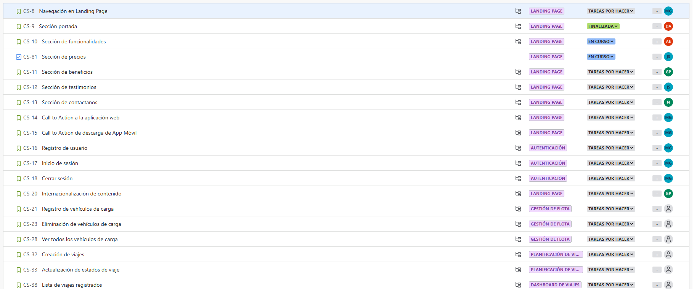
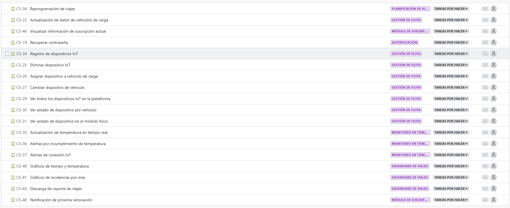

