# Capítulo IV: Solution Software Design

## 4.1. Strategic-Level Domain-Driven Design

### 4.1.1. Design-Level EventStorming

En esta sección se realizó un Event Storming detallado para modelar y analizar el dominio del sistema CargaSafe. Se llevó a cabo en varias sesiones colaborativas donde se identificaron eventos, comandos, agregados y políticas clave del negocio. Este ejercicio permitió descubrir los bounded contexts candidatos y mapear los flujos de mensajes entre ellos, sentando las bases para el diseño de la arquitectura del sistema.

**Step 1: Unstructured Exploration**  
Se identificaron todos los eventos clave del sistema mediante una lluvia de ideas sin orden definido, abarcando registro, monitoreo, alertas, viajes y pagos.  

**Step 2: Timeline**  
Los eventos fueron organizados cronológicamente para representar los principales flujos de negocio y dependencias entre procesos.  

**Step 3: Pain Points**  
Se identificaron los puntos críticos y posibles fallas dentro de los flujos, como errores de comunicación o validación.  

**Step 4: Pivotal Points**  
Se marcaron los eventos que generan un cambio de contexto significativo dentro del sistema, como inicios o cierres de procesos.  

**Step 5: Commands**  
Se definieron los comandos que ejecutan los actores del sistema y que originan los eventos, representando las intenciones de acción.  

**Step 6: Policies**  
Se establecieron reglas automáticas que vinculan eventos con nuevos comandos, automatizando respuestas del sistema.  

**Step 7: Read Models**  
Se definieron vistas de datos que reflejan el estado actual del sistema para consulta o monitoreo en tiempo real.  

**Step 8: External Systems**  
Se identificaron los servicios externos integrados, como APIs, pasarelas de pago y plataformas de notificación.  

**Step 9: Aggregates**  
Se agruparon comandos y eventos bajo agregados que aseguran la coherencia en cada bounded context.  

#### 4.1.1.1 Candidate Context Discovery

Para esta etapa se llevó a cabo una sesión, la sesión tuvo una duración aproximada de 90 minutos y permitió identificar los bounded contexts del sistema CargaSafe. Durante el proceso se aplicaron las técnicas start-with-value, start-with-simple y look-for-pivotal-events, que facilitaron la agrupación de eventos y entidades según su afinidad y valor para el negocio.

Como resultado, se identificaron ocho bounded contexts:

- **Identity and Access Management**: administración de usuarios, autenticación y control de accesos.
- **Profiles and Preferences Management**: gestión de perfiles de usuario y configuración de preferencias.
- **Fleet management**: gestión de vehículos y dispositivos IoT.
- **Trip management**: creación y ejecución de viajes.
- **Real-time monitoring**: monitoreo de condiciones en tiempo real.
- **Alerts and resolution**: generación de alertas.
- **Visualization/Analytics**: visualización de métricas y reportes.
- **Subscriptions and payments**: gestión de suscripciones y pagos con Stripe.

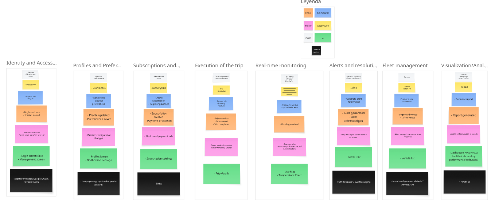

### Leyenda utilizada en el EventStorming

- 🟧 **Event**: describe algo que ocurrió en el dominio (Viaje iniciado, Alerta generada).
- 🟦 **Command**: una instrucción o acción que dispara un evento (Registrar viaje).
- 🟪 **Policy**: regla de negocio que determina qué ocurre ante ciertas condiciones (Si falta dispositivo → bloquear inicio del viaje).
- 🟨 **Aggregate**: entidad principal que concentra datos y operaciones (Viaje, Suscripción).
- 🟩 **UI**: vistas o pantallas del sistema que muestran información al usuario (Dashboard de KPIs).
- ⚪ **Actor**: roles que interactúan con el sistema (Operador, Conductor).
- ⬛ **Sistema externo**: integraciones con servicios de terceros (Google Maps, Stripe).

Con esta estructura, el EventStorming permitió organizar y simplificar el dominio de CargaSafe, evidenciando de forma clara los contextos candidatos y la interacción entre actores, procesos y sistemas externos.

[Ver gráfico en Miro](https://miro.com/app/board/uXjVJMskjeA=/?share_link_id=697373503273)

#### 4.1.1.2. Domain Message Flows Modeling

En esta etapa se desarrolló el **modelado de flujos de mensajes de dominio (Domain Message Flows)** con el objetivo de visualizar cómo colaboran los bounded contexts identificados en el Candidate Context Discovery para resolver los principales casos de negocio del sistema CargaSafe.

Para la construcción de estos flujos se aplicó la técnica de **Domain Storytelling**, la cual permite describir las interacciones en un lenguaje natural, mostrando cómo un evento generado en un bounded context desencadena comandos o nuevos eventos en otros contextos. De este modo se logra una visión clara de la cooperación entre módulos y del ciclo de vida de la información dentro de la plataforma.

### Historias de dominio (Domain Stories)

1. **Gestión de identidad y perfiles**

   - Cuando un _usuario se registra_ en **Identity and Access Management**, se genera un evento que es consumido por **Profiles and Preferences**, el cual crea automáticamente el perfil asociado.
   - Si un _usuario edita sus preferencias_, se guarda la configuración en **Profiles**, y en caso de referirse a notificaciones, estas se utilizan en **Alerts** para personalizar los canales de envío.

2. **Control de acceso y suscripciones**

   - Cuando un _pago es procesado exitosamente_ en **Subscriptions & Billing**, se envía un evento a **Identity and Access Management**, que habilita el acceso al sistema.
   - Si un _pago falla_, el mismo flujo comunica a IAM que debe restringir o bloquear el acceso del usuario hasta regularizar su situación.

3. **Gestión de flota y ejecución de viajes**

   - Al _registrarse un vehículo o dispositivo IoT_ en **Fleet Management**, este queda disponible para **Trip Management**, que puede asignarlo a un viaje planificado.
   - Cuando un _operador crea e inicia un viaje_ en **Trip Management**, se emite un evento que da origen a una sesión de monitoreo en **Monitoring**.

4. **Monitoreo en tiempo real y alertas**

   - **Monitoring** recibe continuamente _lecturas de sensores_ (temperatura, ubicación, señal). Si se detecta una condición fuera de rango, se genera un evento que es consumido por **Alerts**.
   - **Alerts** crea la alerta correspondiente y la notifica a los usuarios, aplicando las preferencias definidas en **Profiles** (por ejemplo, envío por SMS, correo o notificación push).

5. **Analítica y reportes**
   - Cada _alerta generada o reconocida_ en **Alerts** actualiza los indicadores en **Dashboard & Analytics**, alimentando las métricas de cumplimiento y los reportes de incidentes.
   - Cuando **Dashboard & Analytics** genera un _reporte final_, este puede personalizarse de acuerdo con las preferencias almacenadas en **Profiles**, permitiendo al usuario recibir información ajustada a su rol o necesidades.

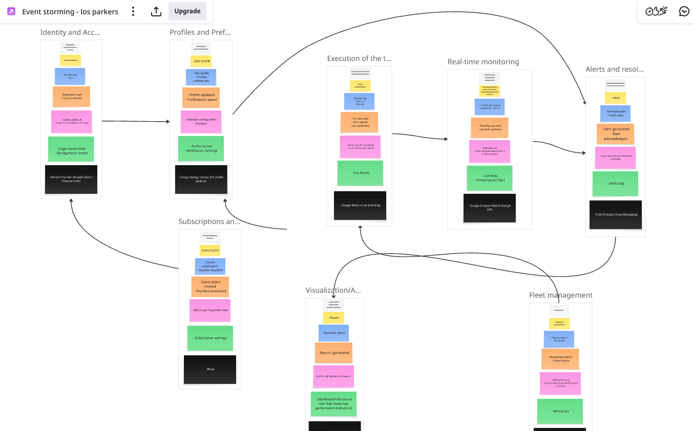

### Resultados

Los flujos de mensajes de dominio evidencian la cooperación entre los ocho bounded contexts de CargaSafe:

- **Identity and Access Management**
- **Profiles and Preferences Management**
- **Fleet Management**
- **Trip management**
- **Real-time monitoring**
- **Alerts and resolution**
- **Visualization/Analytics**
- **Subscriptions and payments**

Este ejercicio permitió comprender cómo un evento local en un contexto puede impactar en otros, asegurando la trazabilidad del negocio y la correcta interacción entre los distintos módulos de la solución.

#### 4.1.1.3. Bounded Context Canvases

En esta sección se elaboraron los Bounded Context Canvases de CargaSafe para los ocho contextos identificados. El objetivo fue delimitar con precisión responsabilidades, lenguaje ubicuo y decisiones de negocio, además de explicitar las comunicaciones (Queries, Commands y Events) y colaboradores (otros BC, sistemas externos y frontend). Cada canvas documenta: Descripción, Clasificación estratégica (core/supporting/generic), Rol de dominio (draft/execution/analysis/gateway), Inbound/Outbound communication, Ubiquitous Language, Business Decisions y Collaborators. Esta definición fija ownership de datos, reduce ambigüedades y prepara los contratos de integración que se implementarán en APIs y mensajería.

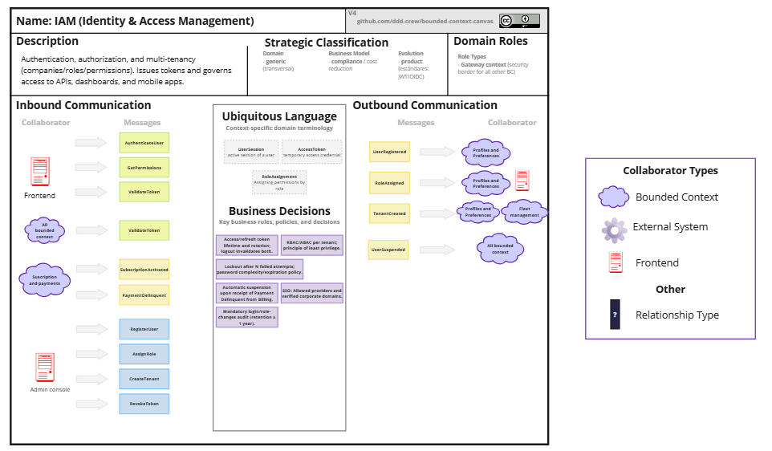

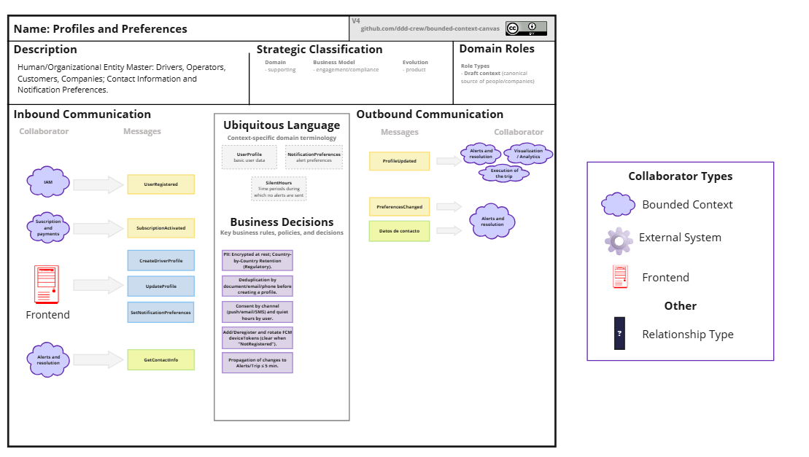

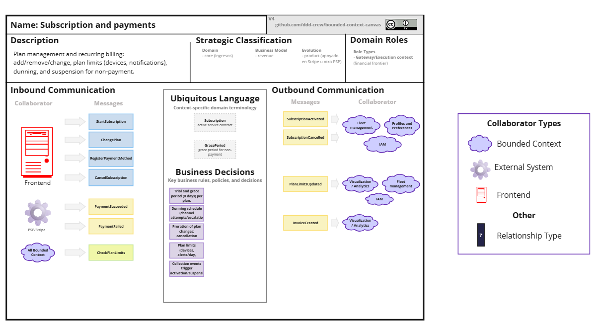

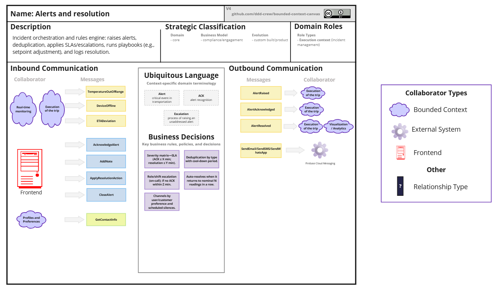

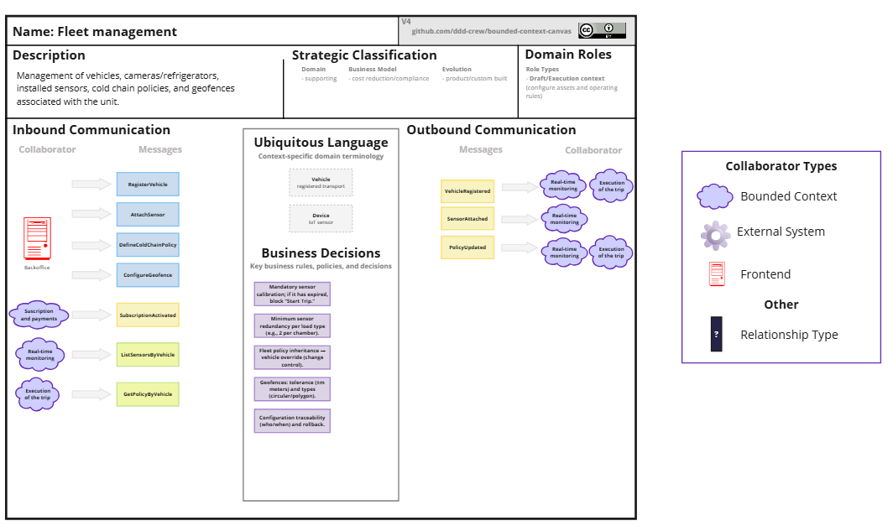

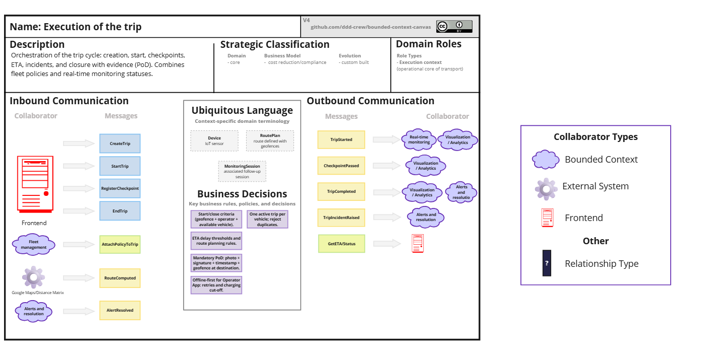

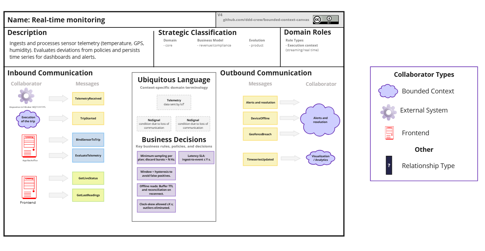

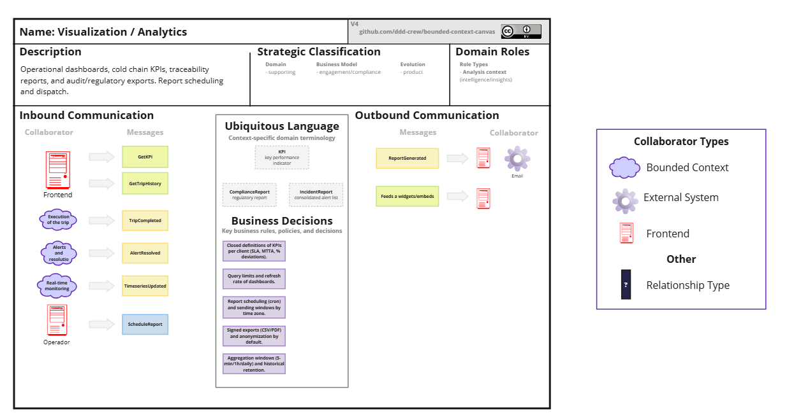

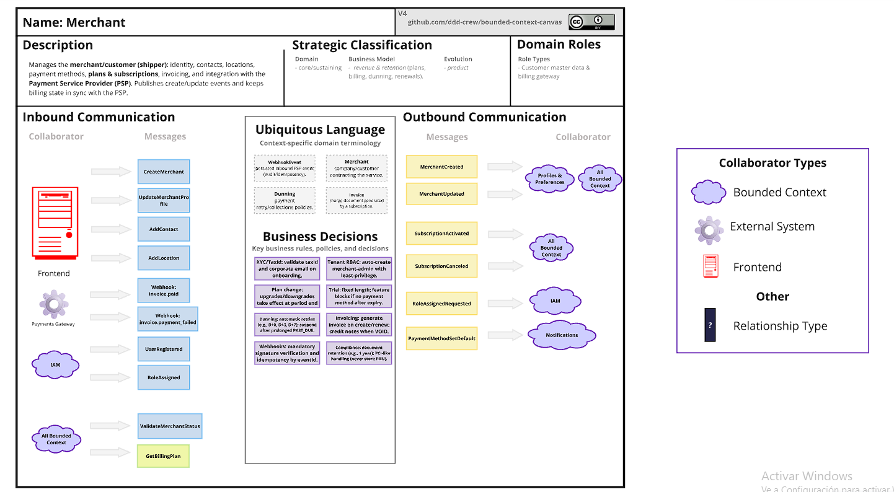

[Ver gráfico en Miro](https://miro.com/app/board/uXjVJ8W56f8=/?share_link_id=323586946145)

### 4.1.2. Context Mapping

En esta etapa se construyó el **Context Map** de CargaSafe con los ocho bounded contexts identificados. El objetivo fue representar las **relaciones estructurales** entre ellos aplicando patrones de Domain-Driven Design como Customer/Supplier, Conformist y Anti-Corruption Layer (ACL).

### Resultado

El mapa final permitió:

1. **Visualizar las dependencias entre contextos**, mostrando qué módulos proveen información y cuáles la consumen.
2. **Identificar los contextos core** (Trip Management, Monitoring, Alerts), los de soporte (Fleet, Profiles, Analytics) y los genéricos (IAM, Billing).
3. **Clasificar las relaciones**:
   - Customer/Supplier en la mayoría de flujos operativos (Billing → IAM, Trip → Monitoring, Monitoring → Alerts).
   - Conformist en el consumo de datos por Analytics.
   - Anti-Corruption Layer en la interacción Analytics → Profiles.

De esta manera, el Context Mapping consolida una visión global del sistema, mostrando cómo los distintos contextos colaboran para dar soporte al negocio.

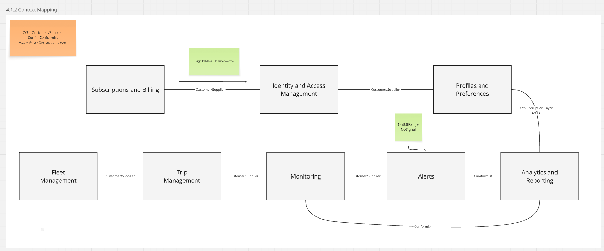

### 4.1.3. Software Architecture

#### 4.1.3.1. Software Architecture System Landscape Diagram

El **System Landscape Diagram** ofrece una visión de alto nivel del **ecosistema empresarial** en el que se integra CargaSafe. Este diagrama no se centra únicamente en un sistema, sino que representa **todas las personas y sistemas de software relevantes**, tanto internos como externos, que participan en la operación logística.

### Propósito

El objetivo de este diagrama es:

1. Mostrar el alcance de la organización y cómo conviven sus distintos sistemas.
2. Identificar a las **personas, sistemas internos, SaaS externos y proveedores** que colaboran en la cadena de valor.
3. Resaltar cómo **CargaSafe (SaaS)** se conecta dentro de este panorama, en interacción con otros actores y servicios.

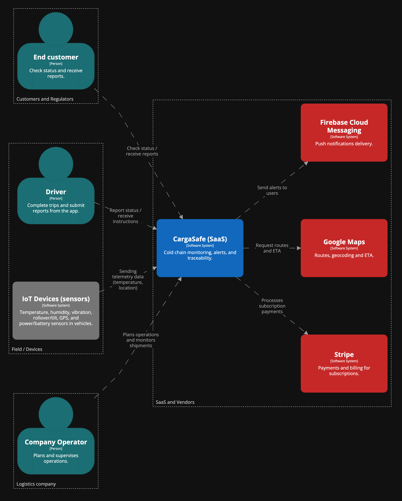

### Elementos incluidos

- **Personas**: Company Operator, Driver and End Customer.
- **Sistemas internos**: Logistics Planning and Power BI Data.
- **Sistemas y proveedores externos**: CargaSafe (SaaS), Stripe, Google Maps, Notification Services e IoT Devices (sensors).
- **Grupos**: Se organizaron en cuatro dominios principales:
  - Logistics company
  - Field / Devices
  - Customers and Regulators
  - SaaS and Vendors

### Relaciones principales

- Logistics Planning → CargaSafe (SaaS): exporta planes y asignaciones de viaje.
- IoT Devices → CargaSafe (SaaS): envía telemetría (temperatura, humedad, vibración, volcado/inclinación, GPS, energía/baterías).
- CargaSafe (SaaS) → Google Maps: consulta rutas y tiempos estimados.
- CargaSafe (SaaS) → Notification Services: envía alertas a los usuarios.
- CargaSafe (SaaS) → Stripe: procesa pagos de suscripción.
- CargaSafe (SaaS) → Power BI Data: exporta datasets consolidados para analítica.
- Company Operator / Driver ↔ CargaSafe (SaaS): planifican, ejecutan y reportan el estado operativo.
- End customer ← CargaSafe (SaaS): consulta estado y recibe reportes.

### Resultado

El diagrama muestra a CargaSafe (SaaS) como el núcleo de integración entre operaciones (Company Operator, Driver, Logistics Planning), telemetría IoT (sensores en campo) y servicios externos (ruteo, notificaciones y pagos), además de su aporte a la inteligencia de negocio mediante Power BI Data. Esta representación proporciona una visión clara e integral de las dependencias y colaboraciones que sustentan la operación logística y la gestión de la cadena de frío.

#### 4.1.3.2. Software Architecture Context Level Diagrams

El **Context Diagram** de CargaSafe muestra una visión de alto nivel del sistema y de cómo se relaciona con los actores humanos y los sistemas externos que lo rodean.

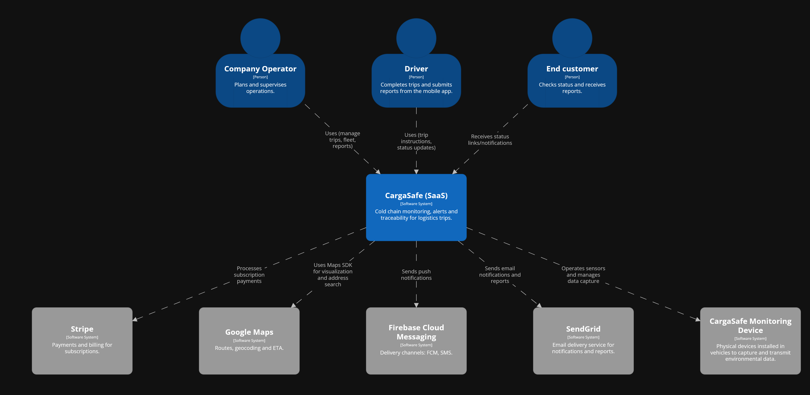

En el centro se ubica CargaSafe (SaaS), que representa el sistema principal encargado del monitoreo de la cadena de frío, la trazabilidad y la generación de alertas en los viajes logísticos.

Alrededor del sistema se identifican los siguientes actores:

- _Company Operator_: gestiona viajes, flota y reportes desde la plataforma.
- _Driver_: completa viajes y reporta información desde la aplicación móvil.
- _End customer_: recibe enlaces de estado, alertas y reportes generados por el sistema.

Asimismo, se destacan las interacciones con sistemas externos que complementan las funcionalidades de CargaSafe:

- _Google Maps_: provee servicios de rutas, geocodificación y cálculo de ETA, utilizados tanto por el backend para estimar tiempos y trayectos, como por las aplicaciones web y móviles para la visualización de mapas y direcciones.
- _Firebase Cloud Messaging (FCM)_: entrega notificaciones push a dispositivos móviles y navegadores web para alertas, actualizaciones de viajes y eventos críticos.
- _Stripe_: procesa pagos y gestiona la facturación de las suscripciones dentro de la plataforma.
- _SendGrid_: se utiliza para el envío de correos electrónicos transaccionales, reportes automáticos y notificaciones.
- _CargaSafe Monitoring Device_: dispositivos físicos instalados en vehículos que capturan datos ambientales (temperatura, humedad, vibración, GPS) y los transmiten hacia el ecosistema CargaSafe mediante las aplicaciones embebidas y edge.

#### 4.1.3.2. Software Architecture Container Level Diagrams

En esta parte expandimos el sistema **CargaSafe (SaaS)** para mostrar sus contenedores internos, las tecnologías que utilizamos y cómo se comunican entre sí y con los sistemas externos.

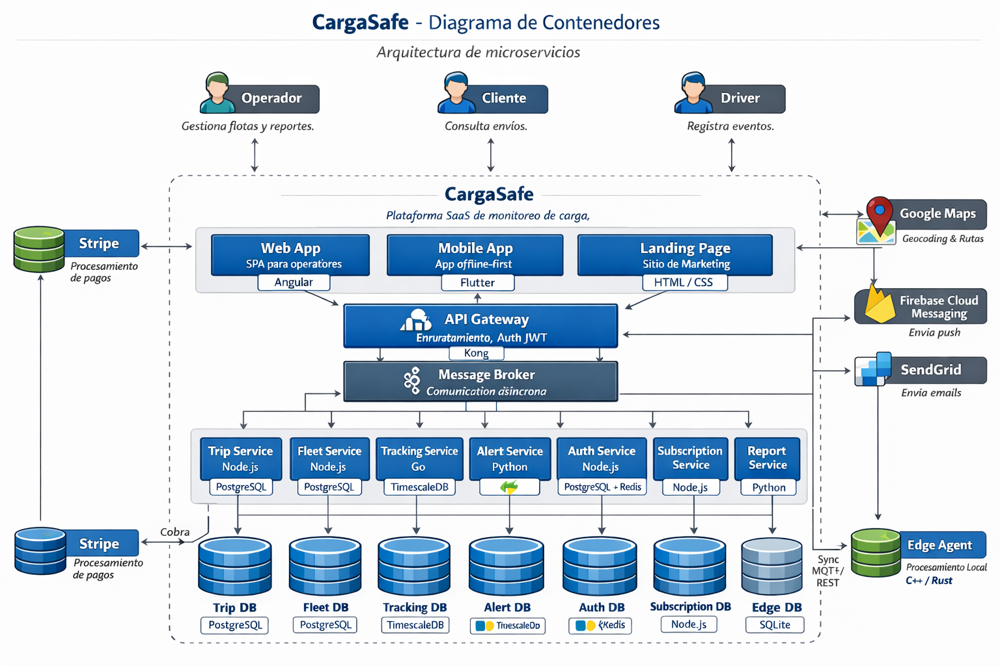

El diagrama de contenedores muestra cómo se organiza internamente CargaSafe (SaaS) y cómo se relaciona con los actores y sistemas externos.

Dentro de la plataforma tenemos varios contenedores:

- _Landing Page_  
  Sitio público de marketing y punto de acceso principal. Redirige a la aplicación web o descarga de la aplicación movil.

- _Web Application_  
  Portal utilizado por los operadores para gestionar flota, viajes, alertas y reportes. Entrega contenido estático y sirve la **Single Page Application**.

- _Single Page Application_  
  Interfaz dinámica en el navegador para operadores y clientes, que ofrece monitoreo en tiempo real, seguimiento de viajes y visualización de datos utilizando el SDK de Google Maps.

- _Mobile App_  
  Aplicación móvil usada por los conductores para recibir instrucciones, actualizar estados y registrar reportes.  
  Soporta modo **offline-first** gracias a una **base de datos embebida (SQLite)**, permitiendo continuar operaciones sin conexión.

- _Mobile Database_  
  Base de datos local embebida utilizada por la **Mobile App** para cache y operación sin conexión (órdenes de viaje, eventos, checkpoints, adjuntos), con colas de sincronización y resolución de conflictos al reconectar.

- _Backend API_  
  Núcleo de la lógica de negocio del sistema.  
  Gestiona usuarios, dispositivos, viajes, alertas, notificaciones, suscripciones y datos de telemetría.  
  Expone endpoints REST/GraphQL y se comunica con servicios externos como **Google Maps**, **Stripe**, **Firebase Cloud Messaging** y **SendGrid**.

- _Relational Database_  
  Base de datos principal que almacena información persistente de usuarios, vehículos, dispositivos IoT, viajes, alertas, reportes y suscripciones.

- _Edge Application_  
  Agente que se ejecuta en instalaciones o vehículos con capacidad de procesamiento local.  
  Permite cachear datos, realizar análisis preliminar y sincronizar con el **Backend API** cuando la conexión está disponible.  
  Utiliza su propia **Edge Database** para resiliencia ante desconexiones.

- _Edge Database_  
  Almacenamiento local de respaldo para los datos capturados por la aplicación Edge, asegurando continuidad operacional incluso en entornos con conectividad limitada.

- _Embedded Application_  
  Componente ligero desplegado en los dispositivos de monitoreo físicos.  
  Captura datos ambientales (temperatura, humedad, GPS) y los envía a la **Edge Application** para su procesamiento y sincronización.

Los actores principales interactúan con los contenedores:

- Company Operator usa la Web App para planificar y supervisar operaciones.
- Driver utiliza la Mobile App para recibir instrucciones y reportar estado de los viajes.
- End Customer accede tanto a la Single Web (para reportes públicos) como a la Mobile App (para recibir notificaciones y links de estado).

Además, CargaSafe se integra con varios sistemas externos:

- _Google Maps_: Provee servicios de geocodificación, cálculo de rutas y estimación de tiempo de llegada (ETA).  
  Es utilizado tanto por el **Backend API** (para procesamiento de rutas) como por la **SPA** y la **Mobile App** (para visualización e interacción con mapas).

- _Stripe_: Maneja los pagos y la facturación de las suscripciones de la plataforma.
- _Firebase Cloud Messaging (FCM)_: para notificaciones push hacia aplicaciones móviles y web.
  En conjunto, el diagrama muestra cómo CargaSafe se estructura en contenedores especializados que soportan las necesidades de operadores, conductores y clientes, asegurando tanto la operación online como offline en distintos puntos de la cadena logística.

- _SendGrid_  
   Servicio de mensajería utilizado para el envío de correos electrónicos transaccionales, reportes y alertas.

#### 4.1.3.3. Software Architecture Deployment Diagrams

El Deployment Diagram de CargaSafe muestra cómo se despliega la solución en un entorno de producción real, representando los nodos de infraestructura, los contenedores de software y las interacciones entre ellos.

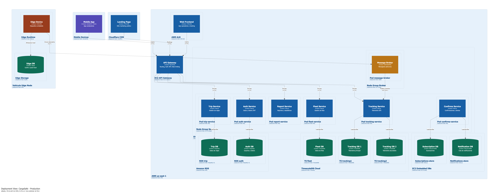

**Clientes**
Los usuarios finales acceden desde navegadores web, donde la Landing Page se sirve desde Cloudflare CDN y el Web Frontend es entregado a través de un AWS Application Load Balancer, ambos optimizando la entrega de contenido estáticamente. Los conductores utilizan una aplicación móvil nativa en dispositivos Android/iOS con SQLite local para almacenamiento offline y sincronización de datos. Todas las peticiones de API se realizan mediante HTTPS hacia el API Gateway, encargado de enrutar el tráfico con autenticación JWT y rate limiting.

**Backend y orquestación**
El backend se compone de microservicios Node.js desplegados dentro de un Kubernetes Cluster (Amazon EKS) en múltiples pods independientes para alta disponibilidad y escalabilidad: Trip Service, Fleet Service, Tracking Service, Auth Service, Confirma Service y Report Service. La comunicación asíncrona entre servicios se gestiona a través de un Message Broker (Kafka/RabbitMQ) desplegado en un node group dedicado. Los dispositivos Edge embebidos en los vehículos envían telemetría al broker vía MQTT.

**Base de datos**
El sistema utiliza múltiples bases de datos especializadas: Trip DB y Auth DB sobre PostgreSQL en Amazon RDS Multi-AZ, Fleet DB y Tracking DB sobre TimescaleDB Cloud optimizadas para series temporales, y Subscription DB y Notification DB con almacenamiento embebido Node.js/LevelDB. Los dispositivos Edge mantienen datos localmente en SQLite para operación offline.

**Integraciones externas**
El backend consume servicios de terceros para extender sus capacidades: Google Maps para rutas, geocodificación y cálculo de ETA. Stripe Pages y Stripe Petet para procesamiento de pagos y facturación de suscripciones. Firebase Cloud Messaging (FCM) para entrega de notificaciones push a los dispositivos móviles de los conductores.

**Resultado**
El diagrama de despliegue muestra que CargaSafe está organizado bajo una arquitectura cloud-native con separación de responsabilidades en microservicios, Kubernetes para orquestación de contenedores, CDN y Load Balancer independientes para contenido estático, bases de datos especializadas por dominio, mensajería asíncrona con Kafka/RabbitMQ, dispositivos Edge con capacidad offline en campo y notificaciones push nativas a través de FCM. Esta infraestructura garantiza escalabilidad, resiliencia y continuidad operativa en la gestión de la cadena de frío.

## 4.2. Tactical-Level Domain-Driven Design

### 4.2.1. Bounded Context: Identity and Access Management (IAM)

---

## 4.2.1.1. Domain Layer

### **Entidades Principales**

---

### **User (Aggregate Root)**

**Propósito:**  
Representa al usuario autenticable dentro del sistema y administra su identidad, credenciales y autorización.

**Atributos principales:**

- `id` — Identificador único (Long)
- `username` — Nombre de usuario único
- `email` — Correo electrónico único
- `passwordHash` — Hash seguro de la contraseña (BCrypt)
- `firstName`, `lastName`
- `enabled` — Indica si la cuenta está activa
- `roles` — Lista de entidades Role asignadas
- `createdAt`, `updatedAt`

**Métodos principales:**

- `updateBasicInfo(firstName, lastName, email)`
- `changePassword(oldPassword, newPassword)`
- `assignRole(role)`
- `enable()`, `disable()`

---

### **Role (Entity)**

**Propósito:**  
Define los roles utilizados para autorización en el sistema.

**Atributos principales:**

- `id`
- `name` — (ADMIN, CUSTOMER, LOGISTICS_MANAGER, DRIVER…)
- `description`

**Métodos principales:**

- `rename(name)`

---

### **Value Objects**

- **Email** — Garantiza formato válido y normalización.
- **Username** — Enforcea reglas sintácticas.
- **Password** — Valida complejidad y encapsula hashing.
- **JwtClaims** — Representa claims del JWT (sub, roles, exp, jti, iat).

---

### **Domain Services**

- **PasswordHashingService**

  - Hashing seguro con BCrypt
  - Comparación segura de contraseñas

- **JwtTokenService**

  - Generación de Access Token y Refresh Token
  - Validación de firma JWT
  - Rotación segura de Refresh Token (Refresh Token Rotation)

- **AuthorizationService**
  - Verifica roles desde los claims del JWT

---

### **Commands**

- `RegisterUserCommand`
- `LoginUserCommand`
- `UpdateUserProfileCommand`
- `ChangePasswordCommand`
- `AssignRoleCommand`
- `LogoutAllDevicesCommand`
- `RevokeTokenCommand`

---

### **Queries**

- `GetUserByIdQuery`
- `GetUserByEmailQuery`
- `GetAllUsersQuery`
- `GetUserRolesQuery`

---

### **Events**

Tu implementación real incluye únicamente:

- **SeedRolesCommand → RoleCommandServiceImpl**  
  Se ejecuta al iniciar la aplicación para crear los roles base.

---

## 4.2.1.2. Interface Layer

### **AuthController**

| Método | Endpoint                     | Descripción                                         |
| ------ | ---------------------------- | --------------------------------------------------- |
| POST   | `/api/v1/auth/login`         | Autentica usuario y devuelve Access + Refresh Token |
| POST   | `/api/v1/auth/refresh-token` | Rotación segura de Refresh Token                    |
| POST   | `/api/v1/auth/logout`        | Revoca el token actual                              |
| POST   | `/api/v1/auth/logout-all`    | Revoca todos los tokens del usuario                 |
| POST   | `/api/v1/auth/register`      | Registra un nuevo usuario                           |

---

### **UserController**

| Método | Endpoint                           | Descripción                               |
| ------ | ---------------------------------- | ----------------------------------------- |
| GET    | `/api/v1/users/me`                 | Obtiene el perfil del usuario autenticado |
| PUT    | `/api/v1/users/me`                 | Actualiza perfil del usuario              |
| PUT    | `/api/v1/users/me/change-password` | Cambia contraseña                         |
| GET    | `/api/v1/users/{id}`               | Obtiene usuario por ID (solo ADMIN)       |

---

### **Security / ACL**

La autorización se basa completamente en JWT firmados:

- Claims incluyen roles y jti
- Token Revocation mediante repositorio persistente
- Filtros de seguridad:
  - `JwtAuthenticationFilter`
  - `TokenRevocationFilter`
- `SecurityConfig` define:
  - Rutas públicas: `/auth/**`
  - Rutas protegidas por rol
  - Políticas de CORS para permitir comunicación con frontend

---

## 4.2.1.3. Application Layer

### **Command Services**

---

### **UserCommandServiceImpl**

- Gestiona creación y actualización de usuarios
- Valida unicidad de email y username
- Hashing seguro de contraseñas
- Asignación de roles
- Procesa `ChangePasswordCommand`
- Maneja auditoría (`createdAt`, `updatedAt`)

---

### **AuthCommandServiceImpl**

- Autenticación de usuarios
- Generación de Access Token + Refresh Token
- Refresh Token Rotation
- Logout (revocación del token actual)
- Logout All Devices (revoca todos los tokens asociados)
- Mantiene repositorio de tokens revocados

---

### **Query Services**

---

### **UserQueryServiceImpl**

- Consultas de solo lectura
- Manejo de vistas y proyecciones
- Optimización para endpoints REST

---

### **AuthQueryServiceImpl**

- Validación de tokens
- Obtención de información de sesión
- Autoridad para autorización basada en claims

---

### **Event Handlers**

- **SeedRolesCommandHandler (RoleCommandServiceImpl)**  
  Crea roles base automáticamente al iniciar la aplicación.

---

## 4.2.1.4. Infrastructure Layer

### **Repositories**

---

### **UserRepository**

- Persistencia del agregado User
- Consultas por email, username, id
- Implementado con Spring Data JPA

---

### **RoleRepository**

- Gestión de roles
- Usado por SeedRoles
- Prevención de duplicados

---

### **TokenRevocationRepository**

- Almacena tokens revocados mediante su jti
- Evita reuso de Refresh Tokens
- Limpieza automática de tokens expirados

---

### **Infraestructura Complementaria**

- `BCryptPasswordEncoder`
- `JwtEncoder` y `JwtDecoder` (Nimbus JOSE)
- `SecurityFilterChain`
- Manejo de CORS para frontend
- Manejo global de excepciones para errores de seguridad

---

#### 4.2.1.5. Bounded Context Software Architecture Component Level Diagrams

Diagrama de Componentes - Backend - Identity and Access Management

Este diagrama muestra la arquitectura por capas del bounded context IAM en el backend. La separación clara entre Interface, Application, Domain e Infrastructure layers permite un diseño mantenible y testeable. Los controllers en la Interface Layer reciben requests HTTP y delegan a los command/query services en Application Layer, que utilizan el dominio y persisten através de repositories en Infrastructure Layer.

**Diagrama de Componentes - Frontend Web - Identity and Access Management**

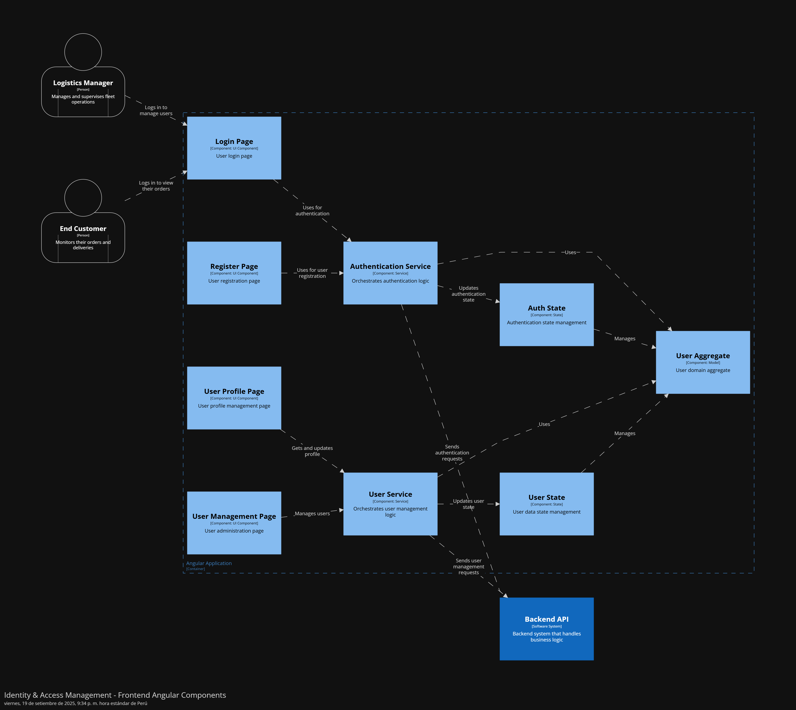

El diagrama del frontend web muestra los componentes Angular organizados por responsabilidades. Las páginas (Login, Register, User Profile) interactúan con services que manejan la lógica de negocio y state management. La comunicación con el backend se realiza através de HTTP services que consumen la API REST.

**Diagrama de Componentes - Mobile - Identity and Access Management**

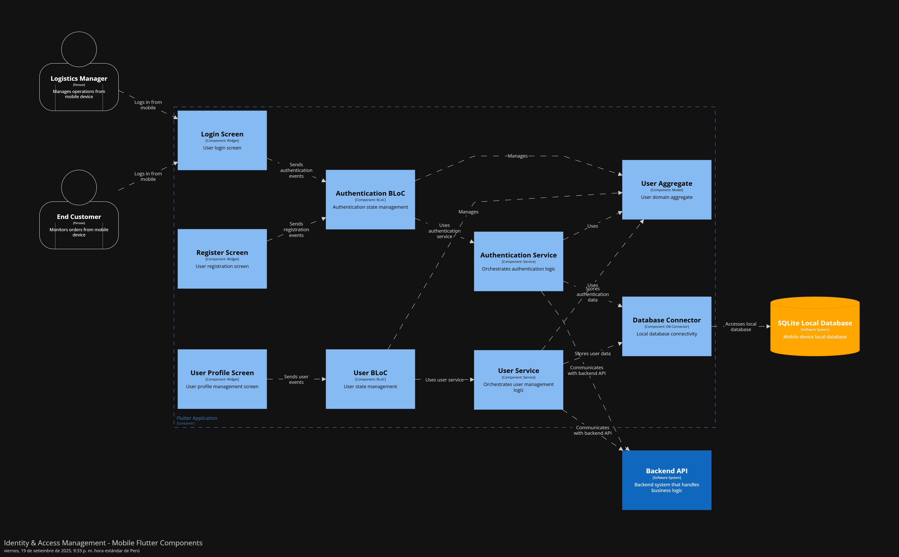

La aplicación móvil utiliza Flutter con arquitectura BLoC para state management. Las pantallas (screens) envían eventos a BLoCs que manejan el estado y coordinan con services. Los services se comunican tanto con el backend API como con la base de datos local SQLite para funcionalidad offline.

#### 4.2.1.6. Bounded Context Software Architecture Code Level Diagrams

##### 4.2.1.6.1. Bounded Context Domain Layer Class Diagrams

**Backend - Identity & Access Management Domain Layer Class Diagram**

El diagrama de clases del backend muestra las entidades principales del IAM bounded context en la capa de dominio. La entidad User actúa como aggregate root y maneja la lógica de autenticación y autorización. Los roles están conectados através de relaciones many-to-many con usuarios, mientras que los tokens gestionan las sesiones y refresh tokens. La estructura implementa el patrón Repository para la persistencia.

**Frontend - Identity & Access Management Domain Layer Class Diagram**

El diagrama del frontend Angular muestra la arquitectura de componentes y services para el manejo de identidad. Los components (Login, Register, Profile) interactúan con services específicos que manejan el estado de autenticación. El AuthService centraliza la lógica de comunicación con el backend API, mientras que los guards protegen las rutas según permisos.

**Mobile - Identity & Access Management Domain Layer Class Diagram**

La aplicación móvil Flutter implementa BLoC pattern para el manejo de estado de autenticación. Los BLoCs (AuthBloc, UserBloc) coordinan entre las pantallas y los services, mientras que el local storage permite funcionalidad offline. La arquitectura asegura sincronización de credenciales entre la app y el backend.

##### 4.2.1.6.2. Bounded Context Database Design Diagram

El diagrama de base de datos implementa un modelo RBAC (Role-Based Access Control) robusto. Las tablas principales (USERS, ROLES, PERMISSIONS) están conectadas através de tablas de unión que permiten relaciones many-to-many. Se incluyen tablas auxiliares para tokens de sesión, logs de auditoría y tokens de recuperación de contraseña. La estructura está optimizada para consultas frecuentes de autorización y mantiene integridad referencial.

### 4.2.2. Bounded Context: _Subscriptions and Billing_

#### 4.2.2.1. Domain Layer

_Entities_

**Plan**

- **Propósito**: Representar los distintos planes de suscripción disponibles.
- **Atributos principales**: planId, name, limits, price, description.
- **Métodos principales**: Creación mediante 'CreatePlanCommand', Getters y setters para sus atributos.

**Subscription**

- **Propósito**: Gestionar el ciclo de vida de una suscripción asociada a un usuario.
- **Atributos principales**: subscriptionId, userId, plan, status (ACTIVE, REVOKED, SUSPENDED), renewal, paymentMethod.
- **Métodos principales**: changePlan(newPlan): permite cambiar de plan si el estado actual es ACTIVE, delete(): elimina la suscripción si existe, Creación mediante CreateSubscriptionCommand.

**Payment**

- **Propósito**: Registrar los pagos efectuados por los usuarios asociados a sus suscripciones.
- **Atributos principales**: paymentId, userId, transactionId, amount, receiptUrl, status (PENDING, SUCCEEDED, FAILED), paymentDate.
- **Métodos principales**: Creación mediante CreatePaymentCommand, Actualización automática del estado a SUCCEEDED al registrarse el pago.

**Commands**

- **CreatePlanCommand**
- **CreateSubscriptionCommand**
- **ChangePlanCommand**
- **DeleteSubscriptionCommand**
- **CreatePaymentCommand**

**Queries**

**GetAllPlansQuery**
**GetPlanByIdQuery**
**GetSubscriptionByUserIdQuery**
**GetPaymentsByUserIdQuery**

#### 4.2.2.2. Interface Layer

**PlanController**

- **POST /api/v1/plans**: Crea un nuevo plan de suscripción.
- **GET /api/v1/plans**: Lista todos los planes disponibles.

**SubscriptionController**

- **POST /api/v1/subscriptions**: Crea una nueva suscripción para un usuario.
- **PATCH /api/v1/subscriptions/{subscriptionId}/plan**: Cambia el plan actual (solo si la suscripción está ACTIVA).
- **DELETE /api/v1/subscriptions/{subscriptionId}**: Elimina una suscripción existente.
- **GET /api/v1/subscriptions/user-id/{userId}**: Consulta la suscripción activa de un usuario.

**PaymentController**

- **POST /api/v1/payments**: Registra un nuevo pago asociado a un usuario.
- **GET /api/v1/payments/user-id/{userId}**: Lista los pagos de un usuario.

#### 4.2.2.3. Application Layer

**Command Services**

- **PlanCommandService**: Crea nuevos planes validando que no se repitan nombres.
- **SubscriptionCommandService**: Gestiona creación, cambio y eliminación de suscripciones y valida que un usuario no tenga más de una suscripción activa.
- **PaymentCommandService**: Registra pagos nuevos, validando unicidad de transactionId y marca automáticamente el estado del pago como SUCCEEDED.

**Query Services**

**PlanQueryService**: Obtiene planes por ID o lista completa.
**SubscriptionQueryService**: Recupera suscripción por userId.
**PaymentQueryService**: Lista pagos por usuario.

#### 4.2.2.4. Infrastructure Layer

**Repositories (Interfaces)**

- **PlanRepository**: Maneja persistencia de planes (existsByName, findAll).
- **SubscriptionRepository**: Maneja suscripciones (existsByUserId, findByUserId).
- **PaymentRepository**: Maneja pagos (existsByTransactionId, findAllByUserId).

**Persistence & Configuration**

- **Base de datos**: PostgreSQL (configurada vía application.properties).
- **Estrategia de nombres**: SnakeCasePhysicalNamingStrategy.
- **Variables de entorno preparadas para Stripe**: (STRIPE_SECRET_KEY, STRIPE_WEBHOOK_SECRET).

#### 4.2.2.5. Bounded Context Software Architecture Component Level Diagrams

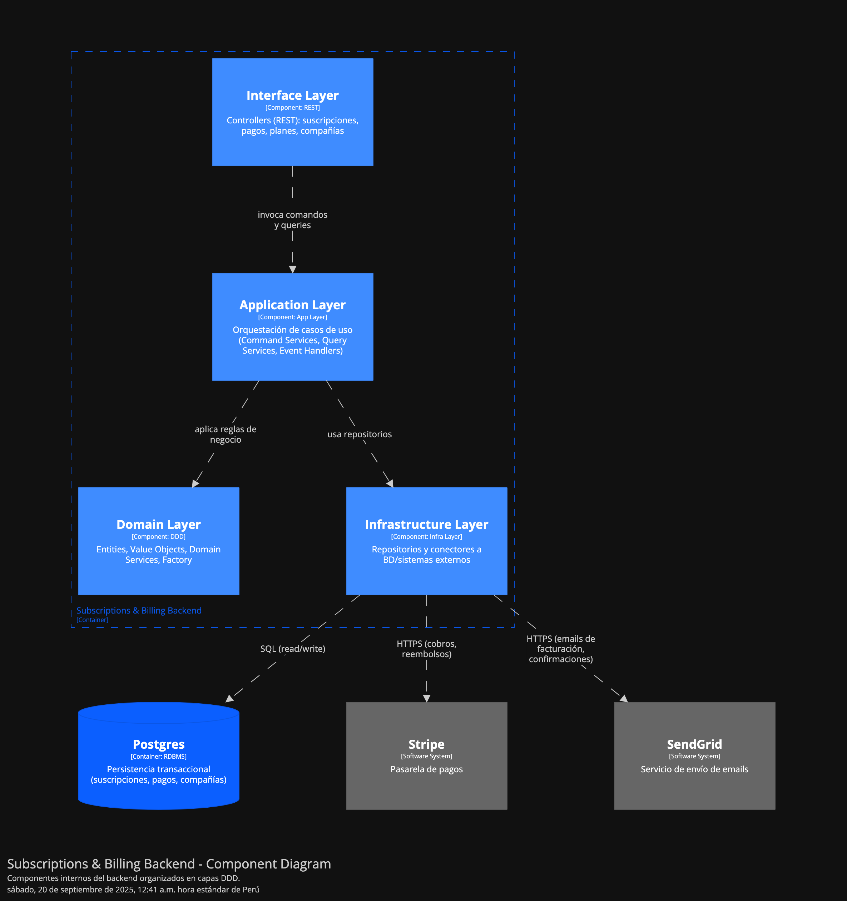

El backend del bounded context de Suscripciones y Pagos está estructurado siguiendo el enfoque de Domain-Driven Design (DDD), y se organiza en cuatro capas principales:

- **Interface Layer**: expone los controladores REST que atienden las operaciones de planes, suscripciones y pagos.Es la puerta de entrada para los usuarios o sistemas que consumen la API.

- **Application Layer**: orquesta los casos de uso mediante Command Services, Query Services y, potencialmente, Event Handlers.En esta capa se coordinan las operaciones y se aplican las reglas de negocio definidas en el dominio.

- **Domain Layer**: concentra la lógica de negocio del contexto, incluyendo las entidades Plan, Subscription y Payment.Define los estados y comportamientos que rigen el ciclo de vida de las suscripciones y los pagos.

- **Infrastructure Layer**: implementa los repositorios JPA y conectores hacia la base de datos y posibles servicios externos.Se encarga de la persistencia y de la integración técnica con sistemas externos.

Conexiones externas actuales:
• **Postgres**: persistencia transaccional de planes, suscripciones y pagos.
• **Stripe**: pasarela de pagos (configurada mediante variables de entorno, preparada para integración futura).
• **SendGrid**: servicio de envío de correos electrónicos (reservado para notificaciones de facturación y confirmaciones).

Diagrama de componentes - Application Web - Subscriptions and Billing

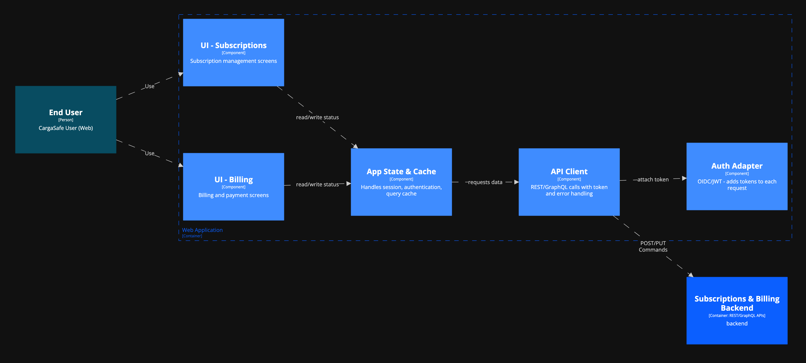

La aplicación web se comunica con el bounded context Subscriptions exclusivamente a través de endpoints REST del backend (mismo API para commands y queries). No existe un módulo separado de “Billing” ni una “Query API” independiente.

**Estructura de la Web Application:**

**UI – Subscriptions**: alta de suscripción, cambio de plan, visualización del plan vigente y lista de pagos del usuario.
**App State & Cache**: gestiona sesión/autenticación, almacén de estado y caché de consultas.
**API Client**: cliente HTTP que invoca la Subscriptions REST API, agrega el token (vía Auth Adapter) y maneja errores/reintentos.
**Auth Adapter**: integra OIDC/JWT para adjuntar credenciales en cada request. (Si la autenticación aún no está implementada en el backend de este BC, se mantiene como integración prevista).

**Alcance funcional en el cliente**:La aplicación web no implementa lógica de negocio, solo presenta datos y envía intenciones del usuario (crear suscripción, cambiar plan, eliminar, registrar pago).

_Conexiones externas representadas en el backend_:
• **Postgres** (persistencia transaccional de planes, suscripciones y pagos).
• **Stripe** (pasarela de pagos — integración planificada).
• **SendGrid** (correos transaccionales — integración planificada).

Diagrama de componentes - Mobile Application - Subscriptions and Billing

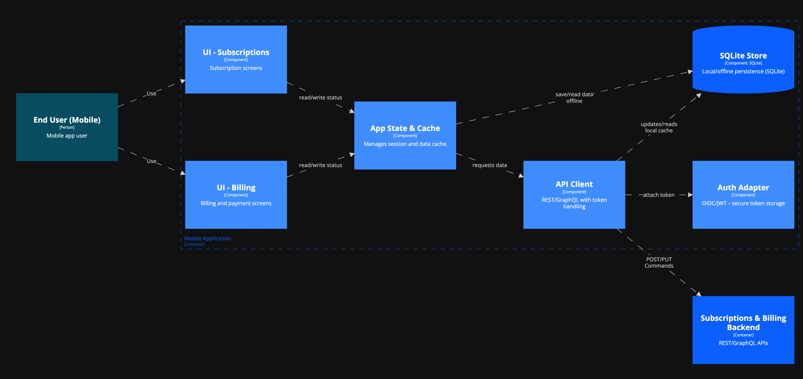

La aplicación móvil de Subscriptions mantiene una arquitectura muy similar a la versión web, ya que también se conecta al backend a través de la Subscriptions REST API, utilizando comandos (POST/PUT) para ejecutar acciones y consultas (GET) para obtener datos de planes, suscripciones y pagos.

La principal diferencia con respecto a la versión web es que en el entorno móvil se incorpora una base de datos local SQLite, la cual permite el funcionamiento offline.Gracias a esta base local, la aplicación puede continuar operando aun sin conexión, guardando temporalmente los datos y sincronizándolos cuando se restablece el acceso a internet.

_La app se organiza en los siguientes componentes_:
• **UI – Subscriptions**: pantallas de gestión de suscripción, cambio de plan y visualización del estado actual.
• **UI – Payments**: pantallas de pagos o facturación, integradas dentro del mismo módulo.
• **App State & Cache**: administra la sesión, autenticación y almacenamiento temporal de datos.
• **SQLite**: guarda información localmente para permitir modo offline.
• **API Client**: maneja las solicitudes HTTP al backend, incluyendo reintentos y gestión de errores.
• **Auth Adapter**: adjunta el token de autenticación (OIDC/JWT) a cada petición al backend.

#### 4.2.2.6. Bounded Context Software Architecture Code Level Diagrams

##### 4.2.2.6.1. Bounded Context Domain Layer Class Diagrams

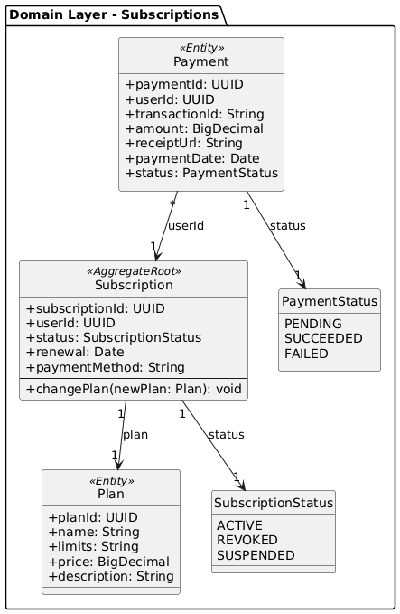

##### Explicación del diagrama

El diagrama de clases del Domain Layer se centra en tres entidades: Subscription (aggregate), Plan (entity) y Payment(entity).

_Subscription_ actúa como agregado principal y gestiona su ciclo de vida mediante el estado status, con los valores ACTIVE, REVOKED y SUSPENDED. La operación principal de negocio implementada es changePlan(newPlan), que solo procede cuando la suscripción está ACTIVE.

_Plan_ modela las ofertas disponibles y persiste atributos como name, limits, price y description.

_Payment_ registra transacciones asociadas a un usuario (userId) con transactionId único, amount, receiptUrl, paymentDate y status (PENDING, SUCCEEDED, FAILED).

##### 4.2.2.6.2. Bounded Context Database Design Diagram

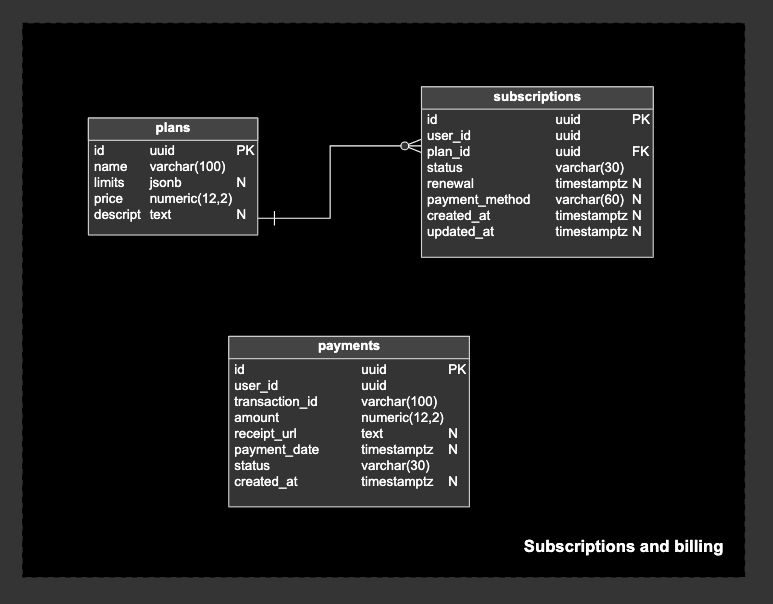

##### Explicación del diagrama

El diseño de base de datos está compuesto por tres tablas principales: **plans, subscriptions y payments**. Este modelo representa la persistencia mínima necesaria para gestionar los planes disponibles, el ciclo de vida de las suscripciones y el registro de pagos asociados a los usuarios.

La tabla plans almacena los planes disponibles dentro del sistema, incluye el identificador del _plan (id)_, el _nombre (name)_, los límites o características del plan (limits, en formato JSON), el precio (price) y una descripción (description). El campo name se encuentra definido como único con el fin de evitar duplicados en la configuración de planes.

La tabla subscriptions representa la suscripción activa o histórica de cada usuario. Contiene el identificador de la suscripción (id), el identificador del usuario (user_id), el plan al que se encuentra asociado (plan_id), el estado de la suscripción (status, cuyos valores posibles son ACTIVE, REVOKED o SUSPENDED), la fecha de renovación (renewal) y el método de pago (payment_method). Además, almacena marcas de auditoría como created_at y updated_at. La relación con la tabla plans se establece mediante la clave foránea plan_id → plans.id, que garantiza que toda suscripción referencia un plan válido. La restricción de que un usuario solo puede mantener una suscripción en estado ACTIVE es aplicada a nivel de la capa de aplicación.

La tabla payments registra los pagos realizados por los usuarios. Cada registro incluye el identificador del pago (id), el usuario asociado (user_id), el identificador único de transacción (transaction_id), el monto (amount), la URL del comprobante (receipt_url), la fecha del pago (payment_date) y el estado del pago (status, con valores permitidos PENDING, SUCCEEDED o FAILED). El campo transaction_id se define como único para garantizar idempotencia en el procesamiento de transacciones, evitando duplicidad de cobros.

### 4.2.3. Bounded Context: _Alerts & Resolution_

#### 4.2.3.1. Domain Layer

**Entidades (Entities)**

**Entity: Alert (Aggregate Root)**  
**Propósito principal**  
Centralizar la gestión del ciclo de vida de una alerta y garantizar que se cumplan las reglas de negocio.  
**Atributos principales**

- alertId: Identificador único de la alerta.
- type: Tipo de alerta (OutOfRange, Offline, RouteDeviation).
- status: Estado actual de la alerta (OPEN, ACKNOWLEDGED, CLOSED).
- sensorType: Tipo de sensor que la generó (TEMPERATURE, HUMIDITY, VIBRATION, TILT, LOCATION, BATTERY).
- createdAt: Fecha y hora de creación de la alerta.
- acknowledgedAt: Momento en que fue reconocida.
- closedAt: Momento en que fue cerrada.  
  **Métodos principales**
- acknowledge(): Marca la alerta como reconocida.
- close(): Cierra la alerta si ya fue reconocida.
- escalate(): Incrementa la criticidad si no fue atendida a tiempo.

**Entity: Notification**  
**Propósito principal**  
Representar un mensaje enviado a un usuario sobre una alerta.  
**Atributos principales**

- notificationId: Identificador único de la notificación.
- alertId: Referencia a la alerta asociada.
- channel: Canal de comunicación (EMAIL, SMS, FCM).
- message: Contenido del mensaje.
- sentAt: Fecha y hora de envío.  
  **Métodos principales**
- markAsSent(): Actualiza el estado de la notificación como enviada.

**Entity: Incident**  
**Propósito principal**  
Registrar un evento relacionado con un viaje que se crea a partir de una alerta.  
**Atributos principales**

- incidentId: Identificador único del incidente.
- alertId: Referencia a la alerta origen.
- tripId: Identificador del viaje asociado.
- description: Detalle del incidente.
- createdAt: Fecha y hora de creación.  
  **Métodos principales**
- resolve(description): Marca el incidente como resuelto con detalles.

**Objetos de Valor (Value Objects)**

- AlertType: clasifica los tipos de alertas (OutOfRange, Offline, RouteDeviation).
- AlertStatus: define en qué etapa se encuentra la alerta (Open, Acknowledged, Closed).
- NotificationChannel: indica el medio de comunicación usado (Email, SMS, FCM).
- PersistenceWindow: define el tiempo mínimo que debe cumplirse para que un evento se considere válido como alerta.
- SensorType: clasifica la fuente de monitoreo (TEMPERATURE, HUMIDITY, VIBRATION, TILT, LOCATION, BATTERY).

**Commands**

**Command: CreateAlertCommand**  
**Parámetros**

- type, sensorType, createdAt.  
  **Cómo funciona**  
  Se ejecuta al detectar un evento anómalo. Crea una nueva alerta validando reglas como la ventana de persistencia y evitando duplicación.

**Command: AcknowledgeAlertCommand**  
**Parámetros**

- alertId.  
  **Cómo funciona**  
  Permite a un operador reconocer la alerta. Cambia su estado a _ACKNOWLEDGED_ y registra la hora.

**Command: CloseAlertCommand**  
**Parámetros**

- alertId.  
  **Cómo funciona**  
  Cierra una alerta reconocida, cambiando su estado a _CLOSED_ y registrando la fecha de cierre.

**Command: EscalateAlertCommand**  
**Parámetros**

- alertId.  
  **Cómo funciona**  
  Incrementa la criticidad de una alerta que lleva demasiado tiempo sin ser reconocida, generando un evento de escalamiento.

**Command: CreateIncidentFromAlertCommand**  
**Parámetros**

- alertId, tripId, description.  
  **Cómo funciona**  
  Crea un incidente asociado a un viaje a partir de una alerta específica, permitiendo registrar el detalle del evento.

**Command: SendNotificationCommand**  
**Parámetros**

- alertId, channel, message.  
  **Cómo funciona**  
  Ordena enviar una notificación al canal definido (Email, SMS, FCM) para informar al usuario o empresa sobre la alerta.

**Queries**

**Query: GetAlertByIdQuery**  
**Parámetros**

- alertId.  
  **Cómo funciona**  
  Recupera los detalles de una alerta específica, incluyendo su estado, tipo y fechas clave.

**Query: GetAlertsByStatusQuery**  
**Parámetros**

- status.  
  **Cómo funciona**  
  Devuelve todas las alertas con un estado determinado (ej. abiertas, reconocidas, cerradas).

**Query: GetAlertsByTypeQuery**  
**Parámetros**

- type.  
  **Cómo funciona**  
  Recupera todas las alertas de un tipo específico (ej. RouteDeviation).

**Query: GetNotificationsByAlertIdQuery**  
**Parámetros**

- alertId.  
  **Cómo funciona**  
  Devuelve todas las notificaciones emitidas en relación con una alerta.

**Query: GetIncidentsByAlertIdQuery**  
**Parámetros**

- alertId.  
  **Cómo funciona**  
  Obtiene todos los incidentes generados a partir de una alerta determinada.

**Events**

**Event: AlertCreatedEvent**  
Se emite cuando una nueva alerta es registrada en el sistema.

**Event: AlertAcknowledgedEvent**  
Se emite cuando una alerta es reconocida.

**Event: AlertClosedEvent**  
Se emite cuando una alerta se cierra exitosamente.

**Event: AlertEscalatedEvent**  
Se emite cuando una alerta aumenta de criticidad por falta de respuesta.

**Event: NotificationSentEvent**  
Se emite al enviar una notificación a un usuario o empresa.

**Event: IncidentCreatedEvent**  
Se emite cuando se genera un incidente a partir de una alerta.

**Fábricas (Factories)**

- AlertFactory: encapsula la lógica de creación de una alerta a partir de eventos recibidos (ejemplo: sensor fuera de rango).
- IncidentFactory: crea incidentes asociados a un viaje cuando una alerta lo requiere.

#### 4.2.3.2. Interface Layer

En esta capa se definen **Controllers (REST)**.

**Controllers (REST — Spring Web)**

**AlertController**  
Este controlador permite crear nuevas alertas a partir de eventos detectados, reconocer (ACK) alertas activas, cerrarlas una vez reconocidas, y obtener tanto el detalle de una alerta específica como la lista de alertas activas (estados OPEN o ACKNOWLEDGED).

**NotificationController**  
Su responsabilidad es consultar y actualizar las preferencias de notificación de los usuarios, por ejemplo, los canales permitidos (EMAIL, SMS o FCM) y los tiempos de escalamiento configurados.

**IncidentController**  
Permite crear incidentes vinculados a una alerta y un viaje, y consultar el detalle de incidentes registrados.

#### 4.2.3.3. Application Layer

**Command Services**

- AlertCommandService: Ejecuta todos los comandos de las alertas.

**Event Services**

- OutOfRangeDetectedEvent: maneja eventos de sensores fuera de rango.
- DeviceOfflineDetectedEvent: maneja eventos de desconexión de dispositivos.
- RouteDeviationDetectedEvent: maneja desvíos de ruta.
- AlertAcknowledgedEvent: actúa tras el reconocimiento de una alerta (ejemplo: detener escalamiento).
- AlertClosedEvent: actúa tras el cierre de una alerta (ejemplo: notificar a analíticas).
- TemperatureOutOfRangeEvent: crea alerta de temperatura.
- HumidityOutOfRangeEvent: crea alerta de humedad.
- VibrationDetectedEvent: maneja vibración anómala.
- TiltOrDumpDetectedEvent: maneja vuelcos o inclinaciones.
- LowBatteryDetectedEvent: maneja alerta de energía.

**Query Services**

- AlertQueryService: Consulta las alertas.

**Outbound Services**

- NotificationService: Servicio para el envío de notificaciones a través de diferentes canales (Email, SMS, Push). Su implementación concreta delega en proveedores externos como Firebase Cloud Messaging (FCM).

#### 4.2.3.4. Infrastructure Layer

- Notification Repository: Repositorio para acceder a las notificaciones.
- Alert Repository: Repositorio para acceder a las alertas.
- Incident Repository: Repositorio para acceder a los incidentes.

#### 4.2.3.5. Bounded Context Software Architecture Component Level Diagrams

Diagrama de componentes - Backend - Alerts & Resolution

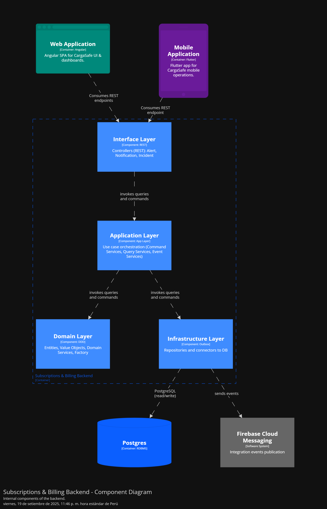

Diagrama de componentes - Application Web - Alerts & Resolution

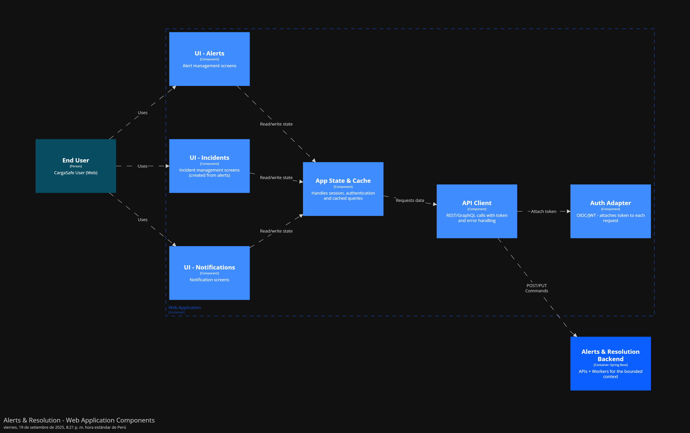

Diagrama de componentes - Mobile App - Alerts & Resolution

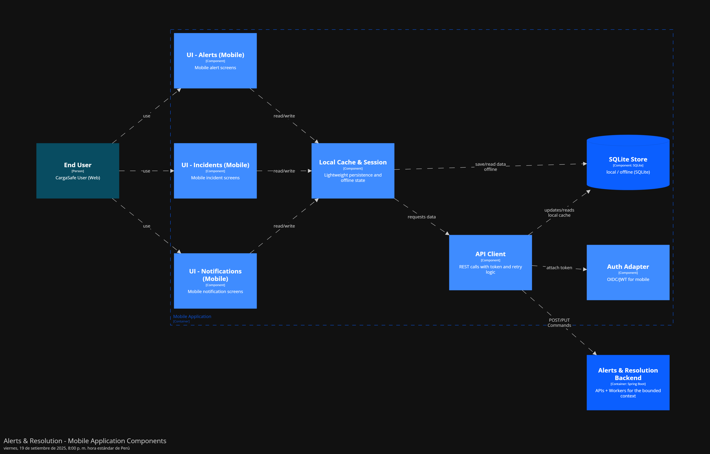

#### 4.2.3.6. Bounded Context Software Architecture Code Level Diagrams

##### 4.2.3.6.1. Bounded Context Domain Layer Class Diagrams

**WebApp Class Diagram**

**Mobile App Class Diagram**

##### 4.2.3.6.2. Bounded Context Database Design Diagram

### 4.2.4. Bounded Context: _Real-Time Monitoring_

#### 4.2.4.1. Domain Layer.

**Entity: MonitoringSession (Aggregate Root)**

**Propósito principal**  
Representar una sesión de monitoreo asociada a un viaje y dispositivo, centralizando su ciclo de vida y estado.

**Atributos principales**

- id: Identificador único de la sesión de monitoreo.
- tripId: Identificador del viaje asociado.
- deviceId: Identificador del dispositivo IoT.
- startTime: Fecha y hora de inicio de la sesión.
- endTime: Fecha y hora de finalización de la sesión (nullable).
- createdAt: Fecha y hora de creación de la sesión.
- sessionStatus: Estado actual de la sesión (relación con MonitoringSessionStatus).

**Métodos principales**

- startSession(): Inicia la sesión de monitoreo y cambia su estado a "ACTIVE".
- endSession(): Finaliza la sesión de monitoreo y cambia su estado a "COMPLETED".
- updateStatus(newStatus): Cambia el estado de la sesión (ej. ACTIVE → PAUSED).
- isActive(): Verifica si la sesión está activa.

---

**Entity: TelemetryData**

**Propósito principal**  
Representar una lectura de telemetría tomada durante una sesión de monitoreo.

**Atributos principales**

- id: Identificador único de la lectura de telemetría.
- monitoringSessionId: Identificador de la sesión de monitoreo asociada.
- temperature: Valor de temperatura registrado.
- humidity: Valor de humedad registrado.
- vibration: Valor de vibración registrado.
- latitude: Latitud geográfica registrada.
- longitude: Longitud geográfica registrada.
- createdAt: Fecha y hora de la lectura.

**Métodos principales**

- getTemperature(): Obtiene el valor de temperatura.
- getHumidity(): Obtiene el valor de humedad.
- getVibration(): Obtiene el valor de vibración.
- getLocation(): Retorna la ubicación (latitud, longitud).

---

**Entity: MonitoringSessionStatus**

**Propósito principal**  
Representar el estado de una sesión de monitoreo como entidad independiente.

**Atributos principales**

- id: Identificador único del estado.
- name: Nombre del estado (ej. ACTIVE, COMPLETED, PAUSED).

**Métodos principales**

- isFinal(): Verifica si el estado es terminal (ej. COMPLETED).

---

**Value Object: Location**

**Propósito principal**  
Representar una ubicación geográfica precisa.

**Atributos principales**

- latitude: Latitud de la ubicación.
- longitude: Longitud de la ubicación.

**Métodos principales**

- distanceTo(other): Calcula la distancia a otra ubicación.

---

**Value Object: SessionStatus**

**Propósito principal**  
Encapsular el estado de una sesión en su ciclo de vida.

**Atributos principales**

- status: Valor posible definido en monitoring_session_status (ej. ACTIVE, INACTIVE, COMPLETED, PAUSED).

---

**Aggregate: MonitoringSessionAggregate**

**Propósito principal**  
Garantizar la consistencia de una sesión de monitoreo, agrupando la sesión y sus datos de telemetría relacionados.

**Métodos principales**

- addTelemetryData(data): Agrega una nueva lectura de telemetría.
- validateSessionStatus(): Verifica que la sesión esté en un estado válido antes de aceptar lecturas.

---

**Factory: MonitoringSessionFactory**

**Propósito principal**  
Crear instancias válidas de MonitoringSession.

**Métodos principales**

- createSession(tripId, deviceId): Genera una nueva sesión en estado inicial (ej. INACTIVE).

---

**Domain Service: TelemetryProcessingService**

**Propósito principal**  
Encapsular la lógica de procesamiento de datos de telemetría.

**Métodos principales**

- processTelemetry(rawData): Procesa datos brutos y crea TelemetryData.
- validateTelemetry(data): Valida integridad y consistencia de los datos.

---

**Domain Service: SessionLifecycleService**

**Propósito principal**  
Gestionar el ciclo de vida de una sesión de monitoreo.

**Métodos principales**

- startSession(session): Inicia la sesión.
- endSession(session): Finaliza la sesión.
- pauseSession(session): Pausa una sesión activa.
- resumeSession(session): Reanuda una sesión pausada.

---

**Command: StartMonitoringSessionCommand**

**Propósito**  
Iniciar una nueva sesión de monitoreo.

**Parámetros**

- tripId
- deviceId

---

**Command: EndMonitoringSessionCommand**

**Propósito**  
Finalizar una sesión activa.

**Parámetros**

- sessionId

---

**Command: PauseMonitoringSessionCommand**

**Propósito**  
Pausar temporalmente una sesión de monitoreo.

**Parámetros**

- sessionId

---

**Command: ResumeMonitoringSessionCommand**

**Propósito**  
Reanudar una sesión previamente pausada.

**Parámetros**

- sessionId

---

**Query: GetMonitoringSessionByIdQuery**

**Propósito**  
Obtener información de una sesión específica.

**Parámetros**

- sessionId

---

**Query: GetTelemetryDataBySessionQuery**

**Propósito**  
Obtener lecturas de telemetría de una sesión.

**Parámetros**

- sessionId
- startTime (opcional)
- endTime (opcional)

---

**Query: GetActiveSessionsQuery**

**Propósito**  
Listar todas las sesiones activas.

---

**Query: GetSessionsByTripIdQuery**

**Propósito**  
Obtener todas las sesiones de un viaje.

**Parámetros**

- tripId

---

**Event: MonitoringSessionStartedEvent**

**Propósito**  
Notificar inicio de una sesión.

**Parámetros**

- sessionId
- tripId
- deviceId
- startedAt

---

**Event: MonitoringSessionCompletedEvent**

**Propósito**  
Notificar finalización de una sesión.

**Parámetros**

- sessionId
- completedAt

---

**Event: TelemetryDataReceivedEvent**

**Propósito**  
Notificar recepción de una lectura de telemetría.

**Parámetros**

- sessionId
- telemetryData
- receivedAt

---

#### 4.2.4.2. Interface Layer.

**Controllers**

- **MonitoringController**: Maneja solicitudes de inicio, fin, pausa, reanudación y consulta de sesiones.

- **TelemetryController**: Maneja solicitudes relacionadas con datos de telemetría (consultas, históricos, gráficos).

---

#### 4.2.4.3. Application Layer.

**Command Services**

- **MonitoringCommandService**: Coordina comandos relacionados a las sesiones.

- **TelemetryCommandService**: Coordina el procesamiento de datos de telemetría.

---

**Query Services**

- **MonitoringQueryService**: Atiende consultas sobre sesiones.

- **TelemetryQueryService**: Atiende consultas sobre lecturas de telemetría.

---

**Event Services**

- **MonitoringEventService**: Atiende eventos de sesiones (inicio, fin, recepción de telemetría).

---

#### 4.2.4.4. Infrastructure Layer.

**Repositories**

- **IMonitoringSessionRepository**: Persistencia de sesiones.

- **ITelemetryDataRepository**: Persistencia y consulta de lecturas de telemetría.

- **ISessionStatusRepository**: Acceso a los estados posibles de sesión.ReintentarClaude aún no tiene la capacidad de ejecutar el código que genera.

#### 4.2.4.5. Bounded Context Software Architecture Component Level Diagrams

Diagrama de componentes - Backend - Real-Time Monitoring

Diagrama de componentes - Application Web - Real-Time Monitoring

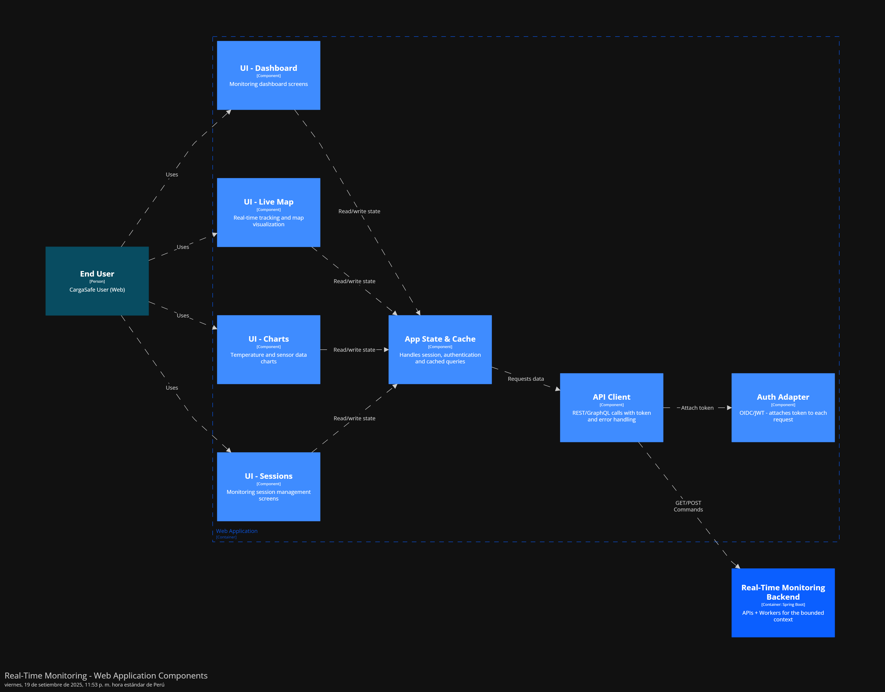

Diagrama de componentes - Mobile App - Real-Time Monitoring

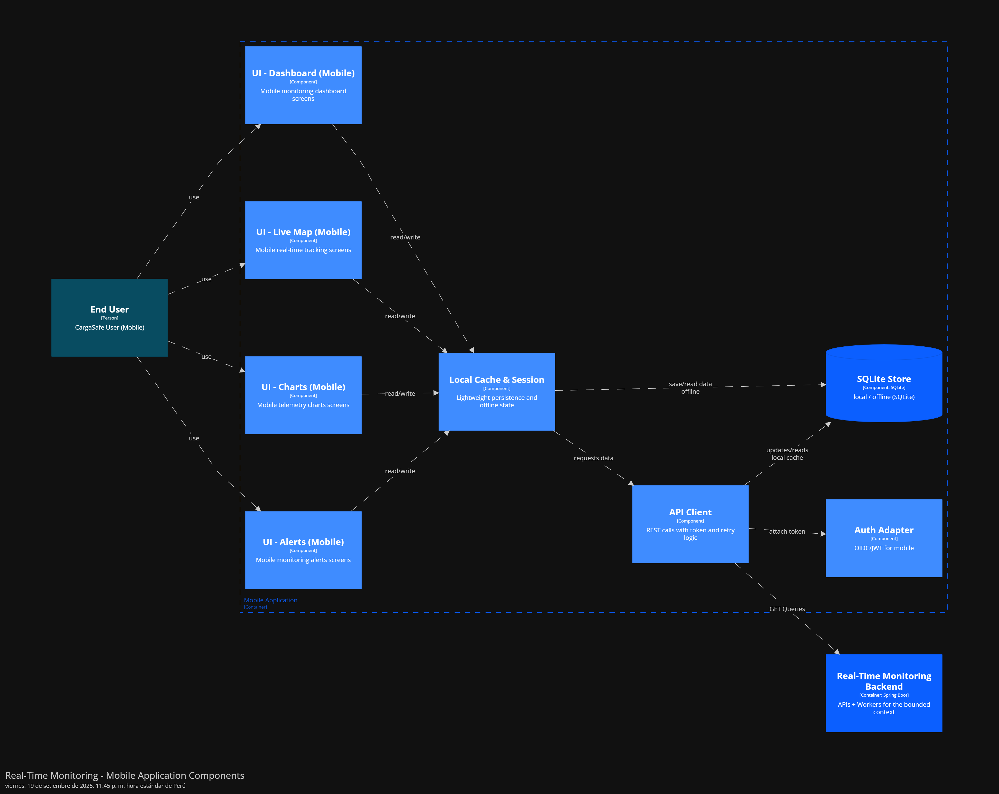

#### 4.2.4.6. Bounded Context Software Architecture Code Level Diagrams

##### 4.2.4.6.1. Bounded Context Domain Layer Class Diagrams

**WebApp Class Diagram**

**Mobile Class Diagram**

##### 4.2.4.6.2. Bounded Context Database Design Diagram

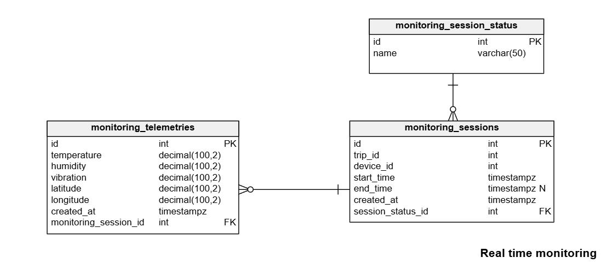

### 4.2.5. Bounded Context: _Trip management_

#### 4.2.5.1. Domain Layer.

**Entity: Trip (Aggregate Root)**

**Propósito principal**  
Representar un viaje y centralizar su ciclo de vida, asegurando que se cumplan las reglas de negocio relacionadas con cliente, conductor, vehículo y ruta.

**Atributos principales**

- tripId: Identificador único del viaje.
- clientId: Identificador del cliente.
- driverId: Identificador del conductor.
- vehicleId: Identificador del vehículo.
- route: Ruta definida para el trayecto.
- status: Estado del viaje (CREATED, IN_PROGRESS, COMPLETED, CANCELLED).
- requestedAt: Fecha y hora de la solicitud.

**Métodos principales**

- assignDriver(driverId): Asigna un conductor al viaje.
- assignVehicle(vehicleId): Vincula un vehículo al viaje.
- startTrip(): Inicia el viaje y cambia su estado a “En curso”.
- completeTrip(): Finaliza el viaje y cambia su estado a “Completado”.
- cancelTrip(reason): Cancela el viaje y registra el motivo.

---

**Entity: Route**

**Propósito principal**  
Representar la ruta de un viaje como una entidad con identidad propia, capaz de almacenar y gestionar la información de los tramos, distancias y duración total.

**Atributos principales**

- routeId: Identificador único de la ruta.
- origin: Punto de inicio.
- destination: Punto final.
- segments: Lista de tramos de la ruta.
- totalDistance: Distancia total del viaje.
- totalDuration: Duración total estimada.

**Métodos principales**

- addSegment(segment): Agrega un tramo adicional a la ruta.
- updateDestination(newDestination): Cambia el destino de la ruta antes de iniciar el viaje.
- recalculateTotals(): Recalcula la distancia y la duración total a partir de los segmentos actuales.

---

**Value Object: GeoCoordinate**

**Propósito principal**  
Representar un punto geográfico inmutable.

**Atributos principales**

- latitude: Latitud válida.
- longitude: Longitud válida.

---

**Value Object: RouteSegment**

**Propósito principal**  
Modelar un tramo de ruta entre dos puntos.

**Atributos principales**

- coordinates: Lista de coordenadas que forman el tramo.
- distance: Distancia recorrida en el segmento.
- duration: Tiempo estimado del segmento.

---

**Value Object: Distance**

**Propósito principal**  
Expresar una magnitud de distancia.

**Atributos principales**

- value: Cantidad numérica de la distancia.
- unit: Unidad de medida (ej. km).

---

**Value Object: Duration**

**Propósito principal**  
Expresar un intervalo de tiempo.

**Atributos principales**

- value: Cantidad numérica de tiempo.
- unit: Unidad de medida (ej. minutos).

---

**Value Object: TripStatus**

**Propósito principal**  
Representar el estado del viaje en su ciclo de vida.

**Atributos principales**

- status: Valor posible (PENDING, IN_PROGRESS, COMPLETED, CANCELLED).

---

**Aggregate: TripAggregate**

**Propósito principal**  
Asegurar la consistencia de un viaje como unidad de negocio.

**Métodos principales**

- validateTripReady(): Verifica que el viaje tenga cliente, conductor, vehículo y ruta antes de iniciar.

---

**Factory: TripFactory**

**Propósito principal**  
Crear instancias de **Trip** en estado inicial válido.

**Métodos principales**

- createTrip(clientId, driverId, vehicleId, route): Genera un viaje en estado PENDING con todos los datos requeridos.

---

**Domain Service: RoutePlanningService**

**Propósito principal**  
Encapsular la lógica de planificación de rutas.

**Métodos principales**

- generateRoute(origin, destination): Construye una ruta válida con segmentos, distancia y duración.

---

**Domain Service: TripSchedulerService**

**Propósito principal**  
Validar disponibilidad de recursos antes de asignarlos a un viaje.

**Métodos principales**

- checkDriverAvailability(driverId, timeRange): Verifica si un conductor está libre.
- checkVehicleAvailability(vehicleId, timeRange): Verifica si un vehículo está disponible.

---

**Command: CreateTripCommand**

**Propósito**  
Crear un nuevo viaje en estado PENDING con las referencias de cliente, conductor, vehículo y ruta.

**Parámetros**

- clientId: Identificador del cliente.
- driverId: Identificador del conductor.
- vehicleId: Identificador del vehículo.
- route: Ruta completa del viaje.

---

**Command: AssignDriverToTripCommand**

**Propósito**  
Asignar un conductor disponible a un viaje existente y actualizar la referencia correspondiente.

**Parámetros**

- tripId: Identificador único del viaje.
- driverId: Identificador del conductor.

---

**Command: AssignVehicleToTripCommand**

**Propósito**  
Asignar un vehículo disponible a un viaje existente y actualizar la referencia correspondiente.

**Parámetros**

- tripId: Identificador único del viaje.
- vehicleId: Identificador del vehículo.

---

**Command: StartTripCommand**

**Propósito**  
Iniciar un viaje, cambiando su estado a EN CURSO y registrando la hora exacta de inicio.

**Parámetros**

- tripId: Identificador único del viaje.

---

**Command: CompleteTripCommand**

**Propósito**  
Finalizar un viaje, cambiando su estado a COMPLETADO y registrando la hora de cierre.

**Parámetros**

- tripId: Identificador único del viaje.

---

**Command: CancelTripCommand**

**Propósito**  
Cancelar un viaje, actualizar su estado a CANCELADO y guardar la razón de la cancelación.

**Parámetros**

- tripId: Identificador único del viaje.
- reason: Motivo de la cancelación.

---

**Command: UpdateRouteForTripCommand**

**Propósito**  
Actualizar la ruta de un viaje antes de que inicie, garantizando que la información sea válida y actualizada.

**Parámetros**

- tripId: Identificador único del viaje.
- newRoute: Nueva ruta a asociar.

**Query: GetTripByIdQuery**

**Propósito**  
Obtener la información completa de un viaje específico mediante su identificador único.

**Parámetros**

- tripId: Identificador único del viaje.

---

**Query: GetTripsByStatusQuery**

**Propósito**  
Listar los viajes filtrados por su estado (Pendiente, En curso, Completado o Cancelado).

**Parámetros**

- status: Estado de los viajes a consultar.

---

**Query: GetTripsByClientIdQuery**

**Propósito**  
Obtener todos los viajes asociados a un cliente específico.

**Parámetros**

- clientId: Identificador único del cliente.

---

**Query: GetAllTripsQuery**

**Propósito**  
Recuperar todos los viajes registrados en el sistema, sin aplicar filtros.

**Parámetros**  
_(No requiere parámetros)_

---

**Event: TripCreatedEvent**

**Propósito**  
Notificar que un nuevo viaje ha sido creado en el sistema.

**Parámetros**

- tripId: Identificador único del viaje.
- clientId: Identificador del cliente.
- driverId: Identificador del conductor asignado.
- vehicleId: Identificador del vehículo asignado.
- route: Ruta definida para el viaje.
- createdAt: Fecha y hora en que se creó el viaje.

---

**Event: DriverAssignedEvent**

**Propósito**  
Notificar que un conductor fue asignado a un viaje.

**Parámetros**

- tripId: Identificador único del viaje.
- driverId: Identificador del conductor asignado.
- assignedAt: Fecha y hora de la asignación.

---

**Event: VehicleAssignedEvent**

**Propósito**  
Notificar que un vehículo fue asignado a un viaje.

**Parámetros**

- tripId: Identificador único del viaje.
- vehicleId: Identificador del vehículo asignado.
- assignedAt: Fecha y hora de la asignación.

---

**Event: TripStartedEvent**

**Propósito**  
Notificar que un viaje ha iniciado oficialmente.

**Parámetros**

- tripId: Identificador único del viaje.
- startedAt: Fecha y hora de inicio del viaje.

---

**Event: TripCompletedEvent**

**Propósito**  
Notificar que un viaje se ha completado satisfactoriamente.

**Parámetros**

- tripId: Identificador único del viaje.
- completedAt: Fecha y hora de finalización del viaje.

---

**Event: TripCancelledEvent**

**Propósito**  
Notificar que un viaje ha sido cancelado.

**Parámetros**

- tripId: Identificador único del viaje.
- reason: Motivo de la cancelación.
- cancelledAt: Fecha y hora en que se canceló el viaje.

#### 4.2.5.2. Interface Layer.

**Controllers**

- TripController: Controlador que maneja las solicitudes relacionadas con los viajes. Atiende operaciones como crear un nuevo viaje, asignar un conductor, actualizar la ruta, iniciar, completar o cancelar un viaje, así como consultar información de viajes por identificador, estado, cliente o recuperar todos los viajes registrados.

- RouteController: Controlador que maneja las solicitudes relacionadas con las rutas de los viajes. Permite registrar una nueva ruta, actualizarla antes del inicio de un viaje y consultar la información de rutas específicas o asociadas a un viaje.

#### 4.2.5.3. Application Layer.

**Command Services**

- TripCommandService: Se encarga de recibir y coordinar los comandos relacionados a un viaje. Dentro de él se manejan distintos handlers, cada uno especializado en ejecutar un comando específico como iniciar, completar, cancelar o asignar recursos al viaje.

- RouteCommandService: Se encarga de coordinar los comandos relacionados con rutas. Administra la creación, actualización y recalculo de rutas para garantizar que los trayectos estén completos y actualizados antes de iniciar un viaje.

---

**Query Services**

- TripQueryService: Se encarga de atender las consultas relacionadas a los viajes. Contiene handlers que procesan queries para obtener información, por ejemplo: consultar un viaje por su identificador, listar viajes por estado o recuperar todos los viajes de un cliente.

- RouteQueryService: Atiende las consultas relacionadas a las rutas de los viajes. Permite obtener información de rutas específicas o de las rutas asociadas a un viaje.

---

**Event Services**

- TripEventService: Se encarga de atender los eventos relacionados a un viaje. Dentro de él se gestionan distintos servicios especializados que reaccionan a cada evento, como creación, asignación de recursos, inicio, finalización o cancelación del viaje, ejecutando las acciones necesarias después de que ocurren.

#### 4.2.5.4. Infrastructure Layer.

**Repositories**

- ITripRepository: Repositorio que define las operaciones de acceso a los viajes, como guardar, actualizar y recuperar información de un viaje.
- IRouteRepository: Repositorio que define las operaciones de acceso a las rutas, como registrar nuevas rutas, actualizarlas y consultarlas en relación con un viaje.

#### 4.2.5.5. Bounded Context Software Architecture Component Level Diagrams.

Diagrama de componentes - Backend - Trip Management

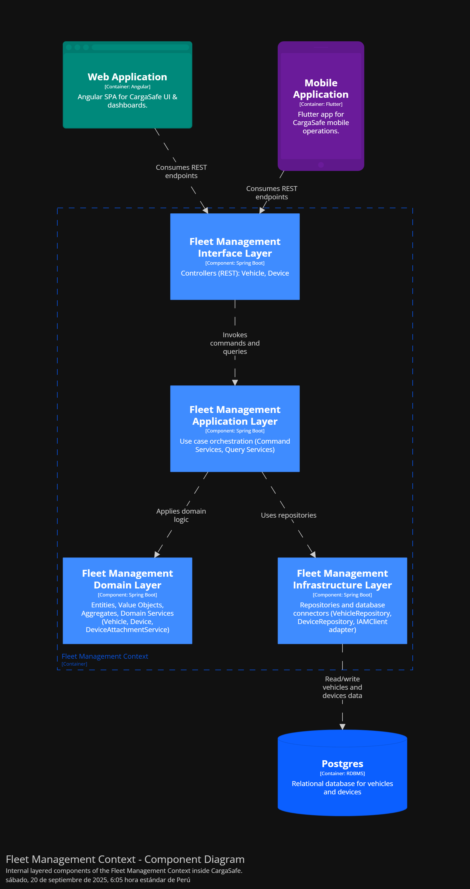

Diagrama de componentes - Application Web - Trip Management

<!--  -->

Diagrama de componentes - Mobile App - Trip Management

<!--  -->

#### 4.2.5.6. Bounded Context Software Architecture Code Level Diagrams.

##### 4.2.5.6.1. Bounded Context Domain Layer Class Diagrams.

##### 4.2.5.6.2. Bounded Context Database Design Diagram.

### 4.2.6. Bounded Context: Fleet Management

#### 4.2.6.1. Domain Layer

**Aggregates principales**

**Vehicle (Aggregate Root)**

- **Propósito:** Representa un vehículo de la flota que puede ser monitoreado, recibir dispositivos IoT y participar en viajes.
- **Atributos principales:**

  - `id` (Long, generado por JPA)
  - `plate` (`Plate`, único)
  - `type` (`VehicleType` = `VAN`, `TRUCK`, `CAR`, `MOTORCYCLE`)
  - `capabilities` (`Set<Capability>` = `BOX`, `REFRIGERATED`, `GPS_ONLY`, `HEAVY_LOAD`, `FRAGILE_CARGO`)
  - `status` (`VehicleStatus` = `IN_SERVICE`, `OUT_OF_SERVICE`, `MAINTENANCE`, `RETIRED`)
  - `odometerKm` (`OdometerKm`, entero ≥ 0)
  - `deviceImeis` (`Set<Imei>`): lista de IMEIs de dispositivos asignados
  - Campos de auditoría heredados de `AuditableAbstractAggregateRoot` (fechas, etc.)

- **Reglas de negocio / métodos relevantes:**
  - `Vehicle(CreateVehicleCommand)`  
    Construye el agregado garantizando:
    - `plate` no vacío y con patrón válido.
    - `type` y `capabilities` no nulos.
    - `capabilities` no vacío.
    - `odometerKm` ≥ 0.
    - `status` por defecto: `IN_SERVICE` si no se envía.
  - `updateType(VehicleType type)`  
    Actualiza el tipo del vehículo.
  - `updateCapabilities(Set<Capability> capabilities)`  
    Reemplaza el conjunto de capacidades (si no viene vacío).
  - `updateStatus(VehicleStatus status)`  
    No permite cambiar desde `RETIRED` a cualquier otro estado (lanza `IllegalStateException`).
  - `updateOdometer(Integer newOdometerKm)`  
    Verifica que el nuevo valor:
    - No sea negativo.
    - No sea menor que el valor actual (no se permite “retroceder” el odómetro).
  - `assignDevice(Imei deviceImei)`
    - No permite asignar si `status == RETIRED`.
    - No permite asignar el mismo IMEI dos veces al mismo vehículo.
  - `unassignDevice(Imei deviceImei)`  
    Elimina el IMEI del set de dispositivos asociados.
  - `hasAnyDevice()`  
    Devuelve `true` si tiene al menos un dispositivo asignado (se usa para restringir el borrado).
  - `hasDevice(Imei deviceImei)`  
    Verifica si un IMEI concreto está asociado al vehículo.

---

**Device (Aggregate Root)**

- **Propósito:** Representa un dispositivo IoT asociado (o no) a un vehículo de la flota.
- **Atributos principales:**

  - `id` (Long, generado por JPA)
  - `imei` (`Imei`, único)
  - `firmware` (`FirmwareVersion`)
  - `online` (boolean)
  - `vehiclePlate` (`Plate` opcional): placa del vehículo al que está asignado o `null`
  - Campos de auditoría vía `AuditableAbstractAggregateRoot`

- **Reglas de negocio / métodos relevantes:**
  - `Device(CreateDeviceCommand)`
    - `imei` obligatorio y con patrón válido.
    - `firmware` obligatorio y con patrón válido.
    - `online`: si no se envía, se inicializa como `false`.
  - `updateFirmware(FirmwareVersion firmware)`  
    Simplifica actualizaciones de versión de firmware.
  - `updateOnline(boolean online)`  
    Actualiza el estado en línea del dispositivo.
  - `assignToVehicle(Plate vehiclePlate)`
    - No permite reasignar si ya tiene una placa (`IllegalStateException("Device is already assigned to a vehicle")`).
    - Guarda la placa del vehículo al que queda asociado.
  - `unassignFromVehicle()`  
    Elimina la placa asociada.
  - `isAssigned()`  
    Indica si el dispositivo está asociado a un vehículo (`vehiclePlate != null`).

---

**Value Objects**

- `Plate`
  - Normaliza en mayúsculas.
  - Valida patrón `[A-Z0-9-]{4,12}`.
  - No permite cadenas en blanco.
- `Imei`
  - No permite cadenas en blanco.
  - Patrón: `IMEI-[0-9]{7,15}` (ej. `IMEI-123456789`).
- `FirmwareVersion`
  - No permite cadenas en blanco.
  - Patrón: `vMAJOR.MINOR.PATCH` (ej. `v1.8.2`).
- `OdometerKm`
  - Entero ≥ 0.
- Enums:
  - `VehicleStatus`: `IN_SERVICE`, `OUT_OF_SERVICE`, `MAINTENANCE`, `RETIRED`.
  - `VehicleType`: `VAN`, `TRUCK`, `CAR`, `MOTORCYCLE`.
  - `Capability`: `BOX`, `REFRIGERATED`, `GPS_ONLY`, `HEAVY_LOAD`, `FRAGILE_CARGO`.

---

**Excepciones de dominio**

- `VehicleNotFoundException`
- `VehiclePlateAlreadyExistsException`
- `VehicleAlreadyHasDeviceException`
- `DeviceNotFoundException`
- `DeviceImeiAlreadyExistsException`
- `DeviceAssignmentConflictException`
- `DeviceAlreadyAssignedException`

Estas excepciones se traducen en la capa de interfaz a códigos HTTP estándar (`404`, `409`, etc.).

---

**Commands**

_Devices_

- `CreateDeviceCommand(imei, firmware, online?)`  
  Valida IMEI y firmware no vacíos.
- `UpdateDeviceCommand(id, firmware?, online?)`  
  Valida que `id` no sea nulo.
- `DeleteDeviceCommand(id)`
- `UpdateDeviceFirmwareCommand(id, firmware)`  
  Firmware no puede ser vacío.
- `UpdateDeviceOnlineStatusCommand(deviceId, online)`

_Vehicles_

- `CreateVehicleCommand(plate, type, capabilities, status?, odometerKm)`
  - `plate`, `type`, `capabilities`, `odometerKm` obligatorios.
  - `capabilities` no puede estar vacío.
  - `odometerKm` ≥ 0.
- `UpdateVehicleCommand(id, type?, capabilities?, status?, odometerKm?)`
- `DeleteVehicleCommand(id)`
- `AssignDeviceToVehicleCommand(vehicleId, deviceImei)`
- `UnassignDeviceFromVehicleCommand(vehicleId, deviceImei)`
- `UpdateVehicleStatusCommand(vehicleId, status)`  
  Ambos campos obligatorios.

---

**Queries**

_Devices_

- `GetAllDevicesQuery`
- `GetDeviceByIdQuery(id)`
- `GetDeviceByImeiQuery(imei)`
- `GetDevicesByOnlineQuery(online)`

_Vehicles_

- `GetAllVehiclesQuery`
- `GetVehicleByIdQuery(id)`
- `GetVehicleByPlateQuery(plate)`
- `GetVehiclesByStatusQuery(status)`
- `GetVehiclesByTypeQuery(type)`

---

#### 4.2.6.2. Interface Layer

#### Controllers principales (HTTP REST)

Los controladores REST exponen los casos de uso del BC Fleet Management a través de endpoints versionados bajo `/api/v1/fleet`.  
Todos los métodos están documentados con **OpenAPI 3.0** usando las anotaciones `@Operation` y `@ApiResponses`.

---

**DeviceController**

Base path: `/api/v1/fleet/devices`

- **GET `/api/v1/fleet/devices`**

  - Descripción: Listar todos los dispositivos.
  - Respuesta: `200 OK` con `List<DeviceResource>`.

- **GET `/api/v1/fleet/devices/{id}`**

  - Descripción: Obtener un dispositivo por su ID.
  - Respuestas:
    - `200 OK` con `DeviceResource`.
    - `404 Not Found` si el dispositivo no existe.

- **GET `/api/v1/fleet/devices/by-imei/{imei}`**

  - Descripción: Buscar un dispositivo por IMEI.
  - Respuestas:
    - `200 OK` con `DeviceResource`.
    - `404 Not Found` si no existe.

- **GET `/api/v1/fleet/devices/by-online/{online}`**

  - Descripción: Listar dispositivos filtrados por estado online (`true`/`false`).
  - Respuesta: `200 OK` con `List<DeviceResource>`.

- **POST `/api/v1/fleet/devices`**

  - Descripción: Crear un nuevo dispositivo IoT.
  - Request body: `CreateDeviceResource { imei, firmware, online? }`.
  - Respuestas:
    - `201 Created` con `DeviceResource`.
    - `400 Bad Request` si IMEI/firmware no cumplen validaciones.
    - `409 Conflict` si el IMEI ya existe (`DeviceImeiAlreadyExistsException`).

- **PUT `/api/v1/fleet/devices/{id}`**

  - Descripción: Actualizar firmware y/o estado online de un dispositivo.
  - Request body: `UpdateDeviceResource { firmware?, online? }`.
  - Respuestas:
    - `200 OK` con `DeviceResource` actualizado.
    - `404 Not Found` si el dispositivo no existe.

- **DELETE `/api/v1/fleet/devices/{id}`**

  - Descripción: Eliminar un dispositivo.
  - Reglas:
    - Solo se puede eliminar si no está asignado a ningún vehículo.
  - Respuestas:
    - `204 No Content` si se elimina correctamente.
    - `404 Not Found` si el dispositivo no existe.
    - `409 Conflict` si el dispositivo está asignado (`DeviceAssignmentConflictException`).

- **POST `/api/v1/fleet/devices/{id}/firmware`**

  - Descripción: Actualizar la versión de firmware del dispositivo.
  - Parámetros: `firmware` como `requestParam`.
  - Respuestas:
    - `200 OK` con `DeviceResource` actualizado.
    - `404 Not Found` si el dispositivo no existe.
    - `400 Bad Request` si la versión no cumple el patrón `vMAJOR.MINOR.PATCH`.

- **PATCH `/api/v1/fleet/devices/{id}/online`**
  - Descripción: Cambiar el estado online del dispositivo.
  - Request body: `UpdateDeviceOnlineStatusResource { online: Boolean }`.
  - Nota: Si `online` llega como `null`, se interpreta como `false`.
  - Respuestas:
    - `200 OK` con `DeviceResource` actualizado.
    - `404 Not Found` si el dispositivo no existe.

---

**VehicleController**

Base path: `/api/v1/fleet/vehicles`

- **GET `/api/v1/fleet/vehicles`**

  - Descripción: Listar todos los vehículos registrados.
  - Respuesta: `200 OK` con `List<VehicleResource>`.

- **GET `/api/v1/fleet/vehicles/{id}`**

  - Descripción: Obtener un vehículo por ID.
  - Respuestas:
    - `200 OK` con `VehicleResource`.
    - `404 Not Found` si no existe.

- **GET `/api/v1/fleet/vehicles/by-plate/{plate}`**

  - Descripción: Buscar vehículo por placa.
  - Respuestas:
    - `200 OK` con `VehicleResource`.
    - `404 Not Found` si no existe.

- **GET `/api/v1/fleet/vehicles/by-status/{status}`**

  - Descripción: Listar vehículos por estado (`IN_SERVICE`, `OUT_OF_SERVICE`, `MAINTENANCE`, `RETIRED`).
  - Respuesta: `200 OK` con `List<VehicleResource>`.

- **GET `/api/v1/fleet/vehicles/by-type/{type}`**

  - Descripción: Listar vehículos por tipo (`VAN`, `TRUCK`, `CAR`, `MOTORCYCLE`).
  - Respuesta: `200 OK` con `List<VehicleResource>`.

- **POST `/api/v1/fleet/vehicles`**

  - Descripción: Registrar un nuevo vehículo en la flota.
  - Request body: `CreateVehicleResource { plate, type, capabilities[], status?, odometerKm }`.
  - Respuestas:
    - `201 Created` con `VehicleResource`.
    - `400 Bad Request` si los datos violan restricciones (placa inválida, capabilities vacío, odómetro negativo).
    - `409 Conflict` si la placa ya existe (`VehiclePlateAlreadyExistsException`).

- **PUT `/api/v1/fleet/vehicles/{id}`**

  - Descripción: Actualizar tipo, capacidades, estado u odómetro.
  - Request body: `UpdateVehicleResource { type?, capabilities?, status?, odometerKm? }`.
  - Respuestas:
    - `200 OK` con `VehicleResource`.
    - `404 Not Found` si el vehículo no existe.

- **DELETE `/api/v1/fleet/vehicles/{id}`**

  - Descripción: Eliminar un vehículo de la flota.
  - Reglas:
    - Solo se puede eliminar si el `status == RETIRED` y **no tiene dispositivos asociados**.
  - Respuestas:
    - `204 No Content` si se elimina correctamente.
    - `404 Not Found` si no existe.
    - `409 Conflict` si:
      - No está en estado `RETIRED`, o
      - Tiene dispositivos asignados (`DeviceAssignmentConflictException` / `IllegalStateException`).

- **POST `/api/v1/fleet/vehicles/{id}/assign-device/{imei}`**

  - Descripción: Asignar un dispositivo a un vehículo.
  - Reglas:
    - No se permite asignar dispositivos a vehículos en estado `RETIRED`.
    - Un dispositivo no puede estar asignado simultáneamente a otro vehículo distinto.
  - Respuestas:
    - `200 OK` con `VehicleResource` actualizado (lista `deviceImeis`).
    - `404 Not Found` si vehículo o dispositivo no existen.
    - `409 Conflict` si:
      - El vehículo ya tiene el dispositivo.
      - El dispositivo está asignado a otro vehículo.
      - Se intenta asignar a un vehículo `RETIRED`.

- **POST `/api/v1/fleet/vehicles/{id}/unassign-device/{imei}`**

  - Descripción: Desasignar un dispositivo de un vehículo concreto.
  - Respuestas:
    - `200 OK` con `VehicleResource` actualizado.
    - `404 Not Found` si el vehículo no existe.
    - `400 Bad Request` si el dispositivo no está asociado a ese vehículo.

- **PATCH `/api/v1/fleet/vehicles/{id}/status`**
  - Descripción: Cambiar el estado de un vehículo.
  - Request body: `UpdateVehicleStatusResource { status }`.
  - Reglas:
    - No se permite cambiar desde `RETIRED` a cualquier otro estado (conflicto de negocio).
  - Respuestas:
    - `200 OK` con `VehicleResource` actualizado.
    - `400 Bad Request` si el estado es inválido o nulo.
    - `404 Not Found` si el vehículo no existe.
    - `409 Conflict` si el cambio de estado no está permitido (ej. desde `RETIRED`).

---

**Seguridad (ACLs)**

- La protección de endpoints se gestiona a nivel de API Gateway/IAM (autenticación JWT).
- Este BC asume que las solicitudes que llegan a `/api/v1/fleet/**` ya están autenticadas y con permisos adecuados, por lo que se enfoca en las reglas de negocio propias de Fleet (unicidad, estados válidos, relaciones vehículo–dispositivo).

---

#### 4.2.6.3. Application Layer

**Command Services**

**DeviceCommandServiceImpl**

- **Propósito:** Gestionar el ciclo de vida de los dispositivos IoT y su estado.
- **Métodos:**
  - `handle(CreateDeviceCommand)`
    - Verifica unicidad de IMEI (`existsByImei`).
    - Crea el agregado `Device` y lo persiste.
  - `handle(UpdateDeviceCommand)`
    - Busca por ID, lanza `DeviceNotFoundException` si no existe.
    - Actualiza `firmware` (si se envía) y/o `online`.
  - `handle(DeleteDeviceCommand)`
    - Solo permite eliminar si el dispositivo **no está asignado** (`isAssigned()` → `false`).
    - Caso contrario, lanza `DeviceAssignmentConflictException`.
  - `handle(UpdateDeviceFirmwareCommand)`
    - Actualiza exclusivamente la versión de firmware.
  - `handle(UpdateDeviceOnlineStatusCommand)`
    - Cambia el valor de `online`, interpretando `null` como `false`.
- **Dependencias:** `DeviceRepository`, `VehicleRepository`.
- **Transacciones:** uso de `@Transactional` para garantizar atomicidad por comando.

---

**VehicleCommandServiceImpl**

- **Propósito:** Gestionar creación, actualización, eliminación y asociación de dispositivos en vehículos.
- **Métodos:**
  - `handle(CreateVehicleCommand)`
    - Verifica unicidad de placa (`existsByPlate`).
    - Valida capacidades y odómetro (no vacíos, ≥ 0).
  - `handle(UpdateVehicleCommand)`
    - Busca vehículo por ID, lanza `VehicleNotFoundException` si no existe.
    - Actualiza tipo, capacidades, estado y/o odómetro respetando reglas de dominio.
  - `handle(DeleteVehicleCommand)`
    - Verifica que el vehículo:
      - Esté en estado `RETIRED`.
      - No tenga devices asociados (`hasAnyDevice() == false`).
    - Si no se cumplen las reglas, lanza `IllegalStateException` o `DeviceAssignmentConflictException`.
  - `handle(AssignDeviceToVehicleCommand)`
    - Valida existencia de vehículo y device.
    - No permite asignar a vehículo `RETIRED`.
    - No permite asignar un dispositivo que ya esté asociado a otro vehículo.
    - Actualiza tanto el agregado `Vehicle` (set `deviceImeis`) como `Device` (set `vehiclePlate`).
  - `handle(UnassignDeviceFromVehicleCommand)`
    - Verifica que el dispositivo esté realmente asociado a ese vehículo (mismo `vehiclePlate`).
    - Desasocia en ambos agregados.
  - `handle(UpdateVehicleStatusCommand)`
    - Cambia el estado del vehículo respetando la regla de no salir de `RETIRED`.
- **Dependencias:** `VehicleRepository`, `DeviceRepository`.
- **Transacciones:** todos los métodos de escritura se marcan con `@Transactional`.

---

**Query Services**

**DeviceQueryServiceImpl**

- **Propósito:** Consultas de solo lectura sobre dispositivos.
- **Métodos:**
  - `handle(GetAllDevicesQuery)` → lista completa.
  - `handle(GetDeviceByIdQuery)` → `Optional<Device>`.
  - `handle(GetDeviceByImeiQuery)` → `Optional<Device>`.
  - `handle(GetDevicesByOnlineQuery)` → lista filtrada por `online`.

**VehicleQueryServiceImpl**

- **Propósito:** Consultas de solo lectura sobre vehículos.
- **Métodos:**
  - `handle(GetAllVehiclesQuery)` → lista completa.
  - `handle(GetVehicleByIdQuery)` → `Optional<Vehicle>`.
  - `handle(GetVehicleByPlateQuery)` → `Optional<Vehicle>`.
  - `handle(GetVehiclesByStatusQuery)` → lista por estado.
  - `handle(GetVehiclesByTypeQuery)` → lista por tipo.

---

**Consideraciones transversales**

- **Transacciones:**  
  1 comando = 1 transacción, gestionado con `@Transactional` en la capa de aplicación.
- **Errores estándar en la API:**
  - `404 NotFound` para agregados inexistentes.
  - `409 Conflict` para violaciones de reglas de negocio (ej. eliminar vehículo no RETIRED, asignar dispositivo ya asignado).
  - `400 Bad Request` para errores de validación de Value Objects (patrones, rangos, nulls no permitidos).

---

#### 4.2.6.4. Infrastructure Layer

**Repositories (JPA)**

- `DeviceRepository extends JpaRepository<Device, Long>`

  - `Optional<Device> findByImei(Imei imei)`
  - `boolean existsByImei(Imei imei)`
  - `List<Device> findAllByOnline(boolean online)`
  - `List<Device> findAllByVehiclePlate(Plate vehiclePlate)`

- `VehicleRepository extends JpaRepository<Vehicle, Long>`
  - `Optional<Vehicle> findByPlate(Plate plate)`
  - `boolean existsByPlate(Plate plate)`
  - `List<Vehicle> findAllByStatus(VehicleStatus status)`
  - `List<Vehicle> findAllByType(VehicleType type)`
  - `Optional<Vehicle> findByDeviceImeis(Imei deviceImeis)`

**Persistencia**

- Implementación basada en **Spring Data JPA**, sobre una base de datos relacional (p. ej. PostgreSQL) compartida en el backend de CargaSafe.
- Los **Value Objects** (`Plate`, `Imei`, `FirmwareVersion`, `OdometerKm`) se mapean como `@Embeddable` con `@AttributeOverride` para definir columnas específicas.
- Las colecciones (`capabilities`, `deviceImeis`) se modelan con `@ElementCollection` y tablas de relación dedicadas (`vehicle_capabilities`, `vehicle_device_imeis`).

**Integración y seguridad**

- La validación de JWT, scopes y multi-tenant se realiza en el API Gateway / BC de IAM.
- El BC Fleet Management se enfoca en la lógica de negocio de flota y en mantener la consistencia de vehículos y dispositivos dentro de la base de datos.

#### 4.2.6.5. Bounded Context Software Architecture Component Level Diagrams.

Diagrama de componentes - Backend - Fleet Management

Diagrama de componentes - Application Web - Fleet Management

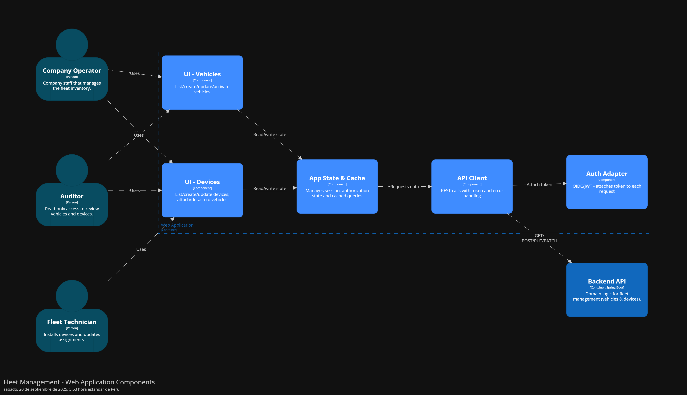

Diagrama de componentes - Mobile App - Fleet Management
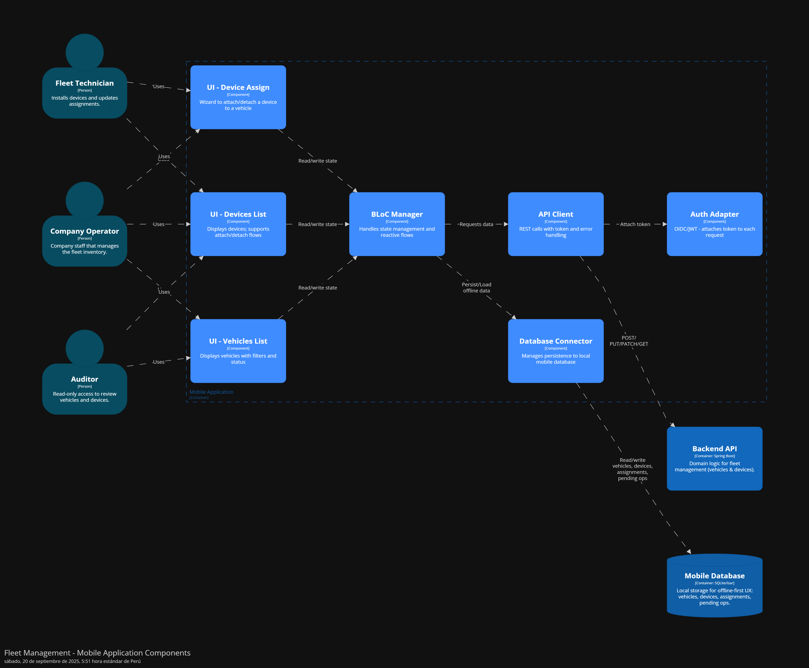

#### 4.2.5.6. Bounded Context Software Architecture Code Level Diagrams.

##### 4.2.5.6.1. Bounded Context Domain Layer Class Diagrams.

##### 4.2.5.6.2. Bounded Context Database Design Diagram.

### 4.2.7. Bounded Context: Profile and Preferences Management

#### 4.2.7.1. Domain Layer.

**Entity: Profile (Aggregate Root)**

**Propósito principal**  
Representar el perfil dentro del sistema, siempre asociado a un `userId`.

**Atributos principales**

- id: Identificador único del perfil.
- userId: Identificador externo obligatorio asociado al perfil.
- fullName: Nombre completo.
- phoneNumber: Número de contacto (opcional).
- avatarUrl: Imagen de perfil o avatar (opcional).
- createdAt: Fecha de creación.
- updatedAt: Fecha de última actualización.

**Métodos principales**

- updateContactInfo(newPhone)
- updateAvatar(newAvatarUrl)
- updateName(newName)

---

**Entity: Preferences**

**Propósito principal**  
Almacenar configuraciones personalizadas de idioma, zona horaria y notificaciones de alertas.

**Atributos principales**

- id: Identificador único de las preferencias.
- profileId: Identificador del perfil asociado.
- language: Idioma preferido.
- timeZone: Zona horaria configurada.
- alertEmailEnabled: Recibir alertas por correo electrónico.
- alertPushEnabled: Recibir alertas como notificaciones push en la aplicación.
- alertSmsEnabled: Recibir alertas vía SMS (opcional).

**Métodos principales**

- updateLanguage(language)
- updateTimeZone(timeZone)
- enableEmailAlerts(flag)
- enablePushAlerts(flag)
- enableSmsAlerts(flag)

---

**Value Object: PhoneNumber**

- countryCode
- number

**Value Object: Language**

- code (ej. "es", "en")
- name

**Value Object: TimeZone**

- code (ej. "UTC-5")

---

**Aggregate: ProfileAggregate**

- updateProfileAndPreferences(profile, preferences)

---

**Factory: ProfileFactory**

- createProfile(fullName, userId)

---

**Domain Service: PreferencesValidationService**

- validateNotificationSettings(emailFlag, pushFlag, smsFlag)
- validateLanguage(language)

---

**Command: CreateProfileCommand**

- fullName
- phoneNumber
- avatarUrl
- userId

**Command: UpdateProfileCommand**

- id
- newName
- newPhone
- newAvatarUrl

**Command: UpdatePreferencesCommand**

- id
- language
- timeZone
- alertEmailEnabled
- alertPushEnabled
- alertSmsEnabled

---

**Query: GetProfileByIdQuery**

- id

**Query: GetPreferencesByProfileIdQuery**

- profileId

---

**Event: ProfileCreatedEvent**

- id
- userId
- createdAt

**Event: ProfileUpdatedEvent**

- id
- updatedAt

**Event: PreferencesUpdatedEvent**

- id
- updatedAt
- changes

---

#### 4.2.7.2. Interface Layer.

**Controllers**

- **ProfileController**: Maneja las solicitudes para crear, actualizar y consultar perfiles.
- **PreferencesController**: Maneja las solicitudes para modificar y consultar preferencias (idioma, zona horaria, notificaciones).

#### 4.2.7.3. Application Layer.

**Command Services**

- **ProfileCommandService**: Coordina la ejecución de comandos relacionados con perfiles (creación y actualización).
- **PreferencesCommandService**: Coordina la ejecución de comandos relacionados con preferencias (idioma, zona horaria, notificaciones).

---

**Query Services**

- **ProfileQueryService**: Atiende consultas sobre perfiles.
- **PreferencesQueryService**: Atiende consultas sobre las preferencias de un perfil.

---

**Event Services**

- **ProfileEventService**: Gestiona eventos relacionados con la creación y actualización de perfiles.
- **PreferencesEventService**: Gestiona eventos relacionados con la actualización de preferencias y su propagación a otros componentes.

#### 4.2.7.4. Infrastructure Layer.

**Repositories**

- **IProfileRepository**: Define operaciones de acceso y persistencia para los perfiles.
- **IPreferencesRepository**: Define operaciones de acceso y persistencia para las preferencias.

#### 4.2.7.5. Bounded Context Software Architecture Component Level Diagrams.

Diagrama de componentes - Backend - Profiles and Preferences Management

Diagrama de componentes - Application Web - Profiles and Preferences Management

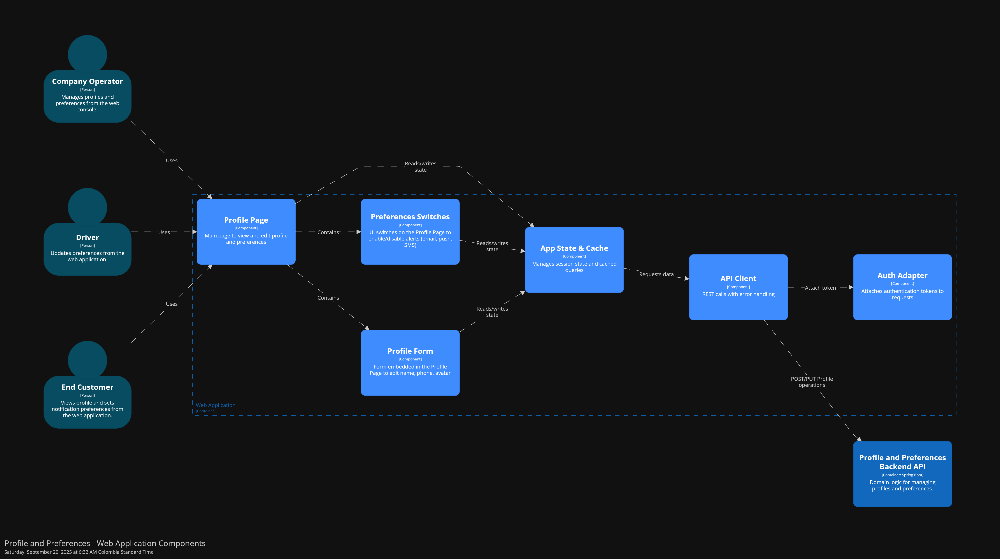

Diagrama de componentes - Mobile App - Profiles and Preferences Management
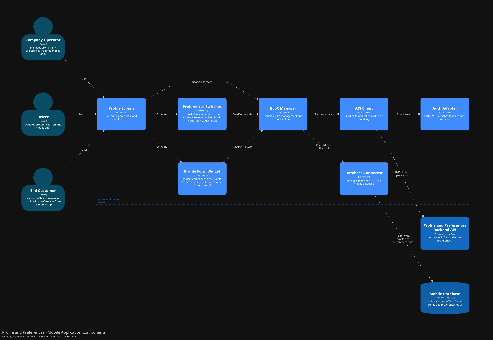

#### 4.2.7.6. Bounded Context Software Architecture Code Level Diagrams.

##### 4.2.7.6.1. Bounded Context Domain Layer Class Diagrams.

##### 4.2.7.6.2. Bounded Context Database Design Diagram

### 4.2.8. Bounded Context: Visualization Analytics

#### 4.2.8.1. Domain Layer

**Entidades Principales**

**Dashboard (Aggregate Root)**

- **Propósito**: Representa un dashboard personalizable con widgets y métricas específicas
- **Atributos principales**:
  - `id`: Identificador único
  - `name`: Nombre del dashboard
  - `userId`: Propietario del dashboard
  - `layout`: Configuración de layout de widgets
  - `isDefault`: Indica si es dashboard por defecto
  - `createdAt`, `updatedAt`: Timestamps de auditoría
- **Métodos principales**:
  - `addWidget(widget)`: Agrega widget al dashboard
  - `removeWidget(widgetId)`: Remueve widget
  - `updateLayout(layout)`: Actualiza disposición de widgets
  - `clone()`: Crea copia del dashboard

**Widget (Entity)**

- **Propósito**: Componente visual que muestra métricas específicas
- **Atributos principales**:
  - `id`: Identificador único
  - `type`: Tipo de widget (CHART, KPI, TABLE, MAP)
  - `title`: Título del widget
  - `dataSource`: Fuente de datos
  - `configuration`: Configuración específica del widget
  - `position`: Posición en el dashboard
- **Métodos principales**:
  - `updateConfiguration(config)`: Actualiza configuración
  - `refresh()`: Refresca datos del widget
  - `validateConfiguration()`: Valida configuración del widget

**Report (Entity)**

- **Propósito**: Reporte generado con datos históricos y métricas
- **Atributos principales**:
  - `id`: Identificador único
  - `name`: Nombre del reporte
  - `type`: Tipo de reporte (TRIP_SUMMARY, COMPLIANCE, PERFORMANCE)
  - `parameters`: Parámetros del reporte
  - `generatedAt`: Fecha de generación
  - `format`: Formato del reporte (PDF, EXCEL, CSV)
- **Métodos principales**:
  - `generate()`: Genera el reporte
  - `schedule(frequency)`: Programa generación automática
  - `export(format)`: Exporta en formato específico

**ChartData (Entity)**

- **Propósito**: Datos procesados para visualización en charts
- **Atributos principales**:
  - `id`: Identificador único
  - `chartType`: Tipo de gráfico (LINE, BAR, PIE, SCATTER)
  - `dataPoints`: Puntos de datos
  - `labels`: Etiquetas de los ejes
  - `metadata`: Metadatos adicionales
- **Métodos principales**:
  - `addDataPoint(point)`: Agrega punto de dato
  - `aggregate(groupBy)`: Agrupa datos
  - `filter(criteria)`: Filtra datos

**Value Objects**

- **TimeRange**: Rango de tiempo para consultas
- **ChartConfiguration**: Configuración específica de gráficos
- **KPIMetric**: Métrica de rendimiento clave
- **DataFilter**: Filtros aplicados a datos
- **ColorSchema**: Esquema de colores para visualizaciones

**Domain Services**

- **DataAggregationService**: Agregación y cálculo de métricas
- **ChartRenderingService**: Lógica de renderizado de gráficos
- **ReportGenerationService**: Generación de reportes complejos
- **MetricsCalculationService**: Cálculo de KPIs y métricas derivadas

**Commands**

- **CreateDashboardCommand**: Comando para crear dashboard
- **UpdateWidgetCommand**: Comando para actualizar widget
- **GenerateReportCommand**: Comando para generar reporte
- **RefreshDataCommand**: Comando para refrescar datos

**Queries**

- **GetDashboardQuery**: Obtiene dashboard por ID
- **GetTripMetricsQuery**: Obtiene métricas de viajes
- **GetComplianceDataQuery**: Obtiene datos de cumplimiento
- **GetTemperatureHistoryQuery**: Obtiene historial de temperatura

**Events**

- **DashboardCreatedEvent**: Dashboard creado
- **ReportGeneratedEvent**: Reporte generado
- **DataRefreshedEvent**: Datos refrescados
- **AlertThresholdExceededEvent**: Umbral de alerta excedido

#### 4.2.8.2. Interface Layer

**Controllers Principales**

**DashboardController**

- `GET /dashboards`: Lista dashboards del usuario
- `POST /dashboards`: Crea nuevo dashboard
- `PUT /dashboards/{id}`: Actualiza dashboard
- `DELETE /dashboards/{id}`: Elimina dashboard
- `GET /dashboards/{id}/data`: Obtiene datos del dashboard

**AnalyticsController**

- `GET /analytics/trips`: Métricas de viajes
- `GET /analytics/compliance`: Datos de cumplimiento
- `GET /analytics/performance`: Métricas de rendimiento
- `GET /analytics/temperature-history`: Historial de temperatura

**ReportController**

- `POST /reports/generate`: Genera reporte bajo demanda
- `GET /reports`: Lista reportes generados
- `GET /reports/{id}/download`: Descarga reporte
- `POST /reports/schedule`: Programa reporte automático

**VisualizationController**

- `GET /visualizations/chart-data`: Datos para gráficos
- `POST /visualizations/custom-chart`: Genera gráfico personalizado
- `GET /visualizations/kpis`: Obtiene KPIs calculados

#### 4.2.8.3. Application Layer

**Command Services**

**DashboardCommandService**

- Maneja creación y modificación de dashboards
- Coordina actualización de widgets
- Gestiona permisos de acceso a dashboards

**ReportCommandService**

- Gestiona generación de reportes
- Maneja programación de reportes automáticos
- Coordina exportación en diferentes formatos

**Query Services**

**AnalyticsQueryService**

- Proporciona métricas y KPIs calculados
- Optimizado para consultas complejas de análisis
- Maneja agregaciones temporales

**VisualizationQueryService**

- Consultas optimizadas para gráficos
- Transformación de datos para visualización
- Cache de datos frecuentemente consultados

**Event Handlers**

**TripCompletedEventHandler**

- Procesa finalización de viajes
- Actualiza métricas de rendimiento
- Genera alertas si es necesario

**TemperatureViolationEventHandler**

- Procesa violaciones de temperatura
- Actualiza métricas de cumplimiento
- Notifica a dashboards relevantes

#### 4.2.8.4. Infrastructure Layer

**Repositories**

**DashboardRepository** (implementa IDashboardRepository)

- Persistencia de dashboards y configuraciones
- Optimizado para consultas por usuario
- Cache de dashboards frecuentemente accedidos

**ReportRepository** (implementa IReportRepository)

- Almacenamiento de reportes generados
- Gestión de archivos de reporte
- Limpieza automática de reportes antiguos

**MetricsRepository** (implementa IMetricsRepository)

- Consultas optimizadas para métricas agregadas
- Conexión con base de datos de time-series
- Cache de métricas calculadas

**ChartDataRepository** (implementa IChartDataRepository)

- Transformación de datos para visualización
- Consultas optimizadas para gráficos
- Manejo de grandes volúmenes de datos temporales

#### 4.2.8.5. Bounded Context Software Architecture Component Level Diagrams

**Diagrama de Componentes - Backend - Visualization Analytics**

Este diagrama ilustra la arquitectura del bounded context de Visualization Analytics en el backend. Los controllers manejan requests relacionados con dashboards, reportes y análisis. Los services en Application Layer coordinan la lógica de negocio, mientras que los repositories optimizan el acceso a datos tanto transaccionales como de time-series para métricas y visualizaciones.

**Diagrama de Componentes - Frontend Web - Visualization Analytics**

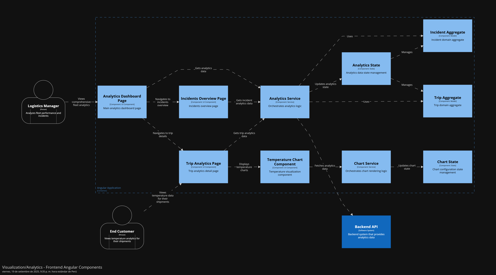

El frontend web del módulo de analytics utiliza componentes especializados para visualización de datos. Los chart components renderizarán gráficos interactivos, mientras que dashboard components gestionarán la composición y layout de widgets. Los services manejan la comunicación con APIs de datos y el cache local de métricas.

**Diagrama de Componentes - Mobile - Visualization Analytics**

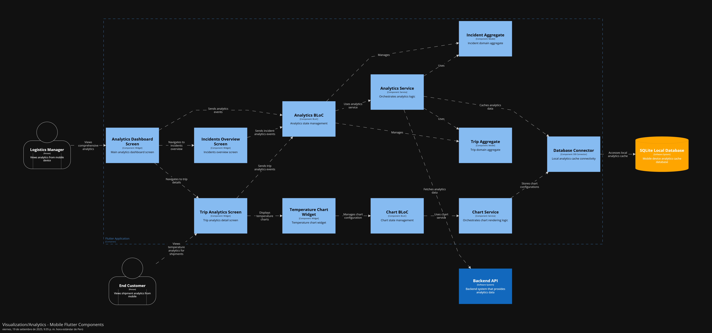

La aplicación móvil prioriza visualizaciones optimizadas para pantallas pequeñas. Los components incluyen widgets responsivos y gráficos touch-friendly. El state management através de BLoC coordina la actualización de datos en tiempo real y gestiona el cache local para funcionalidad offline.

#### 4.2.8.6. Bounded Context Software Architecture Code Level Diagrams

##### 4.2.8.6.1. Bounded Context Domain Layer Class Diagrams

**Backend - Visualization Analytics Domain Layer Class Diagram**

El diagrama de clases del backend de Analytics muestra las entidades principales para visualización y análisis de datos. Dashboard actúa como aggregate root conteniendo múltiples Widgets. Los Reports están asociados a usuarios y pueden ser programados para generación automática. ChartData encapsula la información procesada para visualizaciones, mientras que los services coordinan la agregación y cálculo de métricas.

**Frontend - Visualization Analytics Domain Layer Class Diagram**

El diagrama del frontend Angular muestra los componentes especializados para visualización de datos. Los chart components renderizan gráficos interactivos usando librerías como Chart.js o D3.js, mientras que dashboard components gestionan la composición y layout de widgets. Los services manejan la comunicación con APIs de datos y el cache local de métricas para optimizar rendimiento.

**Mobile - Visualization Analytics Domain Layer Class Diagram**

La aplicación móvil Flutter prioriza visualizaciones optimizadas para pantallas pequeñas. Los components incluyen widgets responsivos y gráficos touch-friendly. El state management através de BLoC coordina la actualización de datos en tiempo real y gestiona el cache local para funcionalidad offline, permitiendo consulta de métricas básicas sin conectividad.

##### 4.2.8.6.2. Bounded Context Database Design Diagram

El diseño de base de datos del módulo Analytics está optimizado para consultas analíticas y agregaciones. Las tablas principales (DASHBOARDS, WIDGETS, REPORTS) mantienen configuraciones de usuario, mientras que las tablas de métricas están desnormalizadas para consultas rápidas. Se incluyen índices especializados para consultas temporales y agregaciones frecuentes.

### 4.2.9. Bounded Context: Merchant

#### 4.2.9.1. Domain Layer

**Entidades Principales**

**Merchant (Aggregate Root)**

- **Propósito**: Representa al comercio/cliente (shipper) que utiliza CargaSafe; centraliza identidad, estado, contactos, ubicaciones y métodos de pago.
- **Atributos principales**:
  - `id`: Identificador único
  - `name`: Razón social / nombre comercial
  - `taxId`: Identificador fiscal (p. ej., RUC)
  - `email`: Email de contacto principal
  - `status`: ACTIVE | SUSPENDED
  - `primaryAddress`: Dirección principal (VO)
  - `createdAt`, `updatedAt`: Auditoría
- **Métodos principales**:
  - `activate()`, `suspend(reason)`
  - `updateProfile(name, email, taxId)`
  - `changePrimaryAddress(address)`
  - `setPrimaryContact(contact)`

**Contact (Entity)**

- **Propósito**: Persona de contacto del Merchant (operaciones, facturación, admin).
- **Atributos principales**:
  - `id`
  - `fullName`
  - `email`
  - `phone`
  - `role (ADMIN|BILLING|OPERATIONS)`
  - `isPrimary`
- **Métodos principales**:
  - `markAsPrimary()`

**Location (Entity)**

- **Propósito**: Sedes/almacenes/puntos de entrega asociados al Merchant.
- **Atributos principales**:
  - `id`
  - `name`
  - `address (VO)`
  - `latitude`
  - `longitude`

**PaymentMethod (Entity)**

- **Propósito**: Medio de pago registrado por el Merchant.
- **Atributos principales**:
  - `id`
  - `type (CARD|BANK)`
  - `card (VO)`
  - `externalId (PSP)`
  - `isDefault`
- **Métodos principales**:
  - `makeDefault()`

**Plan (Entity)**

- **Propósito:** Plan comercial ofertado (precio, periodicidad, features).

- **Atributos principales:**
  - `id`
  - `name`
  - `price (Money)`
  - `billingPeriod (MONTHLY|YEARLY)`
  - `features[]`
  - `active`

**Subscription (Aggregate Root)**

**Propósito:** Suscripción del Merchant a un plan (estado y periodos).

- **Atributos principales:**

  - `id`
  - `merchantId`
  - `plan`
  - `status (TRIALING|ACTIVE|PAST_DUE|CANCELED)`
  - `currentPeriod (Period)`
  - `cancelAt`
  - `externalId (PSP)`

- **Métodos:**

  - `startTrial(days)`
  - `activate(plan)`
  - `markPastDue()`
  - `cancel(at)`
  - `renew(nextPeriod)`

**Invoice (Entity)**

- **Propósito:** Comprobante/cobro emitido por suscripción.

- **Atributos:**

  - `id`
  - `subscriptionId`
  - `amountTotal (Money)`
  - `status (DRAFT|OPEN|PAID|VOID)`
  - `issuedAt`
  - `dueAt`
  - `paidAt`
  - `externalId (PSP)`
  - `pdfUrl`

- **Métodos:**
  - `markPaid(at)`
  - `voidInvoice(reason)`

**WebhookEvent (Entity)**

- **Propósito:** Persistir eventos entrantes del proveedor de pagos (auditoría y re-procesos).

- **Atributos:**

  - `id`
  - `provider (STRIPE|OTHER)`
  - `eventType`
  - `payload`
  - `receivedAt`
  - `processedAt`
  - `status`
  - `merchantId?`
  - `subscriptionId?`
  - `invoiceId?`

**Value Objects**

- **Email**, **Phone**, **Address** (line1, line2, city, region, countryCode, postalCode)

- **Money** (`value`, `currency: USD|EUR|PEN`)

- **Period** (`startAt`, `endAt`)

- **PaymentCard** (`brand`, `last4`, `expMonth`, `expYear`)

- **Enums:** `MerchantStatus`, `SubscriptionStatus`, `InvoiceStatus`, `PaymentMethodType`, `CurrencyCode`, `BillingPeriod`

**Domain Services**

- **MerchantOnboardingService**: Provisiona defaults (roles, settings) y contacto primario.
- **BillingService**: Crea suscripciones, genera facturas, aplica pagos.

**Commands**

- **CreateMerchantCommand**
- **UpdateMerchantProfileCommand**
- **SetPrimaryContactCommand**
- **CreateSubscriptionCommand**
- **CancelSubscriptionCommand**
- **MarkSubscriptionPastDueCommand**
- **GenerateInvoiceCommand**
- **ApplyPaymentCommand**
- **SetDefaultPaymentMethodCommand**

**Queries**

- **GetMerchantByIdQuery**
- **SearchMerchantsQuery**
- **GetMerchantContactsQuery**
- **GetMerchantLocationsQuery**
- **GetPaymentMethodsQuery**
- **GetSubscriptionsByMerchantQuery**
- **GetInvoicesBySubscriptionQuery**

**Events**

- **MerchantCreatedEvent**
- **MerchantSuspendedEvent**
- **SubscriptionActivatedEvent**
- **SubscriptionCanceledEvent**
- **SubscriptionPastDueEvent**
- **InvoiceGeneratedEvent**
- **InvoicePaidEvent**
- **PaymentMethodSetDefaultEvent**

#### 4.2.9.2. Interface Layer

**Controllers Principales**

**MerchantController**

- `GET /merchants/{id}`: Obtiene Merchant

- `POST /merchants`: Crea Merchant

- `PUT /merchants/{id}`: Actualiza perfil

- `POST /merchants/{id}/suspend`: Suspende Merchant

**ContactController**

- `GET /merchants/{id}/contacts`: Lista contactos

- `POST /merchants/{id}/contacts`: Crea contacto

- `PUT /merchants/{id}/contacts/{contactId}`: Actualiza contacto

- `POST /merchants/{id}/contacts/{contactId}/primary`: Marca como primario

**LocationController**

- `GET /merchants/{id}/locations`: Lista ubicaciones

- `POST /merchants/{id}/locations`: Crea ubicación

- `PUT /merchants/{id}/locations/{locationId}`: Actualiza ubicación

- `DELETE /merchants/{id}/locations/{locationId}`: Elimina

**PaymentMethodController**

- `GET /merchants/{id}/payment-methods`

- `POST /merchants/{id}/payment-methods`

- `POST /merchants/{id}/payment-methods/{pmId}/default`

- `DELETE /merchants/{id}/payment-methods/{pmId}`

**SubscriptionController**

- `GET /merchants/{id}/subscriptions`

- `POST /merchants/{id}/subscriptions`: Crea/activa

- `POST /subscriptions/{subId}/cancel`: Cancela

- `GET /subscriptions/{subId}`: Detalle

**InvoiceController**

- `GET /subscriptions/{subId}/invoices`

- `GET /invoices/{invoiceId}`

- `POST /invoices/{invoiceId}/apply-payment`

- `GET /invoices/{invoiceId}/pdf`: Descarga

**WebhookController**

- `POST /webhooks/payments`: Receptor de webhooks del PSP (validación de firma, encolado, idempotencia)

#### 4.2.9.3. Application Layer

**Command Services**

**MerchantCommandService**

- Maneja creación/actualización de Merchant

- Gestiona contactos, ubicaciones y método de pago por defecto

- Encola eventos de auditoría (MerchantCreated/Suspended)

**SubscriptionCommandService**

- Alta/cancelación/renovación de suscripciones

- Transiciones de estado (`TRIALING → ACTIVE → PAST_DUE → CANCELED`)

- Coordinación con PSP (crear/cancelar suscripción)

**BillingCommandService**

- Generación de facturas, aplicación de pagos

- Emisión de eventos `InvoiceGenerated` y `InvoicePaid`

**Query Services**

**MerchantQueryService**

- Búsquedas y lecturas optimizadas de Merchant/Contacts/Locations/PaymentMethods

**BillingQueryService**

- Consultas de suscripciones e invoices (paginadas, por periodo/estado)

**Event Handlers**

**PaymentWebhookEventHandler**

- Procesa webhooks del PSP (idempotente)

- Sincroniza estados de `Subscription`/`Invoice`, publica eventos internos

**SubscriptionActivatedEventHandler**

- Reacciona a `SubscriptionActivated` (provisiona límites/planes, notifica)

**InvoicePaidEventHandler**

- Actualiza saldos, envía recibos, dispara notificaciones

#### 4.2.9.4. Infrastructure Layer

**Repositories**

**MerchantRepository** (implementa `IMerchantRepository`)

- Persistencia de Merchants y relaciones (contacts, locations)

- Búsqueda por criterios (nombre, taxId, status)

- Caché de Merchants de alta frecuencia

**PaymentMethodRepository** (implementa `IPaymentMethodRepository`)

- Almacenamiento de métodos de pago, `isDefault`

- Resolución por `externalId` (PSP)

**SubscriptionRepository** (implementa `ISubscriptionRepository`)

- Persistencia de suscripciones y periodos

- Consultas por estado/merchant

**InvoiceRepository** (implementa `IInvoiceRepository`)

- Persistencia y búsqueda de facturas

- Gestión de pdfUrl y correlación externalId

**WebhookEventRepository** (implementa `IWebhookEventRepository`)

- Registro de eventos entrantes (trazabilidad, reintentos)

- Control de idempotencia

#### 4.2.9.5. Bounded Context Software Architecture Component Level Diagrams

**Diagrama de Componentes - Backend - Merchant**

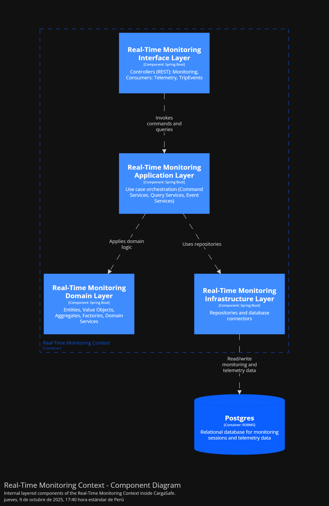

Este diagrama ilustra la arquitectura del bounded context de Visualization Analytics en el backend. Los controllers manejan requests relacionados con dashboards, reportes y análisis. Los services en Application Layer coordinan la lógica de negocio, mientras que los repositories optimizan el acceso a datos tanto transaccionales como de time-series para métricas y visualizaciones.

**Diagrama de Componentes - Frontend Web - Merchant**

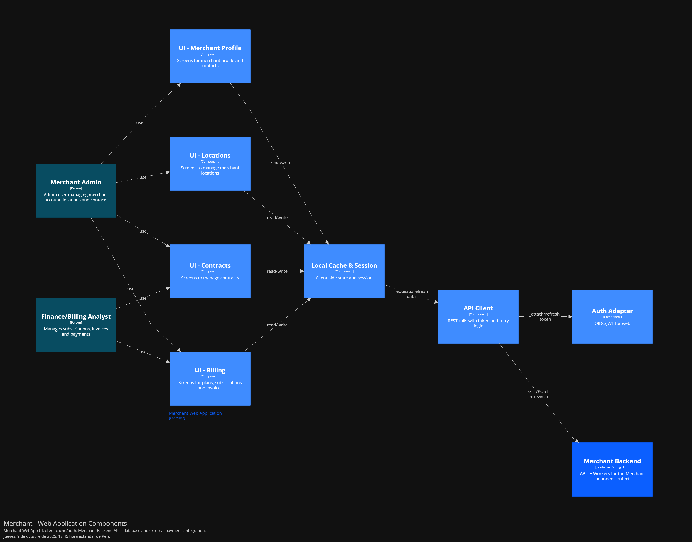

El frontend web del módulo de analytics utiliza componentes especializados para visualización de datos. Los chart components renderizarán gráficos interactivos, mientras que dashboard components gestionarán la composición y layout de widgets. Los services manejan la comunicación con APIs de datos y el cache local de métricas.

**Diagrama de Componentes - Mobile - Merchant**

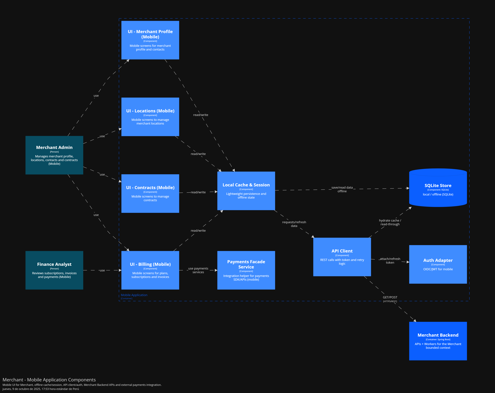

La aplicación móvil prioriza visualizaciones optimizadas para pantallas pequeñas. Los components incluyen widgets responsivos y gráficos touch-friendly. El state management através de BLoC coordina la actualización de datos en tiempo real y gestiona el cache local para funcionalidad offline.

#### 4.2.9.6. Bounded Context Software Architecture Code Level Diagrams

##### 4.2.9.6.1. Bounded Context Domain Layer Class Diagrams

**Backend - Merchant Domain Layer Class Diagram**

El diagrama de clases del backend de Merchant modela el dominio comercial y de facturación. Merchant es Aggregate Root para la identidad del cliente (contactos, ubicaciones, métodos de pago), mientras que Subscription es un aggregate root separado que representa la relación Plan↔Merchant y su ciclo de vida. Invoice es entidad de billing asociada a Subscription. Se emplean Value Objects (Email, Address, Money, Period, PaymentCard) y Enums (MerchantStatus, SubscriptionStatus, InvoiceStatus, PaymentMethodType, CurrencyCode, BillingPeriod). Los Domain Services (p.ej., MerchantOnboardingService, BillingService) orquestan onboarding, creación de suscripciones y aplicación de pagos; los Domain Events (MerchantCreated, SubscriptionActivated, InvoicePaid) sincronizan estados con otros BCs y el PSP.

**Frontend - Merchant Domain Layer Class Diagram**

El diagrama del frontend (Web App) de Merchant refleja modelos de UI para perfil de merchant, contactos, ubicaciones, suscripciones e invoices. Los identificadores se manejan como string (por BIGINT en backend) y las fechas como Date. Se tipan VO y Enums (p.ej., CurrencyCode, BillingPeriod, SubscriptionStatus) para evitar errores. Los servicios de UI consumen APIs de Merchant/Billing y gestionan cache/estado (listas paginadas, filtros por estado/periodo) para una interacción rápida en administración.

**Mobile - Merchant Domain Layer Class Diagram**

El diagrama móvil (Flutter) de Merchant prioriza gestión ágil de perfil/ubicaciones/medios de pago y consulta de suscripciones e invoices. Los IDs se modelan como String y fechas como DateTime. Se reutilizan VO/Enums del dominio (p.ej., Money, Period, SubscriptionStatus). El state management (BLoC/Provider) coordina cache local y refresco de datos, permitiendo operaciones básicas offline (lectura) y sincronización cuando hay conectividad.

##### 4.2.9.6.2. Bounded Context Database Design Diagram

El diseño de base de datos de Merchant está orientado a datos transaccionales con trazabilidad de billing e integración con el PSP. Tablas principales:

- MERCHANTS (identidad, estado, dirección principal),

  - CONTACTS, LOCATIONS, PAYMENT_METHODS (con external_id del PSP y is_default),

  - PLANS (precio amount/currency, billing_period),

  - SUBSCRIPTIONS (estado, current_period_start/end, cancel_at, external_id),

  - INVOICES (monto, estado, issued_at/due_at/paid_at, external_id, pdf_url),

  - WEBHOOK_EVENTS (payload, provider, event_type, received_at/processed_at, status, claves de correlación).

Se incluyen índices por merchant_id, estado y rangos de fechas; claves foráneas para integridad; y idempotencia en WEBHOOK_EVENTS para procesar de forma segura los webhooks del proveedor de pagos.

