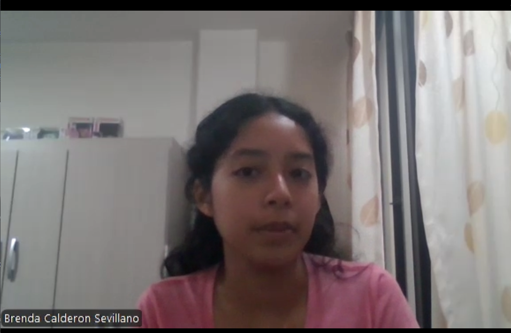

# Capítulo II: Requirements Elicitation & Analysis

## 2.1. Competidores

### 2.1.1. Análisis competitivo

<table>
<!-- Título -->
  <tr>
    <th colspan="6" valign="top"><b>Análisis Competitivo</b></th>
  </tr>

  <!-- Motivación del análisis -->
  <tr>
    <td rowspan="2" colspan="1" valign="top">¿Por qué llevar a cabo este Análisis?</td>
    <td colspan="5" valign="top">
      Este análisis permite identificar fortalezas, debilidades y oportunidades en el mercado de soluciones IoT para el monitoreo de cadena de frío, de modo que Macetech pueda priorizar características, precios y estrategias de marketing que maximicen su adopción en el mercado peruano y latinoamericano.
    </td>
  </tr>
  <tr></tr>

  <!-- Cabeceras de competidores (logo + nombre) -->
  <tr>
    <td colspan="2" valign="top"></td>
    <td valign="top">
      
<b>Sensitech (Thermo King)</b>

      
    </td>
    <td valign="top">
      
<b>Frigga (China)</b>

      
    </td>
    <td valign="top">
      
<b>Emerson Cargo Solutions</b>

      
    </td>
    <td valign="top">
      
<b>Carga Safe</b>

      
    </td>
  </tr>

  <!-- PERFIL -->
  <tr>
    <td rowspan="2" valign="top">
Perfil
</td>
    <td valign="top">Overview</td>
    <td valign="top">Multinacional estadounidense líder en monitoreo de la cadena de frío con décadas de experiencia.</td>
    <td valign="top">Fabricante global de dispositivos IoT para cadena de frío, con distribución en más de 60 países.</td>
    <td valign="top">División de Emerson Electric dedicada a soluciones de monitoreo de transporte refrigerado.</td>
    <td valign="top">Startup tecnológica latinoamericana que ofrece monitoreo en tiempo real enfocado en la temperatura del transporte de cargas.</td>
  </tr>
  <tr>
    <td valign="top">¿Qué valor ofrece a los clientes?</td>
    <td valign="top">Ofrece confianza, cumplimiento de normativas globales (FDA, OMS), cobertura mundial y tecnología robusta.</td>
    <td valign="top">Ofrece sensores desechables/reutilizables de bajo costo, fáciles de implementar en transporte.</td>
    <td valign="top">Seguridad y precisión en tiempo real con analítica avanzada para grandes corporaciones.</td>
    <td valign="top">Propuesta accesible y flexible que asegura la conservación de productos críticos, con alertas inmediatas y dashboards intuitivos.</td>
  </tr>

  <!-- MARKETING -->
  <tr>
    <td rowspan="2" valign="top">
Perfil de Marketing
</td>
    <td valign="top">Mercado objetivo</td>
    <td valign="top">Multinacionales farmacéuticas, agroexportadoras y grandes retailers.</td>
    <td valign="top">Exportadores agrícolas y farmacéuticos medianos.</td>
    <td valign="top">Corporaciones de alimentos y farmacéuticas multinacionales.</td>
    <td valign="top">Empresas de transporte, agroexportadores medianos, distribuidores locales de alimentos y fármacos.</td>
  </tr>
  <tr>
    <td valign="top">Estrategias de marketing</td>
    <td valign="top">Presencia en ferias globales, contratos con distribuidores y certificaciones internacionales.</td>
    <td valign="top">Marketing digital, distribuidores locales, precios competitivos.</td>
    <td valign="top">Ventas consultivas, certificaciones globales, contratos a largo plazo.</td>
    <td valign="top">Marketing digital, alianzas con cámaras de comercio, programas de suscripción escalables.</td>
  </tr>

  <!-- PRODUCTO -->
  <tr>
    <td rowspan="3" valign="top">
Perfil de Producto
</td>
    <td valign="top">Productos & Servicios</td>
    <td valign="top">Data loggers, sensores IoT, software de análisis predictivo, soporte técnico 24/7.</td>
    <td valign="top">Data loggers, dispositivos de monitoreo en tiempo real, dashboards básicos.</td>
    <td valign="top">Monitoreo en tiempo real, analítica predictiva, dashboards avanzados.</td>
    <td valign="top">Sensores IoT propios o integrados, aplicación web y móvil, dashboards con métricas clave, alertas en tiempo real.</td>
  </tr>
  <tr>
    <td valign="top">Precios y costos</td>
    <td valign="top">Altos; modelo premium con costo por dispositivo y licencias anuales.</td>
    <td valign="top">Muy competitivos; pago por dispositivo + acceso a plataforma.</td>
    <td valign="top">Elevados; modelo enterprise con contratos anuales.</td>
    <td valign="top">Suscripciones flexibles + costo bajo por dispositivo.</td>
  </tr>
  <tr>
    <td valign="top">Canales de distribución</td>
    <td valign="top">Distribuidores autorizados globales, venta directa enterprise, canal online.</td>
    <td valign="top">Marketplace de e-commerce, distribuidores locales, venta directa.</td>
    <td valign="top">Venta directa corporativa, partners certificados, canal enterprise.</td>
    <td valign="top">Venta directa, partnerships con cámaras de comercio, distribuidores especializados en logística.</td>
  </tr>

  <!-- SWOT -->
  <tr>
    <td rowspan="4" valign="top">
Análisis SWOT
</td>
    <td valign="top">Fortalezas</td>
    <td valign="top">• Reputación global • Cumplimiento normativo • Soporte internacional</td>
    <td valign="top">• Precios accesibles • Disponibilidad masiva</td>
    <td valign="top">• Marca reconocida • Integración tecnológica avanzada</td>
    <td valign="top">• Accesibilidad y escalabilidad • Enfoque en empresas de transporte • Software amigable</td>
  </tr>
  <tr>
    <td valign="top">Debilidades</td>
    <td valign="top">• Alto costo • Poca flexibilidad para PYMEs</td>
    <td valign="top">• Limitada personalización de software • Menor soporte local en LATAM</td>
    <td valign="top">• Precio inaccesible para PYMEs • Implementación compleja</td>
    <td valign="top">• Respaldo de marca frente a multinacionales • Mercado nicho especializado</td>
  </tr>
  <tr>
    <td valign="top">Oportunidades</td>
    <td valign="top">• Creciente regulación en transporte farmacéutico y alimentario</td>
    <td valign="top">• Crecimiento del e-commerce y transporte de alimentos</td>
    <td valign="top">• Demanda en mercados regulados (fármacos, vacunas)</td>
    <td valign="top">• Expansión en LATAM donde grandes competidores no tienen presencia fuerte • Crecimiento del e-commerce y transporte</td>
  </tr>
  <tr>
    <td valign="top">Amenazas</td>
    <td valign="top">• Startups ágiles con precios más bajos en LATAM</td>
    <td valign="top">• Competidores regionales con soluciones más adaptadas</td>
    <td valign="top">• Startups regionales con mejor relación costo-beneficio</td>
    <td valign="top">• Copia rápida de modelo por competidores grandes o locales • Regulaciones de transporte cambiantes</td>
  </tr>
</table>

### 2.1.2. Estrategias y tácticas frente a competidores

- **Precios accesibles y modelo de suscripción flexible**  
  Plan básico desde $29/mes por dispositivo con suscripción mensual sin compromisos a largo plazo, contrastando con licencias anuales costosas de Sensitech y Emerson.

- **Soporte local y personalización regional**  
  Equipo técnico en español con horarios LATAM, dashboards personalizables con métricas locales y cumplimiento de normativas regionales (SENASA, DIGESA).

- **Implementación rápida y sin complejidad técnica**  
  Configuración plug-and-play en menos de 24 horas versus semanas de implementación de competidores enterprise, con capacitación incluida.

- **Alianzas estratégicas con el ecosistema local**  
  Partnerships con cámaras de comercio agrícola, asociaciones de transportistas y distribuidores de dispositivos IoT en mercados emergentes.

- **Transparencia de datos y alertas proactivas**  
  API abierta para integración con sistemas ERP locales, reportes en tiempo real y alertas vía WhatsApp/SMS, ventajas sobre dashboards cerrados de competidores.

## 2.2. Entrevistas

### 2.2.1. Diseño de entrevistas

### 1. Preguntas generales

- ¿Cuál es tu nombre y cargo?
- ¿Cuántos años tienes?
- ¿En qué sector o industria trabajas? (alimentos, farmacéutica, logística, etc.)

---

### 2. Preguntas — **Segmento: Empresa (Gestores de transporte)**

1. **Proceso actual de monitoreo**

   - ¿Cómo monitoreas actualmente la temperatura durante el transporte de tus productos?

2. **Herramientas y tecnología**

   - ¿Qué dispositivos o sistemas utilizas para el control de cadena de frío y por qué los elegiste?

3. **Gestión de viajes y rutas**

   - ¿Cómo planificas y registras los viajes de transporte? ¿Qué información consideras esencial?

4. **Desafíos principales**

   - ¿Qué problemas enfrentas cuando se rompe la cadena de frío? ¿Cómo impacta en costos y tiempo?

5. **Alertas y respuesta a incidentes**

   - ¿Cómo te enteras cuando hay un problema de temperatura? ¿Qué tan rápido puedes responder?

6. **Reportes y documentación**

   - ¿Qué tipo de reportes necesitas generar para clientes o autoridades regulatorias?

7. **Gestión de dispositivos IoT**

   - Cuéntame sobre tu experiencia gestionando el mantenimiento y configuración de sensores o dispositivos de monitoreo. ¿Qué desafíos has encontrado?

8. **Características ideales**

   - Si pudieras diseñar la plataforma perfecta, ¿qué funciones serían imprescindibles para ti?

9. **Presupuesto y modelo de pago**
   - ¿Cuál sería tu modelo de pago preferido para este tipo de servicios y qué factores influyen en esa decisión?

---

### 3. Preguntas — **Segmento: Clientes Finales (Consumidores finales)**

1. **Experiencia actual de recepción de productos**

   - Cuéntame cómo verificas actualmente que los productos que compras llegaron en condiciones óptimas de temperatura.

2. **Confianza y transparencia en proveedores**

   - Describe tu nivel de confianza en los reportes de temperatura que te proporcionan tus proveedores. ¿Qué factores aumentarían o disminuirían esa confianza?

3. **Información requerida sobre el transporte**

   - ¿Qué información consideras más valiosa tener sobre el transporte de tus productos y cómo te ayudaría en tus operaciones?

4. **Experiencias con productos dañados**

   - Comparte alguna experiencia que hayas tenido rechazando productos por problemas de cadena de frío. ¿Cómo identificaste el problema y qué impacto tuvo?

5. **Preferencias de acceso a información**

   - Describe cómo prefieres recibir y acceder a información sobre tus pedidos. ¿Qué métodos de comunicación funcionan mejor para tu flujo de trabajo?

6. **Alertas y notificaciones proactivas**

   - Cuéntame qué tipo de notificaciones durante el transporte de tus productos serían más útiles para ti y en qué momentos las necesitarías.

7. **Facilidad de uso y comprensión**

   - Describe la importancia que tiene para ti que la información técnica sea presentada de manera comprensible. ¿Qué características valoras en las interfaces que usas?

8. **Características más valoradas**

   - ¿Qué funcionalidades consideras que agregarían más valor a tu proceso de recepción y validación de productos?

9. **Expectativas sobre tecnología IoT**
   - ¿Qué beneficios esperas de un sistema de monitoreo IoT para tus compras de productos sensibles a temperatura y qué preocupaciones tienes al respecto?

### 2.2.2. Registro de entrevistas

### Segmento 1: Empresa

- **Nombre**: Miguel Ruiz
- **Edad**: 28 años
- **Ocupación**: Gestor de transportes - linea de frio
- **Empresa**: Ofertimaq - Distribuidora
- **Enlace**: [Click aquí para ver la entrevista](https://upcedupe-my.sharepoint.com/:v:/g/personal/u20201c410_upc_edu_pe/EQnkVAuczH1LrYiGNF_7JdcBPW2RT-EsqX0thMbMGisRKg?e=KIofFP&nav=eyJyZWZlcnJhbEluZm8iOnsicmVmZXJyYWxBcHAiOiJTdHJlYW1XZWJBcHAiLCJyZWZlcnJhbFZpZXciOiJTaGFyZURpYWxvZy1MaW5rIiwicmVmZXJyYWxBcHBQbGF0Zm9ybSI6IldlYiIsInJlZmVycmFsTW9kZSI6InZpZXcifSwicGxheWJhY2tPcHRpb25zIjp7fX0%3D)
- **Fecha de entrevista**: 14 de Abril del 2026
- **Tiempo inicio - tiempo fin**: 00:00:00 - 00:07:28
   
   

**Resumen**  
Monitorea la temperatura de forma manual a través de choferes que revisan el cooler en paradas y con termómetro digital. Usa GPS para validar paradas y kilometraje, no para temperatura. La planificación la hace un asistente considerando tráfico de Lima (Waze) con holguras, y exige verificación de cooler en puntos de parada. La detección de problemas depende de llamadas de choferes; cuando hay incidente, redirigen un vehículo cercano para salvar producto. Gestiona reportes de ruta como evidencia frente a reclamos. No han implementado sensores; demanda una plataforma con monitoreo en tiempo real, alertas automáticas, y reportes simples/dashboards. Prefiere suscripción mensual (mejor aún prepago/largo plazo) y acceso del cliente a un link para seguimiento.

**Rasgos objetivos**  

- _Herramientas_: GPS, termómetro digital, Waze/Mapas.
- _Canales_: Llamadas, mensajería interna.
- _Dispositivos_: Smartphone de choferes + PC oficina.
- _Reportes_: Hoja de ruta; auditorías sanitarias.

**Rasgos subjetivos**  

- Perfil operativo, orientado a continuidad y respuesta rápida.
- Valora trazabilidad visible para clientes.

**Dolores y oportunidades**  
_Pain_: Dependencia de manualidad y llamadas; falta de visibilidad en ruta.
_Need_: Telemetría + alertas; portal cliente; evidencia automática.

**Implicancias para CARGA-TROM**  
Requisitos: Sensor temperatura; alertas; linea de tiempo por viaje; Link para compartir seguimiento.

##  

 

- **Nombre**: Sebastian Montalvo
- **Edad**: 26 años
- **Ocupación**: Operador Logístico
- **Empresa**: Urbano - Distribuidora Ecommerces
- **Enlace**: [Click aquí para ver la entrevista](https://upcedupe-my.sharepoint.com/:v:/g/personal/u202213989_upc_edu_pe/IQCTVpRAR7pGSKc6yom4PbHXAYR81cn0dUrEr2dtwXW0h9Q?nav=eyJyZWZlcnJhbEluZm8iOnsicmVmZXJyYWxBcHAiOiJTdHJlYW1XZWJBcHAiLCJyZWZlcnJhbFZpZXciOiJTaGFyZURpYWxvZy1MaW5rIiwicmVmZXJyYWxBcHBQbGF0Zm9ybSI6IldlYiIsInJlZmVycmFsTW9kZSI6InZpZXcifX0%3D&e=7SUVjD)
- **Fecha de entrevista**: 18 abril del 2025
- **Tiempo inicio - tiempo fin**: 00:00:10 - 00:08:06

 

 

**Resumen**  
Controla temperatura con termómetro portátil en paradas y el indicador del camión. El sistema de cadena de frío es nativo del vehículo, elegido por sencillez. Planifica con hojas de ruta y bitácora manual. Cuando falla el frío, se avisa a central; los daños impactan tiempos y reclamos. Emite hoja de viaje firmada con datos de temperatura. Percibe el monitoreo como pesado y manual. Pide una plataforma que integre panel del camión + app móvil con notificaciones cuando se sale del estándar.

**Rasgos objetivos**  
_Herramientas_: Indicador del camión, termómetro, bitácora.
_Canales_: Llamada a central.
_Dispositivo_: Celular personal; cabina camión.

**Rasgos subjetivos**

- Busca simplicidad y automatización de tareas repetitivas.

**Dolores / Oportunidades**
_Pain_: Monitoreo manual constante; reacción tardía.
_Need_: App móvil con push alerts, captura automática de lecturas.

**Implicancias para Carga-Safe**
_Requisitos_: App conductor (checklist, lecturas guiadas, foto/nota), notificaciones.

 

---

  

### Segmento 2: Clientes Finales (Consumidores finales)

- **Nombre**: Adrián Zapata
- **Edad**: 23 años
- **Ocupación**: Responsable de parrilla en un negocio de comida rápida
- **Empresa/Sector**: Negocio local de comida rápida / Sector alimentario
- **Enlace**: [URL del video de la entrevista](https://upcedupe-my.sharepoint.com/:v:/g/personal/u20201c410_upc_edu_pe/EQnkVAuczH1LrYiGNF_7JdcBPW2RT-EsqX0thMbMGisRKg?e=xwhjks&nav=eyJyZWZlcnJhbEluZm8iOnsicmVmZXJyYWxBcHAiOiJTdHJlYW1XZWJBcHAiLCJyZWZlcnJhbFZpZXciOiJTaGFyZURpYWxvZy1MaW5rIiwicmVmZXJyYWxBcHBQbGF0Zm9ybSI6IldlYiIsInJlZmVycmFsTW9kZSI6InZpZXcifSwicGxheWJhY2tPcHRpb25zIjp7InN0YXJ0VGltZUluU2Vjb25kcyI6MTI1MS44OX19)
- **Fecha de entrevista**: 10 de Setiembre del 2025
- **Tiempo inicio - tiempo fin**: 00:20:51 - 00:30:50
   
  
   

**Resumen**  
_Verifica al recibir_: estado físico, frío al tacto, indicadores simples; desconfía de la cadena previa. Aumenta confianza con datos en tiempo real y trazabilidad.
_Información valiosa_: tiempo y temperatura en trayecto; notificaciones ante retrasos (tráfico) o temperaturas fuera de rango. Prefiere WhatsApp para avisos y un portal/app para consultar detalles on-demand. Quiere interfaces claras, en °C y tipografía grande. Pide notificaciones al proveedor además del cliente.

**Tecnología & canales**  

- WhatsApp como principal; App/portal web como consulta.
- Smartphone predominante.

**Dolores / Oportunidades**  
_Pain_: Incertidumbre en ruta; impacto de retrasos.
_Need_: ETA (calculo de duracion de ruta) + temperatura en vivo; doble notificación (cliente/proveedor).

**Implicancias para CargaSafe**  
_Requisitos_: Link para seguimiento, push WhatsApp/SMS configurable, UI accesible (alto contraste, números grandes).

---

 

---

 

- **Nombre**: Brenda Calderon
- **Edad**: 20 años
- **Ocupación**: Trabajadora de medio tiempo en un minimarket, responsable de compras de insumos para refrigeración
- **Empresa/Sector**: Retail alimentario local – Consumo final
- **Enlace**: [URL del video de la entrevista](https://upcedupe-my.sharepoint.com/:v:/g/personal/u20201c410_upc_edu_pe/EQnkVAuczH1LrYiGNF_7JdcBPW2RT-EsqX0thMbMGisRKg?e=xwhjks&nav=eyJyZWZlcnJhbEluZm8iOnsicmVmZXJyYWxBcHAiOiJTdHJlYW1XZWJBcHAiLCJyZWZlcnJhbFZpZXciOiJTaGFyZURpYWxvZy1MaW5rIiwicmVmZXJyYWxBcHBQbGF0Zm9ybSI6IldlYiIsInJlZmVycmFsTW9kZSI6InZpZXcifSwicGxheWJhY2tPcHRpb25zIjp7InN0YXJ0VGltZUluU2Vjb25kcyI6MTI1MS44OX19)
- **Fecha de entrevista**: 13 de Setiembre del 2025
- **Tiempo inicio - tiempo fin**: 00:31:00 - 00:37:20
   
  
   

**Resumen**  
_Audita recepción_: integridad del empaque, condensación, frío al tacto, fecha de vencimiento. Confía parcialmente en reportes; requiere datos trazables y consistentes con lo recibido. _Información clave_: temperatura a lo largo del trayecto, eventos fuera de rango, tiempos. Rechazó lote de yogures por tibieza/inflado; proveedor sin justificación. Prefiere portal o app para consultar sin llamadas; notificaciones breves ante retrasos/problemas. Valora interfaces simples con gráficos y reportes descargables para evidencias.

**Tecnología & canales**  
App/portal web, notificaciones breves; móvil como dispositivo principal.

**Dolores / Oportunidades**  
_Pain_: Reportes genéricos; inconsistencias.
_Need_: Logs detallados, exportables y comparables por pedido.

**Implicancias para CargaSafe**  
_Requisitos_: Panel cliente con histórico por pedido, botón Descargar PDF/CSV, alertas de retraso y anomalía térmica.

   

---

  

   

### 2.2.3. Análisis de entrevistas

 
 

 
 

## 2.3. Needfinding

### 2.3.1. User Personas

- **Segmento: Empresa (Gestores de transporte)**

  

  **Carlos Mendoza - Jefe de Logística**  
  El user persona de Carlos representa al gestor experimentado que prioriza la eficiencia operativa y la minimización de riesgos. Muestra la necesidad de herramientas tecnológicas robustas y precisas que le permitan mantener control total sobre la cadena de frío. Su perfil refleja la importancia de la confiabilidad del sistema, ya que cualquier falla puede resultar en pérdidas económicas significativas y problemas regulatorios. Carlos ejemplifica al usuario que valora los datos en tiempo real, reportes detallados y funcionalidades que le permitan tomar decisiones informadas para proteger productos de alto valor.

   

- **Segmento: Clientes Finales (Consumidores finales)**

  

  **María González - Gerente de Compras de Restaurante**  
  El user persona de María representa al consumidor final que valora la transparencia y la calidad en los productos que adquiere para su negocio. Como responsable de compras de un restaurante, necesita la seguridad de que los alimentos que recibe han mantenido la cadena de frío adecuada durante el transporte. Su perfil ilustra la importancia de contar con información clara y accesible sobre el estado de los productos, reportes de cumplimiento fáciles de entender, y la capacidad de verificar la integridad de los alimentos antes de aceptar las entregas. María ejemplifica al usuario que busca confianza y transparencia en el proceso logístico para proteger la reputación de su negocio.

   

### 2.3.2. User Task Matrix

**Segmento: Empresa (Gestores de transporte)**

| Tarea                                                                             | Frecuencia | Importancia |
| --------------------------------------------------------------------------------- | ---------- | ----------- |
| Llamar a conductores para verificar condiciones de carga manualmente              | Alta       | Alta        |
| Revisar múltiples parámetros (temperatura, humedad, vibración) al final del viaje | Alta       | Alta        |
| Completar bitácoras en papel con datos de condiciones del cargamento              | Alta       | Media       |
| Buscar información de viajes en múltiples sistemas desintegrados                  | Alta       | Media       |
| Coordinar por teléfono cuando hay incidencias en las condiciones de transporte    | Media      | Alta        |
| Recopilar firmas y documentos físicos de entregas                                 | Alta       | Media       |
| Armar reportes manuales combinando datos de diferentes fuentes                    | Media      | Alta        |
| Enviar unidades de emergencia cuando se detecta falla en el transporte            | Baja       | Alta        |
| Atender consultas de clientes por falta de visibilidad en tiempo real             | Media      | Alta        |
| Revisar rutas en GPS básico sin integración con sensores de carga                 | Alta       | Media       |
| Capacitar conductores en procedimientos de verificación de carga                  | Baja       | Media       |
| Verificar manualmente el funcionamiento de sistemas de conservación               | Alta       | Alta        |
| Consolidar información de múltiples dispositivos y plataformas                    | Alta       | Alta        |

**Segmento: Clientes Finales (Consumidores finales)**

| Tarea                                                                     | Frecuencia | Importancia |
| ------------------------------------------------------------------------- | ---------- | ----------- |
| Verificar productos visualmente al recibirlos                             | Alta       | Alta        |
| Inspeccionar condiciones físicas de productos sensibles                   | Alta       | Alta        |
| Llamar al proveedor para preguntar estado del envío                       | Media      | Media       |
| Examinar empaques buscando señales de deterioro o daños                   | Alta       | Alta        |
| Rechazar productos que muestran signos de mal manejo                      | Media      | Alta        |
| Solicitar reportes de trazabilidad que suelen ser genéricos o incompletos | Media      | Alta        |
| Esperar sin información sobre el estado real de sus pedidos               | Media      | Alta        |
| Revisar fechas de vencimiento y condiciones de almacenamiento             | Alta       | Alta        |
| Registrar incidencias de productos que llegan en mal estado               | Baja       | Alta        |
| Aceptar productos sin evidencia objetiva de las condiciones de transporte | Alta       | Media       |
| Realizar reclamos por productos deteriorados o fuera de especificación    | Baja       | Alta        |
| Archivar documentación física de entregas                                 | Media      | Baja        |
| Validar cumplimiento de condiciones especiales sin datos verificables     | Alta       | Alta        |

### 2.3.3. User Journey Mapping

## Journey Map: Carlos Mendoza (Gestor de transporte)

El Journey Map de Carlos muestra un proceso de 5 etapas desde la planificación hasta la entrega final. Sus momentos críticos se concentran en la configuración de parámetros correctos y la gestión eficiente de alertas durante el viaje. Las oportunidades principales incluyen simplificar la configuración inicial con plantillas predefinidas, proporcionar dashboards unificados durante el monitoreo, y automatizar la generación de reportes post-viaje. Sus mayores pain points están en la complejidad de configuración y la falta de contexto en las alertas críticas.

 

## Journey Map: María González (Gerente de Compras de Restaurante)

El journey map de María ilustra un proceso enfocado en la verificación y validación de productos desde la solicitud hasta la aceptación final. Sus momentos críticos se centran en la recepción de productos y la verificación de que cumplan con los estándares de calidad requeridos. Las oportunidades principales incluyen proporcionar acceso fácil a reportes de cumplimiento, notificaciones proactivas sobre el estado del transporte, y documentación clara que facilite la toma de decisiones de aceptación. Sus mayores pain points están en la falta de transparencia durante el transporte y la dificultad para verificar la integridad de los productos al momento de la entrega.

 

### 2.3.4. Empathy Mapping

## Segmento: Empresa (Gestores de transporte) - Carlos Mendoza

El empathy map de Carlos revela a un profesional experimentado que busca control total y confiabilidad en los sistemas de monitoreo. Sus principales preocupaciones giran en torno a las pérdidas económicas por fallas en la cadena de frío y la necesidad de mantener la reputación empresarial. Valora la tecnología que le proporcione visibilidad en tiempo real, reportes automáticos y alertas accionables que le permitan responder rápidamente ante incidentes. Su enfoque está en el ROI medible y sistemas que cumplan con regulaciones estrictas.

 

## Segmento: Clientes Finales (Consumidores finales) - María González

El empathy map de María revela a una profesional responsable que prioriza la calidad y la confianza en sus proveedores. Sus principales preocupaciones se centran en la reputación de su negocio y la satisfacción de sus clientes finales. Valora la transparencia en el proceso de transporte, documentación clara de cumplimiento, y la capacidad de tomar decisiones informadas sobre la aceptación de productos. Su dolor principal es la incertidumbre sobre las condiciones de transporte y la falta de información confiable que le permita verificar la calidad de los productos. Su ganancia principal es tener acceso a información transparente y reportes de cumplimiento que le den confianza para aceptar productos y mantener la calidad en su negocio.

 
